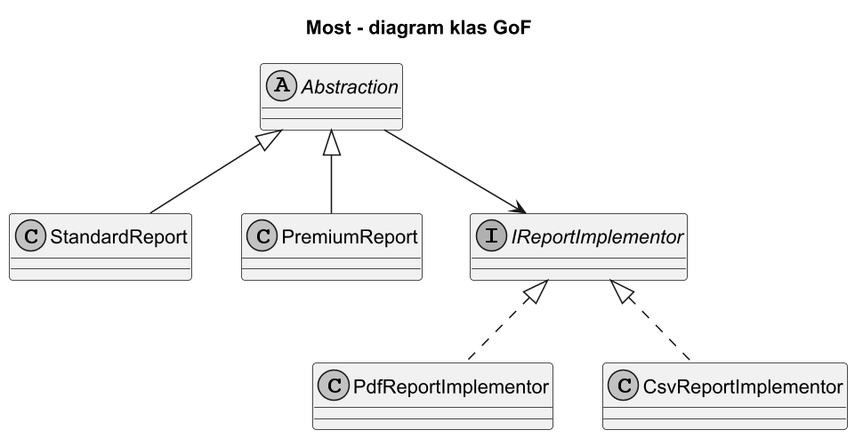
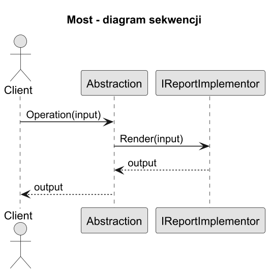
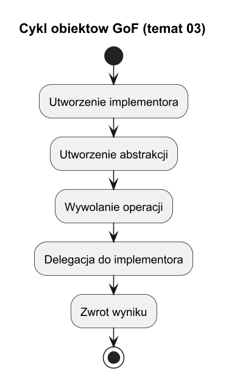

# 03. Struktura GoF wzorca Most

## Cel tematu

Poznac formalna strukture GoF i przeplyw wywolan.

## Role

1. Abstraction - interfejs domenowy dla klienta.
2. RefinedAbstraction - rozszerzone operacje domenowe.
3. Implementor - kontrakt techniczny.
4. ConcreteImplementor - konkretne wykonanie.

## Diagram klas



Źródło: [diagrams/01-class.puml](diagrams/01-class.puml)

## Diagram sekwencji



Źródło: [diagrams/02-sequence.puml](diagrams/02-sequence.puml)

## Cykl zycia obiektow



Źródło: [diagrams/03-lifecycle.puml](diagrams/03-lifecycle.puml)

## Kod C#

Kod: [Examples/Program.cs](Examples/Program.cs)

Program pokazuje klasyczna strukture GoF na prostym API raportowym.

## Uruchom

```bash
cd src/09-most/03-struktura-gof/Examples
dotnet run
```

## Zadania z rozwiązaniami

1. Dodaj RefinedAbstraction PremiumReport.
Rozwiązanie: nowa klasa po stronie abstrakcji, bez zmian implementorów.

2. Dodaj CsvReportImplementor.
Rozwiązanie: nowa klasa implementora, bez zmian Abstraction.
