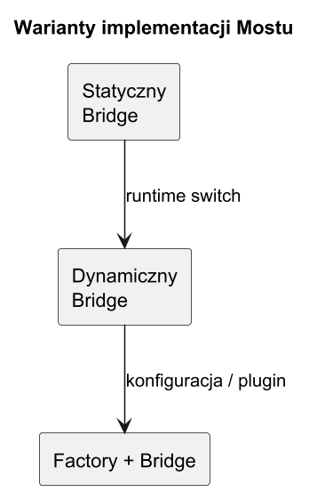
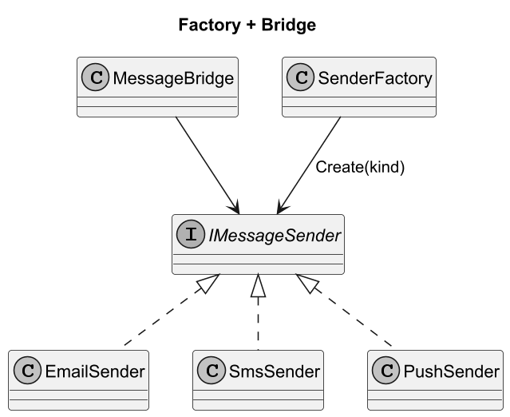
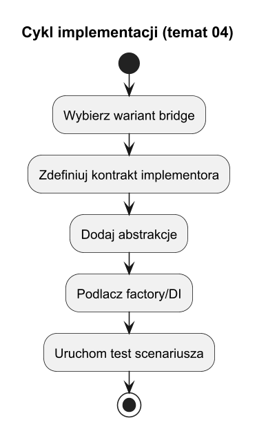

# 04. Implementacje i warianty Mostu

## Cel tematu

Pokazac praktyczne style implementacji Mostu i kryteria wyboru.

## Warianty

1. Statyczny (klasyczny) - implementor podawany raz.
2. Dynamiczny - mozliwa podmiana runtime.
3. Factory + Bridge - wybor implementora przez fabryke.



Zrodlo: [diagrams/01-variants.puml](diagrams/01-variants.puml)



Zrodlo: [diagrams/02-factory.puml](diagrams/02-factory.puml)

## Cykl implementacji



Zrodlo: [diagrams/03-lifecycle.puml](diagrams/03-lifecycle.puml)

## Jak wybrac wariant

1. Statyczny: mala skala i znane implementory.
2. Dynamiczny: potrzeba runtime switch.
3. Factory: konfiguracja lub pluginy.

## Kod C#

Kod: [Examples/Program.cs](Examples/Program.cs)

Program porownuje trzy warianty na tym samym use-case.

## Uruchom

```bash
cd src/09-most/04-implementacje-i-warianty/Examples
dotnet run
```

## Zadania z rozwiazaniami

1. Dodaj variant RegistryBridge.
Rozwiazanie: slownik string -> implementor tworzony lazily.

2. Dodaj walidacje konfiguracji fabryki.
Rozwiazanie: fallback + jasny blad domenowy.
