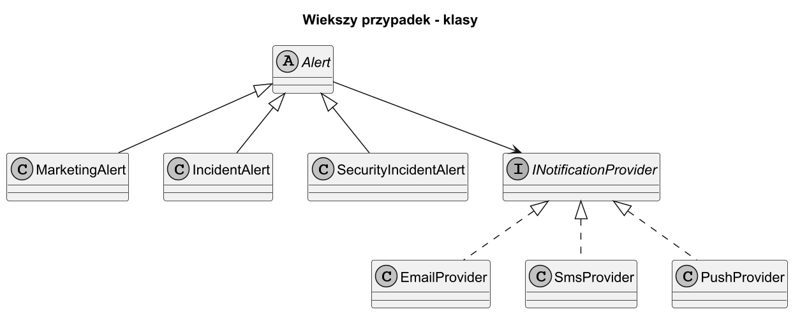
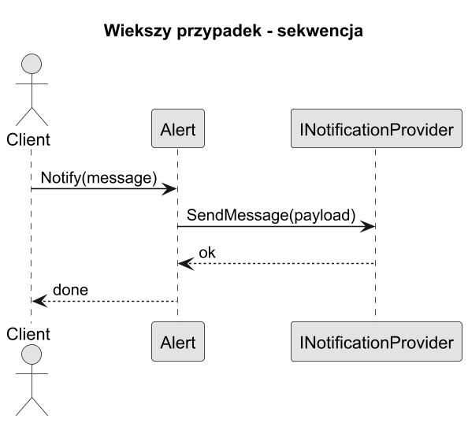
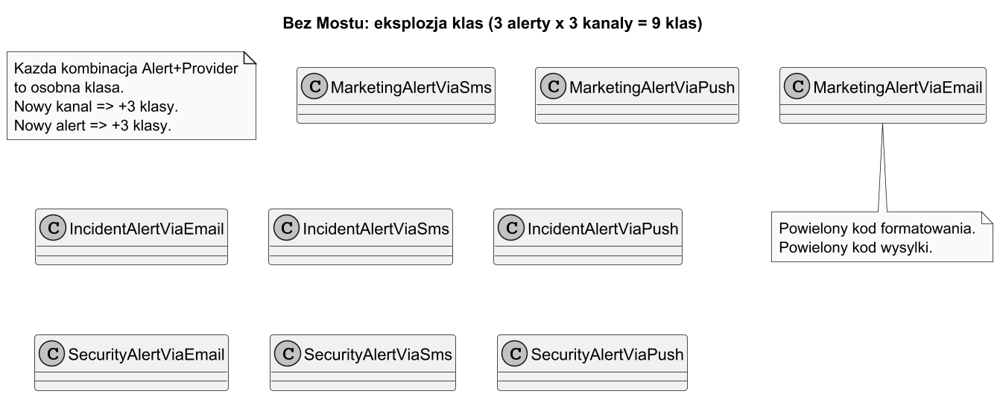
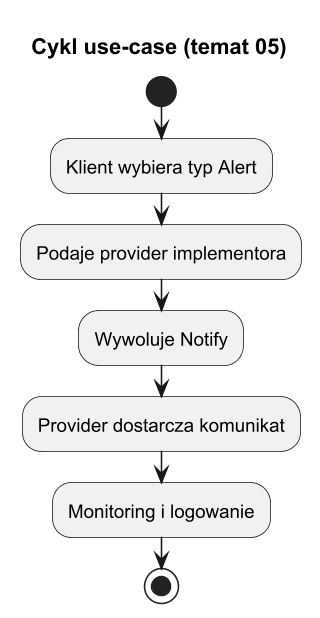

# 05. Większy przykład i alternatywy

## Cel tematu

Przepracowac pelny scenariusz, zobaczyc jak rosnie system bez Mostu i jak Most go kontroluje.

## Scenariusz: system notyfikacji

Firma rozbudowuje system powiadomień. Mamy dwie niezalezne osie zmienności:

- **Os abstrakcji** (typ alertu / reguly biznesowe): Alert marketingowy, alert o incydencie, alert o incydencie bezpieczenstwa.
- **Os implementacji** (kanał dostarczenia): EmailProvider, SmsProvider, PushProvider.

### Bez Mostu: eksplozja kombinacji

| | EmailProvider | SmsProvider | PushProvider |
|---|---|---|---|
| MarketingAlert | MarketingAlertViaEmail | MarketingAlertViaSms | MarketingAlertViaPush |
| IncidentAlert | IncidentAlertViaEmail | IncidentAlertViaSms | IncidentAlertViaPush |
| SecurityIncidentAlert | SecurityAlertViaEmail | SecurityAlertViaSms | SecurityAlertViaPush |

**3 alerty x 3 kanalki = 9 klas.** Dodanie `WhatsAppProvider` wymaga 3 nowych klas. Dodanie `SlaBreachAlert` wymaga 3 nowych klas. Po kilku sprintach mamy kilkadziesiat klas z powielanym kodem.



Źródło: [diagrams/01-big-class.puml](diagrams/01-big-class.puml)

### Z Mostem: niezalezne osie

Alert trzyma referencje do `INotificationProvider` i deleguje wysylke. Obie osie rozwijaja się oddzielnie:

```
Sprint 1 — Team Alert (abstrakcja):
  + MarketingAlert    — formatuje tresc promocji
  + IncidentAlert     — formatuje powiazany incydent

Sprint 1 — Team Channel (implementacja):
  + EmailProvider
  + SmsProvider

Sprint 2 — Team Alert (zero zmian w providerach):
  + SecurityIncidentAlert — nowe reguly formatu i priorytetu
  Dotkniety 1 plik. Testy providerow nie zmieniaja sie.

Sprint 2 — Team Channel (zero zmian w alertach):
  + PushProvider      — nowy kanal mobilny
  Dotkniety 1 plik. Testy alertow nie zmieniaja sie.

Sprint 3 — Team Channel:
  + WhatsAppProvider
  Dotkniety 1 plik. Wszystkie istniejace alerty dzialaja bez zmian.
```

**Koszt rozszerzenia: zawsze 1 nowa klasa**, niezależnie od liczby elementow na drugiej osi.



Źródło: [diagrams/02-big-sequence.puml](diagrams/02-big-sequence.puml)



Źródło: [diagrams/04-without-bridge.puml](diagrams/04-without-bridge.puml)

## Cykl zycia use-case



Źródło: [diagrams/03-lifecycle.puml](diagrams/03-lifecycle.puml)

## Alternatywy

1. **Adapter** — gdy laczysz niekompatybilne API zewnetrzne, model domenowy zostaje bez zmian.
1. **Strategia** — gdy zmienia się głównie algorytm w jednej osi.
1. **Fasada** — gdy upraszczasz wejscie do subsystemu.

### Krotka checklista decyzyjna

Scenariusz integracji obcego API:

1. Model domenowy bez zmian? [tak]
1. Problemem jest różnica interfejsów? [tak]
1. Brak nowej osi biznesowej? [tak]

Decyzja: **Adapter**.

Scenariusz podmiany algorytmu:

1. Zmienia się głównie sposob liczenia/decyzji? [tak]
1. Jedna oś zmienności? [tak]
1. Kontekst tylko deleguje? [tak]

Decyzja: **Strategia**.

Scenariusz dwóch osi rozwoju:

1. Co najmniej 2 osie zmienności? [tak]
1. Osie rozwijane niezależnie (oddzielne zespoły / release'y)? [tak]
1. Rosnie liczba klas typu XViaY? [tak]

Decyzja: **Most**.

## Kod C#

Kod: [Examples/Program.cs](Examples/Program.cs)

Program pokazuje:

1. Wyslanie alertow 3 typow przez 3 kanaly — 9 kombinacji, 6 klas.
1. Dodanie `WhatsAppProvider` — 1 nowa klasa, zero zmian w alertach.
1. Dodanie `SlaBreachAlert` — 1 nowa klasa, zero zmian w providerach.

## Uruchom

```bash
cd src/09-most/05-wiekszy-przyklad-i-alternatywy/Examples
dotnet run
```

## Zadania z rozwiązaniami

1. Dodaj `WhatsAppProvider` (oś implementacji).
   Rozwiązanie: nowy implementor, bez zmian klas `Alert`/`Incident`.

1. Dodaj `SlaBreachAlert` (oś abstrakcji).
   Rozwiązanie: nowa abstrakcja, bez zmian providerow.

1. Policz: ile klas byloby potrzebnych bez Mostu dla 5 alertow i 6 kanalow?
   Rozwiązanie: 5×6 = 30 klas vs 5+6 = 11 klas z Mostem.
