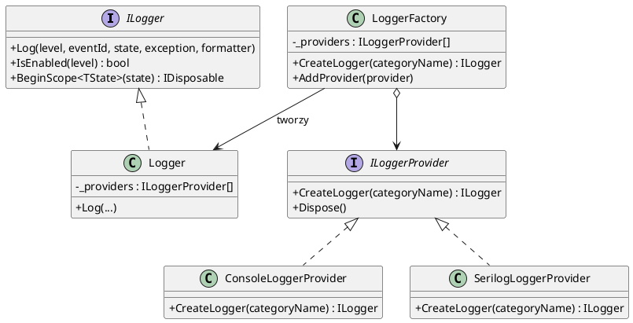
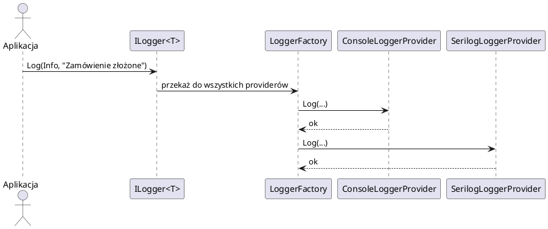
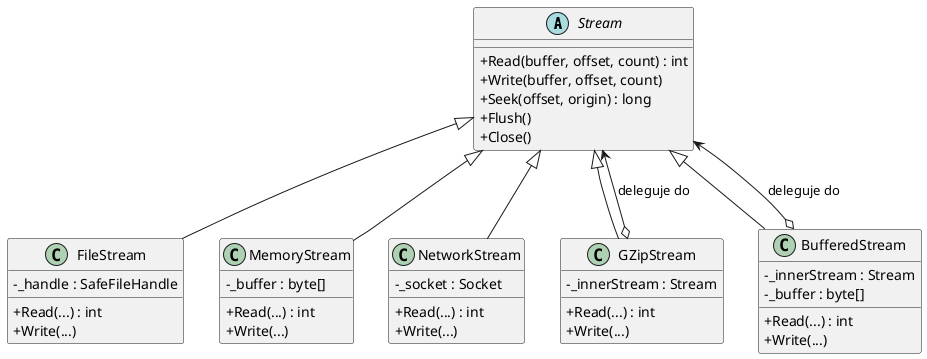
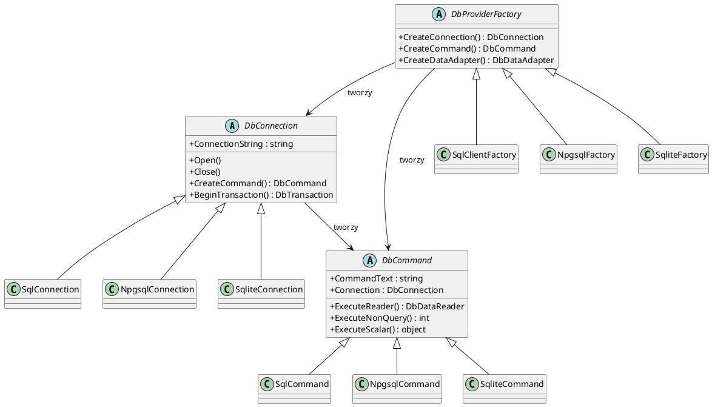
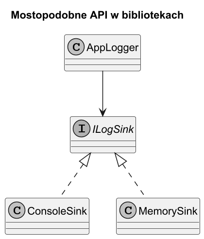
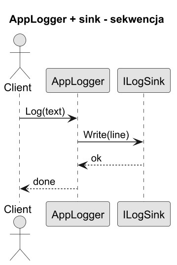
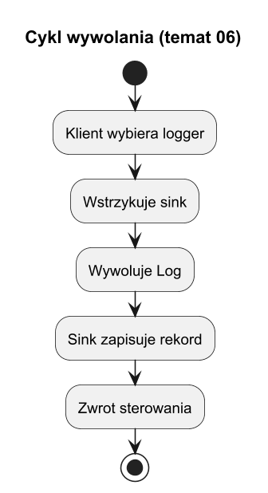

# 06. Most w bibliotekach standardowych

## Cel tematu

Pokazać mostopodobne rozwiązania w praktyce i granice klasyfikacji.

## Przykłady

1. [ILogger (abstrakcja logowania) + provider](#1-ilogger--provider)
2. [Stream abstractions + konkretne backendy](#2-stream-abstractions--konkretne-backendy)
3. [ADO.NET abstractions + provider bazodanowy](#3-adonet--provider-bazodanowy)

---

## 1. ILogger + provider

### Kontekst

`Microsoft.Extensions.Logging` to klasyczny Most zawarty w .NET runtime.

- **Abstrakcja** — `ILogger` / `ILogger<T>` — interfejs, z którego korzysta kod aplikacji.
- **Implementor** — `ILoggerProvider` — fabryka sinkow; każdy provider tworzy `ILogger` piszący do konkretnego celu.

Kod aplikacji nigdy nie importuje `Serilog`, `NLog`, `ApplicationInsights` itd. wprost — zależy tylko od `ILogger`. Provider jest podpinany przez DI w kompozycji aplikacji (`Program.cs`/`Startup.cs`).

### Schemat ról wzorca Most

| Rola Mostu | Typ w MEL |
|---|---|
| Abstraction | `ILogger<T>` (lub `Logger<T>`) |
| Refined Abstraction | `(brak — jest jeden interfejs)` |
| Implementor | `ILoggerProvider` |
| Concrete Implementor | `ConsoleLoggerProvider`, `DebugLoggerProvider`, `ApplicationInsightsLoggerProvider`, `SerilogLoggerProvider` (Serilog.Extensions.Logging) |

### Diagram klas



### Diagram sekwencji



### Przykładowy kod C#

```csharp
// ---- Kompozycja (Program.cs / Startup) --------------------------------
using Microsoft.Extensions.Logging;

using ILoggerFactory factory = LoggerFactory.Create(builder =>
{
    builder
        .SetMinimumLevel(LogLevel.Debug)
        .AddConsole()           // ConsoleLoggerProvider — Concrete Implementor A
        .AddDebug();            // DebugLoggerProvider  — Concrete Implementor B
});

// ---- Kod aplikacji — zależy TYLKO od ILogger<T> ----------------------
ILogger<OrderService> logger = factory.CreateLogger<OrderService>();

logger.LogInformation("Zamówienie {OrderId} złożone przez {User}", 42, "jan@example.com");
logger.LogWarning("Stan magazynowy niski: {Product}", "Widget");

// Własny provider (Concrete Implementor C) — rozszerzenie bez zmiany aplikacji
class InMemoryLoggerProvider : ILoggerProvider
{
    public List<string> Entries { get; } = new();

    public ILogger CreateLogger(string categoryName) =>
        new InMemoryLogger(categoryName, Entries);

    public void Dispose() { }
}

class InMemoryLogger(string category, List<string> entries) : ILogger
{
    public IDisposable? BeginScope<TState>(TState state) where TState : notnull => null;
    public bool IsEnabled(LogLevel level) => true;

    public void Log<TState>(LogLevel level, EventId id, TState state,
        Exception? ex, Func<TState, Exception?, string> formatter)
    {
        entries.Add($"[{level}] {category}: {formatter(state, ex)}");
    }
}
```

> **Wniosek**: dodanie nowego celu logowania (Splunk, Seq, własna baza) to **1 nowa klasa** `ILoggerProvider` — bez żadnej zmiany w `ILogger` ani w kodzie aplikacji.

---

## 2. Stream abstractions + konkretne backendy

### Kontekst

`System.IO.Stream` to abstrakcja operacji bajtowych. Kod, który pisze/czyta bajty, nigdy nie musi wiedzieć, czy dane trafiają na dysk, do pamięci, przez sieć czy przez kompresję.

### Schemat ról wzorca Most

| Rola Mostu | Typ w .NET |
|---|---|
| Abstraction | `System.IO.Stream` (klasa abstrakcyjna) |
| Refined Abstraction | `BufferedStream`, `CryptoStream`, `DeflateStream`, `GZipStream`, `BrotliStream` |
| Implementor | wbudowany — realizowany przez dziedziczenie (patrz uwaga poniżej) |
| Concrete Implementor | `FileStream`, `MemoryStream`, `NetworkStream`, `PipeStream` |

> **Uwaga — Most przez kompozycję (dekorator-most)**: `BufferedStream`, `CryptoStream` i klasy kompresji przyjmują `Stream` jako argument konstruktora — czyli łączą w sobie Most (delegacja do backendu) i Dekorator (owijanie). To przykład, gdzie wzorce nakładają się.

### Diagram klas



### Przykładowy kod C#

```csharp
// ---- Funkcja niezależna od backendu -----------------------------------
static async Task SaveJsonAsync(Stream destination, object data)
{
    // Nie wie nic o FileStream, MemoryStream, NetworkStream itp.
    await System.Text.Json.JsonSerializer.SerializeAsync(destination, data);
    await destination.FlushAsync();
}

// ---- Backend A: plik na dysku -----------------------------------------
await using var fileStream = new FileStream("dane.json", FileMode.Create);
await SaveJsonAsync(fileStream, new { Id = 1, Name = "Widget" });

// ---- Backend B: pamięć ------------------------------------------------
using var memStream = new MemoryStream();
await SaveJsonAsync(memStream, new { Id = 2, Name = "Gadget" });
byte[] bytes = memStream.ToArray();

// ---- Backend C: plik + kompresja (Most + Dekorator) -------------------
await using var compressedFile = new FileStream("dane.json.gz", FileMode.Create);
await using var gzip = new System.IO.Compression.GZipStream(
    compressedFile, System.IO.Compression.CompressionMode.Compress);
await SaveJsonAsync(gzip, new { Id = 3, Name = "Thing" });

// ---- Backend D: własny stream (np. zapis do chmury) ------------------
class CloudStream(string blobUrl) : Stream
{
    public override bool CanRead => false;
    public override bool CanSeek => false;
    public override bool CanWrite => true;
    public override long Length => throw new NotSupportedException();
    public override long Position { get => 0; set => throw new NotSupportedException(); }
    public override void Flush() { /* wyślij bufor do chmury */ }
    public override int Read(byte[] buffer, int offset, int count) => throw new NotSupportedException();
    public override long Seek(long offset, SeekOrigin origin) => throw new NotSupportedException();
    public override void SetLength(long value) => throw new NotSupportedException();
    public override void Write(byte[] buffer, int offset, int count)
    {
        // HTTP PUT/append do blobUrl
        Console.WriteLine($"CloudStream: wysyłam {count} bajtów do {blobUrl}");
    }
}

await using var cloud = new CloudStream("https://storage.example.com/blob/dane.json");
await SaveJsonAsync(cloud, new { Id = 4, Name = "CloudItem" });
```

> **Wniosek**: `SaveJsonAsync` działa z **dowolnym backendem** bez żadnych zmian — wystarczy przekazać inny `Stream`.

---

## 3. ADO.NET + provider bazodanowy

### Kontekst

ADO.NET definiuje zestaw abstrakcyjnych klas bazowych (od .NET 2.0) i interfejsów. Kod dostępu do danych zależy od tych abstrakcji — konkretny silnik bazy jest wybierany przez provider rejestrowany przez DI lub przez fabrykę `DbProviderFactories`.

### Schemat ról wzorca Most

| Rola Mostu | Typ abstrakcyjny | SQL Server | PostgreSQL (Npgsql) | SQLite |
|---|---|---|---|---|
| Abstraction | `DbConnection` | `SqlConnection` | `NpgsqlConnection` | `SqliteConnection` |
| Abstraction | `DbCommand` | `SqlCommand` | `NpgsqlCommand` | `SqliteCommand` |
| Abstraction | `DbDataReader` | `SqlDataReader` | `NpgsqlDataReader` | `SqliteDataReader` |
| Abstraction | `DbTransaction` | `SqlTransaction` | `NpgsqlTransaction` | `SqliteTransaction` |
| Implementor | `DbProviderFactory` | `SqlClientFactory` | `NpgsqlFactory` | `SqliteFactory` |

### Diagram klas



### Przykładowy kod C#

```csharp
// ---- Funkcja niezależna od providera ----------------------------------
static async Task<List<string>> GetProductNamesAsync(
    DbConnection connection,   // abstrakcja — nie SqlConnection!
    string tableName)
{
    await connection.OpenAsync();

    await using DbCommand cmd = connection.CreateCommand();
    cmd.CommandText = $"SELECT name FROM {tableName} ORDER BY name";

    var results = new List<string>();
    await using DbDataReader reader = await cmd.ExecuteReaderAsync();
    while (await reader.ReadAsync())
        results.Add(reader.GetString(0));

    return results;
}

// ---- Backend A: SQL Server --------------------------------------------
// using Microsoft.Data.SqlClient;
await using var sqlConn = new SqlConnection(
    "Server=localhost;Database=Shop;Trusted_Connection=true");
var sqlProducts = await GetProductNamesAsync(sqlConn, "Products");

// ---- Backend B: PostgreSQL --------------------------------------------
// using Npgsql;
await using var pgConn = new NpgsqlConnection(
    "Host=localhost;Database=shop;Username=postgres;Password=secret");
var pgProducts = await GetProductNamesAsync(pgConn, "products");

// ---- Backend C: SQLite (testy / dev) ----------------------------------
// using Microsoft.Data.Sqlite;
await using var liteConn = new SqliteConnection("Data Source=shop.db");
var liteProducts = await GetProductNamesAsync(liteConn, "Products");

// ---- Użycie DbProviderFactory (wybór w runtime / konfiguracja) --------
DbProviderFactory factory = DbProviderFactories.GetFactory("Microsoft.Data.SqlClient");
await using DbConnection dynConn = factory.CreateConnection()!;
dynConn.ConnectionString = "Server=localhost;Database=Shop;Trusted_Connection=true";
var dynProducts = await GetProductNamesAsync(dynConn, "Products");

// ---- Repository korzystający z abstrakcji (bez wiedzy o providerze) --
class ProductRepository(DbConnection connection)
{
    public async Task<int> AddProductAsync(string name, decimal price)
    {
        await using DbCommand cmd = connection.CreateCommand();
        cmd.CommandText = "INSERT INTO Products (name, price) VALUES (@name, @price)";

        DbParameter pName = cmd.CreateParameter();
        pName.ParameterName = "@name";
        pName.Value = name;
        cmd.Parameters.Add(pName);

        DbParameter pPrice = cmd.CreateParameter();
        pPrice.ParameterName = "@price";
        pPrice.Value = price;
        cmd.Parameters.Add(pPrice);

        return await cmd.ExecuteNonQueryAsync();
    }
}
```

> **Wniosek**: `ProductRepository` i `GetProductNamesAsync` działają z **SQL Server, PostgreSQL i SQLite** bez żadnej zmiany — wystarczy wstrzyknąć inną implementację `DbConnection`.

---

## Porównanie trzech przykładów

| Cecha | ILogger | Stream | ADO.NET |
|---|---|---|---|
| Abstrakcja | interfejs `ILogger` | klasa abstrakcyjna `Stream` | klasy abstrakcyjne `Db*` |
| Implementory | `ILoggerProvider` | `FileStream`, `MemoryStream`, ... | `SqlConnection`, `NpgsqlConnection`, ... |
| Kompozycja | przez DI / `LoggerFactory` | przez konstruktor (dekorator-most) | przez DI lub `DbProviderFactory` |
| Rozszerzenie | nowy `ILoggerProvider` | nowa klasa dziedzicząca `Stream` | nowy pakiet NuGet z providerem |
| Zmiany w abstrakcji | brak | brak | brak |



Źródło: [diagrams/01-libs-class.puml](diagrams/01-libs-class.puml)



Źródło: [diagrams/02-libs-sequence.puml](diagrams/02-libs-sequence.puml)

## Cykl wywolania



Źródło: [diagrams/03-lifecycle.puml](diagrams/03-lifecycle.puml)

## Kod C#

Kod: [Examples/Program.cs](Examples/Program.cs)

Program tworzy mini logger bridge: AppLogger + ILogSink.

## Uruchom

```bash
cd src/09-most/06-most-w-bibliotekach-standardowych/Examples
dotnet run
```

## Zadania z rozwiązaniami

1. Dodaj FileSink obok ConsoleSink.
Rozwiązanie: nowy implementor sink.

2. Dodaj AuditLogger (RefinedAbstraction).
Rozwiązanie: nowa abstrakcja po stronie domeny.

## Literatura

1. Microsoft Docs ILogger: https://learn.microsoft.com/dotnet/api/microsoft.extensions.logging.ilogger
2. Refactoring.Guru Bridge: https://refactoring.guru/design-patterns/bridge
