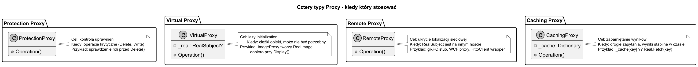

# 01. Idea i kontekst wzorca Proxy

## Cel tematu

Zrozumieć, kiedy chcemy podstawić obiekt pośredniczący przed obiekt docelowy.

Po tym temacie powinieneś umieć odpowiedzieć na pytania:

1. Dlaczego klient nie powinien czasem rozmawiać bezpośrednio z RealSubject?
2. Co daje dodatkowa warstwa kontrolna (Proxy)?
3. Jakie są 4 główne typy Proxy i kiedy każdy z nich stosować?
4. Jak odróżnić Proxy od Adaptera i Dekoratora?

## Problem: brak kontroli nad dostępem do obiektu

Wyobraź sobie serwis bazodanowy generujący raporty. Klient wywołuje go bezpośrednio. Pojawia się problem: każdy użytkownik może skasować wszystko, inicjalizacja połączenia trwa 2 sekundy nawet jeśli raport nie jest potrzebny, a każda operacja jest niewidoczna w logach.

Potrzebujemy warstwy, która — nie zmieniając kontraktu klienta — może:

1. Pilnować polityk dostępu (kto i kiedy może wywołać metodę).
2. Odłożyć koszt inicjalizacji (lazy initialization).
3. Zwrócić wynik z cache zamiast kosztownego wywołania.
4. Dodać logowanie i metryki bez ingerencji w logikę domenową.
5. Ukryć fakt, że RealSubject jest zdalne (sieć, RPC, REST).

## Idea Proxy

Proxy ma **ten sam kontrakt** co RealSubject, ale dodaje kontrolowany punkt wejścia:

```
Client --> ISubject <|.. Proxy --> RealSubject : ISubject
```

Klient nie wie, czy pracuje z Proxy, czy z RealSubject. Obie klasy implementują ten sam interfejs.


Źródło: [diagrams/01-proxy-motivation.puml](diagrams/01-proxy-motivation.puml)

## Przepływ wywołania krok po kroku

1. Klient wywołuje metodę na interfejsie `ISubject`.
1. Wywołanie trafia do `Proxy`, nie do `RealSubject`.
1. Proxy wykonuje logikę **pre-check**: autoryzacja, sprawdzenie cache, start pomiaru czasu.
1. Proxy deleguje (lub nie) wywołanie do `RealSubject`.
1. Proxy wykonuje logikę **post-check**: zapis do cache, stop pomiaru czasu, log wyniku.
1. Wynik wraca do klienta.

## Cztery typy Proxy — kiedy który

| Typ | Cel | Przykład z życia | Przykład C# |
|---|---|---|---|
| **Protection Proxy** | Kontrola uprawnień | Bramka w biurze — wchodzisz tylko ze zdjęciem | Proxy sprawdza rolę przed `Delete()` |
| **Virtual Proxy** | Lazy initialization | Miniatura zdjęcia zamiast oryginalnego pliku | `ImageProxy` tworzy `RealImage` dopiero przy `Display()` |
| **Remote Proxy** | Ukrycie lokalizacji | Recepcja przyjmuje zamówienie, kuchnia je realizuje | Stub gRPC ukrywa fakt komunikacji sieciowej |
| **Caching Proxy** | Zapamiętanie wyników | Kelner pamięta zamówienie stolika — nie pyta szefa drugi raz | `_cache[key]` zamiast ponownego zapytania do bazy |



Źródło: [diagrams/02-proxy-types.puml](diagrams/02-proxy-types.puml)

## Co odróżnią Proxy od innych wzorców

| Wzorzec | Zachowuje kontrakt? | Główny cel |
|---|---|---|
| **Proxy** | Tak | Kontrola dostępu, lazy, cache, remote |
| **Adapter** | Nie — zmienia interfejs | Dostosowanie obcego API do swojego kontraktu |
| **Dekorator** | Tak | Nakładanie nowych zachowań warstwowo |
| **Strategia** | Tak | Podmiana algorytmu w jednej osi |

Krótka reguła: jeśli zachowujesz interfejs i chcesz **kontrolować**, nie **rozszerzać** — to Proxy. Jeśli chcesz warstwowo **doklejać** zachowania — to Dekorator.

## Przykładowy program C# (Protection Proxy)

Poniżej minimalny, samodzielny przykład pokazujący cztery etapy wzorca:

```csharp
// Subject
interface IReportService
{
    string GetMonthlyReport(int month);
    void DeleteAllReports();
}

// RealSubject — logika domenowa, bez znajomości ról
sealed class RealReportService : IReportService
{
    public string GetMonthlyReport(int month) => $"REPORT-{month:00}";
    public void DeleteAllReports() => Console.WriteLine("RealReportService: deleted");
}

// Protection Proxy — warunek dostępu, pre-check
sealed class ReportServiceProxy(IReportService inner, UserContext ctx) : IReportService
{
    public string GetMonthlyReport(int month)
    {
        Console.WriteLine($"Proxy: GET report/{month} [rolę={ctx.Rolę}]");
        return inner.GetMonthlyReport(month);
    }

    public void DeleteAllReports()
    {
        Console.WriteLine("Proxy: DELETE requested");
        if (ctx.Rolę != UserRolę.Admin)
            throw new UnauthorizedAccessException("Only Admin can delete reports.");
        inner.DeleteAllReports();
    }
}

// Client — pracuje wyłącznie na IReportService, nie zna Proxy ani RealSubject
IReportService userProxy  = new ReportServiceProxy(new RealReportService(), new UserContext(UserRolę.User));
IReportService adminProxy = new ReportServiceProxy(new RealReportService(), new UserContext(UserRolę.Admin));

Console.WriteLine(userProxy.GetMonthlyReport(3));
// => Proxy: GET report/3 [rolę=User]
// => REPORT-03

try { userProxy.DeleteAllReports(); }
catch (UnauthorizedAccessException ex) { Console.WriteLine($"Expected: {ex.Message}"); }
// => Proxy: DELETE requested
// => Expected: Only Admin can delete reports.

adminProxy.DeleteAllReports();
// => Proxy: DELETE requested
// => RealReportService: deleted
```

### Co sie tu dzieje?

1. Klient widzi tylko `IReportService` — nie wie, czy ma Proxy, czy RealSubject.
1. `ReportServiceProxy` implementuje ten sam interfejs co `RealReportService`.
1. Proxy sprawdza rolę przed operacja krytyczna (pre-check).
1. `RealReportService` nie zna zasad autoryzacji — SRP zachowane.
1. Zasady dostępu są w jednym miejscu i łatwo je testować.

## Kod przykładu

Kod: [Examples/Program.cs](Examples/Program.cs)

Program pokazuje Protection Proxy z kontrola roli. Klient pracuje wyłącznie na interfejsie `IReportService`.
Dla roli `User` operacja `DeleteAllReports()` rzuca `UnauthorizedAccessException`. Dla roli `Admin` przechodzi.

```bash
cd src/10-proxy/01-idea-i-kontekst/Examples
dotnet run
```

## Dalsze kroki

1. Pełna implementacja Static Proxy z loggerem: [../04-static-proxy/README.md](../04-static-proxy/README.md)
1. Wersja dynamiczna w C#: [../05-dynamic-proxy-csharp/README.md](../05-dynamic-proxy-csharp/README.md)
1. Procedura decyzyjna — kiedy który wzorzec: [../02-kiedy-stosować-zalety-wady/README.md](../02-kiedy-stosować-zalety-wady/README.md)
