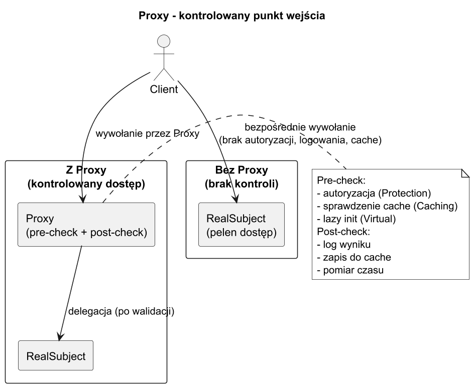

# 01. Idea i kontekst wzorca Proxy

## Cel tematu

Zrozumiec, kiedy chcemy podstawic obiekt posredniczacy przed obiekt docelowy.

Po tym temacie powinienes umiec odpowiedziec na pytania:

1. Dlaczego klient nie powinien czasem rozmawiac bezposrednio z RealSubject?
2. Co daje dodatkowa warstwa kontrolna (Proxy)?
3. Jak odroznic Proxy od Adaptera i Dekoratora?

## Problem

Klient nie powinien zawsze:

1. miec pelnego dostepu do RealSubject,
2. inicjalizowac ciezkich zasobow od razu,
3. znac szczegolow infrastruktury zdalnej.

W praktyce oznacza to, ze potrzebujemy warstwy, ktora:

1. pilnuje polityk (kto i kiedy moze wywolac metode),
2. moze odlozyc koszt (lazy initialization),
3. moze dodac aspekty techniczne (logowanie, cache, retry),
4. nie zmienia kontraktu widzianego przez klienta.

## Idea Proxy

Proxy ma ten sam kontrakt co RealSubject, ale dodaje kontrolowany punkt wejscia.

1. Client -> ISubject.
2. Proxy : ISubject.
3. RealSubject : ISubject.

## Diagram



Zrodlo: [diagrams/01-proxy-motivation.puml](diagrams/01-proxy-motivation.puml)

Na diagramie klient ma dwa warianty:

1. dostep bezposredni (trudniej kontrolowac),
2. dostep przez Proxy (mozna walidowac, logowac i ograniczac).

## Przeplyw wywolania krok po kroku

1. Klient wywoluje metode na interfejsie ISubject.
2. Wywolanie trafia najpierw do Proxy.
3. Proxy wykonuje logike pre-check (np. role, cache, telemetry).
4. Proxy deleguje wywolanie do RealSubject.
5. Proxy moze wykonac logike post-check i zwrocic wynik klientowi.

## Typowe zastosowania

1. Protection Proxy: autoryzacja.
2. Virtual Proxy: lazy initialization.
3. Remote Proxy: ukrycie komunikacji sieciowej.
4. Caching/Logging Proxy: cross-cutting concerns.

## Co odroznia od innych wzorcow

1. Adapter zmienia interfejs, Proxy zachowuje ten sam.
2. Dekorator glownie rozszerza zachowanie, Proxy glownie kontroluje dostep.

## Przykladowy program C# (Protection Proxy)

Ponizej minimalny, samodzielny przyklad pokazujacy kontrole uprawnien.

```csharp
enum UserRole
{
	User,
	Admin
}

sealed record UserContext(UserRole Role);

interface IReportService
{
	string GetMonthlyReport(int month);
	void DeleteAllReports();
}

sealed class RealReportService : IReportService
{
	public string GetMonthlyReport(int month) => $"REPORT-{month:00}";

	public void DeleteAllReports()
	{
		Console.WriteLine("RealReportService: all reports deleted");
	}
}

sealed class ReportServiceProxy : IReportService
{
	private readonly IReportService _inner;
	private readonly UserContext _context;

	public ReportServiceProxy(IReportService inner, UserContext context)
	{
		_inner = inner;
		_context = context;
	}

	public string GetMonthlyReport(int month)
	{
		Console.WriteLine($"Proxy: GetMonthlyReport({month})");
		return _inner.GetMonthlyReport(month);
	}

	public void DeleteAllReports()
	{
		Console.WriteLine("Proxy: DeleteAllReports() requested");

		if (_context.Role != UserRole.Admin)
		{
			throw new UnauthorizedAccessException("Only Admin can delete reports.");
		}

		_inner.DeleteAllReports();
	}
}

var userProxy = new ReportServiceProxy(new RealReportService(), new UserContext(UserRole.User));
var adminProxy = new ReportServiceProxy(new RealReportService(), new UserContext(UserRole.Admin));

Console.WriteLine(userProxy.GetMonthlyReport(3));

try
{
	userProxy.DeleteAllReports();
}
catch (UnauthorizedAccessException ex)
{
	Console.WriteLine($"Expected: {ex.Message}");
}

adminProxy.DeleteAllReports();
```

### Co sie tu dzieje?

1. Klient widzi tylko IReportService.
2. ReportServiceProxy implementuje ten sam interfejs co RealReportService.
3. Proxy sprawdza role przed operacja krytyczna.
4. RealReportService nie zna zasad autoryzacji.
5. Zasady dostepu sa w jednym miejscu i latwo je testowac.

## Dalsze kroki

1. Kod uruchamialny (bardziej rozbudowany): [../04-static-proxy/Examples/Program.cs](../04-static-proxy/Examples/Program.cs)
2. Wersja dynamiczna w C#: [../05-dynamic-proxy-csharp/README.md](../05-dynamic-proxy-csharp/README.md)
