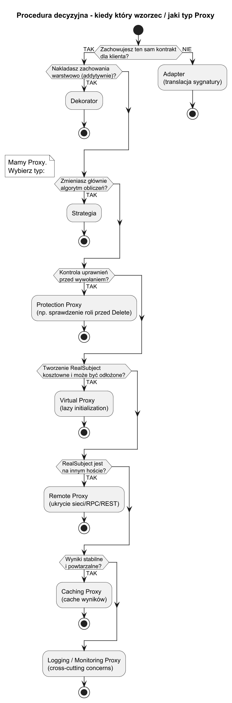
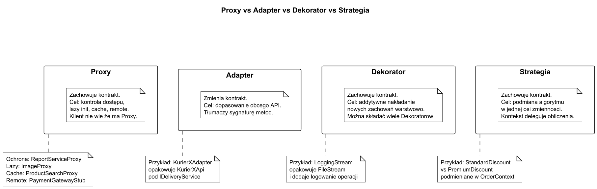

# 02. Kiedy stosować Proxy - zalety i wady

## Cel tematu

Nauczyc sie podejmowac decyzje: kiedy Proxy rozwiązuje problem, jaki typ Proxy wybrac, a kiedy lepiej wybrac inny wzorzec.

## Krok 1 - czy w ogole Proxy?

Pytania filtrujace:

1. Chcesz zachować ten sam kontrakt co RealSubject dla klienta? **[jeśli TAK - Proxy kandyduje]**
1. Chcesz dodać logikę kontrolna/infrastrukturalna bez zmiany kodu klienta? **[jeśli TAK - Proxy kandyduje]**
1. Chcesz zmienić interfejs obcego API? **[jeśli TAK - Adapter, nie Proxy]**
1. Chcesz warstwowo nakładać zachowania (dekorowanie)? **[jeśli TAK - Dekorator, nie Proxy]**
1. Chcesz zmienić algorytm obliczeń? **[jeśli TAK - Strategia, nie Proxy]**

## Krok 2 - jaki typ Proxy?

Jeśli przeszles krok 1 i wybrales Proxy, dobierz typ:

```
Potrzebujesz kontroli uprawnień przed wywołaniem?
  TAK => Protection Proxy
  NIE => kontynuuj

Tworzenie RealSubject jest kosztowne i może być niepotrzebne?
  TAK => Virtual Proxy
  NIE => kontynuuj

RealSubject jest na innym hoście (sieć, RPC, REST)?
  TAK => Remote Proxy
  NIE => kontynuuj

Wyniki są stabilne i chcesz zaoszczędzić na wielokrotnych wywołaniach?
  TAK => Caching Proxy
  NIE => rozważ Logging/Monitoring Proxy (cross-cutting concerns)
```



Źródło: [diagrams/01-decision-map.puml](diagrams/01-decision-map.puml)

## Krok 3 - Proxy vs inne wzorce (pełna tabela)

| Pytanie kluczowe | Wzorzec | Uzasadnienie |
|---|---|---|
| Zmieniasz kontrakt obcego API? | **Adapter** | Adapter tłumaczy sygnaturę - Proxy jej nie zmienia |
| Ten sam kontrakt + kontrola uprawnień? | **Protection Proxy** | Pilnuje polityk bez wiedzy klienta |
| Ten sam kontrakt + lazy init? | **Virtual Proxy** | Odkłada koszt tworzenia do momentu użycia |
| Ten sam kontrakt + ukrycie sieci? | **Remote Proxy** | Klient myśli, że wywołuje lokalny obiekt |
| Ten sam kontrakt + cache wyników? | **Caching Proxy** | Zwraca zapamiętany wynik zamiast delegować |
| Ten sam kontrakt + warstwowe rozszerzanie? | **Dekorator** | Dekorator nakłada nowe zachowanie addytywnie |
| Podmiana algorytmu w jednej osi? | **Strategia** | Strategia zmienia co się oblicza, nie kto ma dostęp |



Źródło: [diagrams/02-proxy-vs-patterns.puml](diagrams/02-proxy-vs-patterns.puml)

## Scenariusze decyzyjne - przykłady z życia

### Scenariusz A: serwis raportow - kto może usuwać?

Masz `IReportService`. Chcesz, żeby `DeleteAllReports()` bylo dostępne tylko dla admina.

1. Czy zmieniasz kontrakt? [NIE]
1. Czy to kontrola uprawnień? [TAK]
1. Decyzja: **Protection Proxy**.

Koszt rozszerzenia: 1 klasa `ReportServiceProxy`, klient bez zmian.

### Scenariusz B: galeria obrazow - ładowanie tylko gdy potrzebne

Masz `IImage`. Obraz wazy 50 MB. Użytkownik może nigdy nie otworzyć galerii.

1. Czy zmieniasz kontrakt? [NIE]
1. Czy tworzenie jest kosztowne i może być odłożone? [TAK]
1. Decyzja: **Virtual Proxy**.

Koszt rozszerzenia: 1 klasa `ImageProxy`, klient bez zmian.

### Scenariusz C: zewnętrzny serwis płatności - ukrycie HTTP

Masz kontrakt `IPaymentGateway`. Implementacja to wywołanie REST API.

1. Czy zmieniasz kontrakt? [NIE - tworzysz własny kontrakt i ukrywasz HTTP]
1. Czy RealSubject jest zdalny? [TAK]
1. Decyzja: **Remote Proxy**.

Klient wywołuje `IPaymentGateway.Pay()` jak lokalny obiekt.

### Scenariusz D: wyszukiwarka produktów - wyniki się powtarzają

Masz `IProductSearch`. Zapytanie do bazy trwa 300 ms. Te same frazy wyszukiwane wielokrotnie.

1. Czy zmieniasz kontrakt? [NIE]
1. Czy wyniki są stabilne w czasie? [TAK - TTL 5 min]
1. Decyzja: **Caching Proxy**.

Koszt rozszerzenia: 1 klasa z `Dictionary<string, Product[]>`, klient bez zmian.

### Scenariusz E: nowy dostawca kuriera - inny interfejs

Masz `IDeliveryService`. Nowy kurier ma API z innymi metodami i typami.

1. Czy zmieniasz kontrakt? [TAK - translacja sygnatury]
1. Decyzja: **Adapter**, nie Proxy.

## Checklista decyzyjna - szablon 10 sekund

```
Pytanie                                    TAK/NIE  Wzorzec
------------------------------------------------------
Zmieniam kontrakt obcego API?              [ ]      Adapter
Ten sam kontrakt + kontrola uprawnień?     [ ]      Protection Proxy
Ten sam kontrakt + lazy init?              [ ]      Virtual Proxy
Ten sam kontrakt + ukrycie sieci?          [ ]      Remote Proxy
Ten sam kontrakt + cache wyników?          [ ]      Caching Proxy
Ten sam kontrakt + nakładam warstwy?       [ ]      Dekorator
Podmiana algorytmu (jedna oś)?             [ ]      Strategia
```

## Kiedy nie stosować Proxy

1. Logika pośrednia jest minimalna i jednorazowa - prosta kompozycja wystarczy.
1. Masz już middleware (np. ASP.NET pipeline) realizujacy ten cel.
1. Narzut na debugowanie i wydajność przewyższa zysk.
1. Liczba interfejsów jest duża - rozważ Dynamic Proxy zamiast Static.

## Zalety

1. Separacja odpowiedzialności infrastrukturalnych od domenowych.
1. Lepsza kontrola dostępu i obserwowalność.
1. Zachowanie jednego kontraktu dla klienta.
1. Łatwa wymiana Proxy bez zmian klienta lub RealSubject.

## Wady

1. Wiecej klas i poziomów wywołań.
1. Trudniejsza diagnostyka błędów (szczególnie Dynamic Proxy).
1. Potencjalny narzut runtime.
1. Ryzyko logiki biznesowej w Proxy zamiast w RealSubject.

## Typowe błędy

1. Uzywanie Proxy do zmiany interfejsu - to Adapter.
1. Wkladanie logiki domenowej do Proxy - SRP naruszone.
1. Wiele warstw proxy bez metryk - trudny debugging.
1. Brak testow dla ścieżki dostępu zabronionego.

## Kod przykładu

Kod: [Examples/Program.cs](Examples/Program.cs)

Program demonstruje Virtual Proxy z leniwym ladowaniem obrazu. Obiekt `ImageProxy` nie tworzy `RealImage`
dopóki klient nie wywoła `Display()` po raz pierwszy. Drugie wywołanie nie powoduje ponownego ładowania.

```bash
cd src/10-proxy/02-kiedy-stosować-zalety-wady/Examples
dotnet run
```

## Dalsze kroki

1. Static Proxy z kontrola uprawnień: [../04-static-proxy/README.md](../04-static-proxy/README.md)
1. Dynamic Proxy i interception runtime: [../05-dynamic-proxy-csharp/README.md](../05-dynamic-proxy-csharp/README.md)
