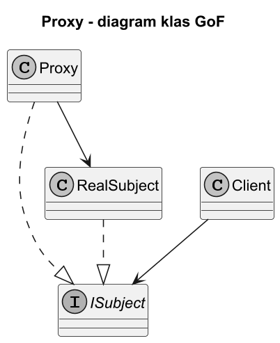

# 03. Struktura GoF Proxy

## Szczegolowy opis

## Role we wzorcu

1. `Subject` - wspolny kontrakt dla klienta i obiektu docelowego.
2. `RealSubject` - docelowa implementacja wykonujaca operacje biznesowa.
3. `Proxy` - implementuje `Subject`, kontroluje dostep i deleguje do `RealSubject`.
4. `Client` - pracuje na `Subject`, bez zaleznosci od konkretnej implementacji.

Jak dziala wspolpraca rol:

1. `Client` wywoluje operacje przez interfejs `Subject`.
2. `Proxy` wykonuje logike pre/post, np. autoryzacje, cache, logowanie lub lazy init.
3. `Proxy` deleguje wywolanie do `RealSubject` albo zwraca wynik z cache.
4. `Client` pozostaje odseparowany od szczegolow tworzenia i zabezpieczen obiektu docelowego.

## Diagramy



Zrodlo: [diagrams/01-class.puml](diagrams/01-class.puml)

Opis diagramu klas:

1. Relacja `Subject <|.. RealSubject` pokazuje implementacje wspolnego kontraktu.
2. Relacja `Subject <|.. Proxy` pokazuje podstawialnosc proxy z perspektywy klienta.
3. Relacja `Proxy --> RealSubject` oznacza delegacje wywolan do obiektu docelowego.
4. Relacja `Client --> Subject` utrzymuje klienta niezaleznym od konkretow implementacyjnych.

## Przyklad C Sharp

Kod: [Examples/Program.cs](Examples/Program.cs)

Program ilustruje kazda z czterech rol GoF (`ISubject`, `RealSubject`, `Proxy`, `Client`).
Proxy jest Caching Proxy: pierwsze wywolanie pelni delegacje do `RealSubject`, kolejne zwraca wynik z cache.
W logach widoczne sa pre-check, delegacja i post-processing.

```bash
cd src/10-proxy/03-struktura-gof/Examples
dotnet run
```

Co robi program:

1. Definiuje kontrakt `IReportService`, na ktorym pracuje klient.
2. Udostepnia `RealReportService` jako `RealSubject` wykonujacy operacje docelowe.
3. Implementuje `ReportServiceProxy`, ktory loguje wywolania i kontroluje autoryzacje.
4. W kodzie klienta obiekt jest widziany jako `IReportService`, wiec szczegoly implementacji sa ukryte.

```csharp
IReportService userProxy = new ReportServiceProxy(new RealReportService(), user, Console.WriteLine);
Console.WriteLine(userProxy.GetMonthlyReport(3));
```

Interpretacja wyniku:

1. Najpierw widac logike proxy (`Proxy: ...`), a dopiero potem wykonanie operacji w `RealReportService`.
2. Dla zwyklego uzytkownika usuwanie raportow konczy sie kontrolowanym `UnauthorizedAccessException`.
3. Wzorzec realizuje cel GoF: dodanie kontroli dostepu bez zmiany kodu klienta.

Uruchom:

```bash
cd src/10-proxy/04-static-proxy/Examples
dotnet run
```
