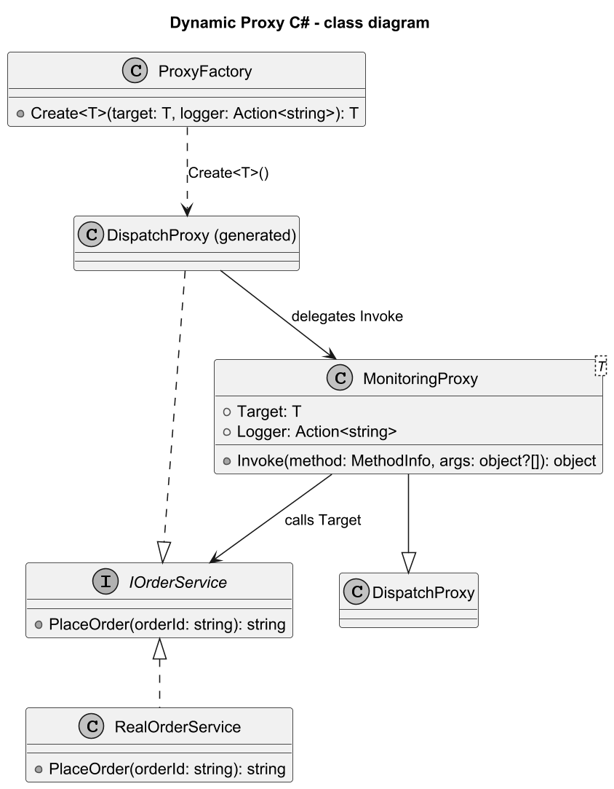

# 05. Dynamic Proxy w C#

## Cel tematu

Pokazać interception runtime bez pisania osobnej klasy proxy dla każdego interfejsu.

## W kilku słowach: czym jest Dynamic Proxy

Dynamic Proxy to obiekt proxy tworzony automatycznie w runtime, który przechwytuje wywołania metod i może dodać logikę techniczną (np. logowanie, pomiar czasu, autoryzację), zanim deleguje do obiektu docelowego.

Różnica względem zwykłego (statycznego) proxy:

1. Static Proxy piszesz ręcznie jako osobną klasę dla interfejsu.
1. Dynamic Proxy jest generowany w locie (w C# np. przez `DispatchProxy`), więc mniej kodu powtarzalnego.
1. Static Proxy jest prostszy w debugowaniu, Dynamic Proxy jest bardziej elastyczny przy wielu interfejsach.

## Szczegółowe wyjaśnienie koncepcji w C#

W C# dynamic proxy można zbudować przez `DispatchProxy`, który generuje implementację interfejsu w runtime.
Zamiast pisać ręcznie klasę proxy dla każdego kontraktu, definiujesz jedną klasę interceptora i przechwytujesz wywołania metod.

Jak to działa:

1. Klient pracuje na interfejsie, np. `IOrderService`.
1. `DispatchProxy.Create<T, TProxy>()` zwraca obiekt, który implementuje `T`.
1. Każde wywołanie metody trafia do `Invoke(MethodInfo, object?[]?)`.
1. W `Invoke` można dodać logowanie, pomiar czasu, politykę retry, metryki, walidacje, itp.
1. Ostatecznie interceptor deleguje wywołanie do prawdziwego obiektu (`Target`).

Korzyści i koszty:

1. Plus: mocna redukcja boilerplate dla wielu interfejsów.
1. Plus: centralizacja logiki przekrojowej.
1. Minus: trudniejszy debugging i mniejsza czytelność stack trace.
1. Minus: narzut reflection i runtime dispatch.

## Rolę w przykładzie

1. `IOrderService` - kontrakt (`Subject`).
1. `RealOrderService` - implementacja docelowa (`RealSubject`).
1. `MonitoringProxy<T>` - interceptor dynamicznego proxy.
1. `ProxyFactory` - bezpieczne tworzenie proxy dla interfejsu.
1. Kod kliencki - wywołuje metodę jak zwykłą implementację interfejsu.

## Diagramy

### Diagram interakcji


Źródło: [diagrams/01-dispatch-proxy-flow.puml](diagrams/01-dispatch-proxy-flow.puml)

### Diagram klas


Źródło: [diagrams/02-class.puml](diagrams/02-class.puml)

## Co pokazuje kod

1. IOrderService i RealOrderService.
2. DispatchProxy generujący proxy runtime.
3. Interceptor: log start/stop, pomiar czasu i obsługa wyjątków.
4. Rzucenie wyjątku z `RealOrderService` i ponowne rzucenie `InnerException` w interceptorze.

## Program ilustrujący

Kod: [Examples/Program.cs](Examples/Program.cs)

```csharp
IOrderService real = new RealOrderService();
IOrderService proxy = ProxyFactory.Create(real, Console.WriteLine);

Console.WriteLine(proxy.PlaceOrder("ORD-100"));

try
{
	proxy.PlaceOrder(string.Empty);
}
catch (ArgumentException ex)
{
	Console.WriteLine($"Expected: {ex.Message}");
}
```

## Wyjaśnienie programu krok po kroku

1. Tworzony jest obiekt docelowy `RealOrderService`.
1. `ProxyFactory.Create` buduje dynamiczne proxy implementujące `IOrderService`.
1. Dla poprawnego `orderId` metoda przechodzi przez interceptor: `START -> OK -> ELAPSED_US`.
1. Dla pustego `orderId` `RealOrderService` rzuca `ArgumentException`.
1. Interceptor loguje `ERROR ...` i rzuca ponownie wewnętrzny wyjątek, zachowując semantykę błędu.

## Oczekiwany efekt uruchomienia

1. Linia z zaakceptowanym zamówieniem `ORDER_ACCEPTED:ORD-100`.
1. Logi `START`, `OK`, `ELAPSED_US` dla poprawnego wywołania.
1. Log `ERROR PlaceOrder: orderId is required` i komunikat `Expected: ...` dla błędnego wywołania.

## Uruchom

```bash
cd src/10-proxy/05-dynamic-proxy-csharp/Examples
dotnet run
```

## Testy

```bash
dotnet test src/10-proxy/05-dynamic-proxy-csharp/Tests/Examples.Tests.csproj
```

## Wnioski

1. Dynamic Proxy redukuje boilerplate.
2. Koszt: trudniejszy debugging i wiekszy narzut runtime.
