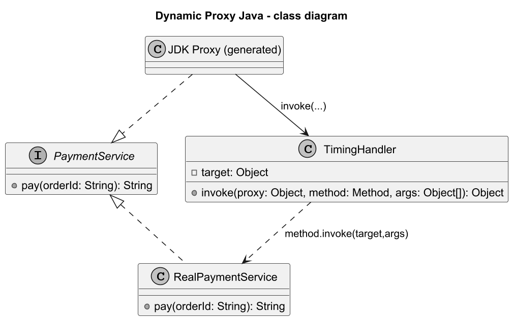

# 06. Dynamic Proxy w Javie

## Cel tematu

Pokazać Java Dynamic Proxy przez InvocationHandler i Proxy.newProxyInstance.

## Szczegółowe wyjaśnienie koncepcji w Javie

JDK Dynamic Proxy pozwala tworzyć implementację interfejsu w runtime bez pisania ręcznej klasy proxy.
Mechanizm opiera się o `InvocationHandler`, który przechwytuje każde wywołanie metody.

Jak to działa:

1. Klient pracuje na interfejsie, np. `PaymentService`.
1. `Proxy.newProxyInstance(...)` tworzy obiekt implementujący ten interfejs.
1. Każde wywołanie metody trafia do `invoke(proxy, method, args)` w handlerze.
1. Handler wykonuje logikę przekrojową i deleguje przez `method.invoke(target, args)`.
1. Ewentualne `InvocationTargetException` jest rozpakowywane do rzeczywistego wyjątku biznesowego.

Ważne ograniczenie:

1. Standardowy JDK proxy działa tylko dla interfejsów (nie dla klas).

## Rolę w przykładzie

1. `PaymentService` - kontrakt (`Subject`).
1. `RealPaymentService` - implementacja docelowa (`RealSubject`).
1. `TimingHandler` - interceptor (`InvocationHandler`).
1. Obiekt z `Proxy.newProxyInstance` - dynamiczny proxy obsługujący wywołania klienta.

## Diagramy

### Diagram interakcji


Źródło: [diagrams/01-jdk-proxy-flow.puml](diagrams/01-jdk-proxy-flow.puml)

### Diagram klas


Źródło: [diagrams/02-class.puml](diagrams/02-class.puml)

## Program ilustrujacy (Java)

Kod: [Examples/JavaDynamicProxyDemo.java](Examples/JavaDynamicProxyDemo.java)

```java
import java.lang.reflect.*;

interface PaymentService {
    String pay(String orderId);
}

class RealPaymentService implements PaymentService {
    public String pay(String orderId) {
        if (orderId == null || orderId.isBlank()) {
            throw new IllegalArgumentException("orderId is required");
        }

        return "PAID:" + orderId;
    }
}

class TimingHandler implements InvocationHandler {
    private final Object target;

    TimingHandler(Object target) {
        this.target = target;
    }

    public Object invoke(Object proxy, Method method, Object[] args) throws Throwable {
        long start = System.nanoTime();
        System.out.println("START " + method.getName());

        try {
            Object result = method.invoke(target, args);
            System.out.println("OK " + method.getName());
            return result;
        } catch (InvocationTargetException ex) {
            Throwable inner = ex.getTargetException();
            System.out.println("ERROR " + method.getName() + ": " + inner.getMessage());
            throw inner;
        } finally {
            long elapsedUs = (System.nanoTime() - start) / 1000;
            System.out.println("ELAPSED_US " + method.getName() + "=" + elapsedUs);
        }
    }
}

public class JavaDynamicProxyDemo {
    public static void main(String[] args) {
        PaymentService service = (PaymentService) Proxy.newProxyInstance(
            PaymentService.class.getClassLoader(),
            new Class<?>[] { PaymentService.class },
            new TimingHandler(new RealPaymentService())
        );

        System.out.println(service.pay("ORD-42"));
    }
}
```

## Wyjaśnienie programu krok po kroku

1. `RealPaymentService` realizuje logikę biznesowa i waliduje `orderId`.
1. `TimingHandler` dodaje logi `START/OK/ERROR` oraz pomiar czasu `ELAPSED_US`.
1. Proxy JDK implementuje `PaymentService` i przekazuje każde wywołanie do handlera.
1. Dla poprawnego `orderId` zwracane jest `PAID:<id>`.
1. Dla błędnego argumentu handler rozpakowuje `InvocationTargetException` i rzuca oryginalny wyjątek.

## Uruchom

```bash
cd src/10-proxy/06-dynamic-proxy-java/Examples
javac JavaDynamicProxyDemo.java
java JavaDynamicProxyDemo
```

## Wnioski

1. Interceptor działa dla wszystkich metod interfejsu.
2. Dynamic Proxy wymaga pracy przez interfejs.
3. Wyjątki z reflection trzeba obsługiwać jawnie.
