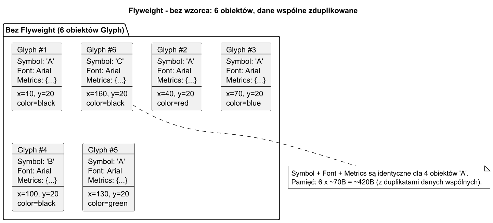
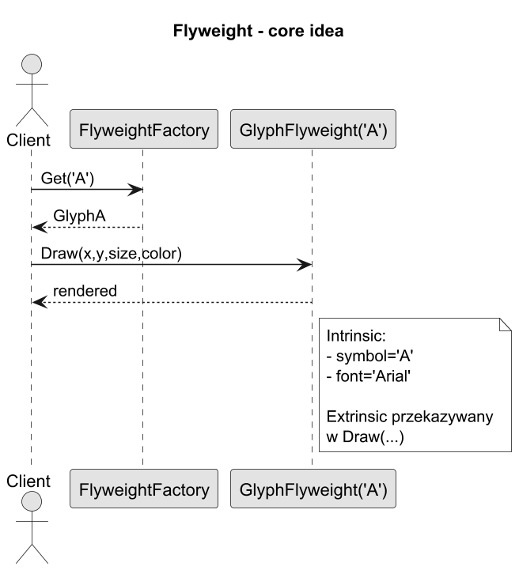
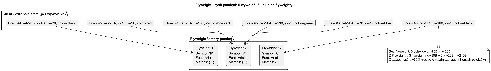

# 01. Idea i kontekst

## Cel rozdziału

Zrozumieć, jaki problem pamięciowy rozwiązuje wzorzec Pyłek i dlaczego sama optymalizacja algorytmu nie zawsze wystarcza.

## Problem: miliony obiektów, z których większość jest identyczna

Wyobraź sobie edytor tekstu renderujący dokument 500 stron. Każda strona ma ok. 3000 znaków. Razem: 1 500 000 obiektów `Glyph`. Każdy przechowuje:

- `char Symbol` (2 B)
- `string FontFamily` (ref = 8 B + dane)
- `FontMetrics Metrics` (40 B)
- `int X, Y, PointSize` (12 B)
- `string Color` (ref = 8 B + dane)

Razem ok. 70–80 B na znak. Przy 1,5 mln znaków to **ok. 120 MB** — tylko na glify.

**Kluczowa obserwacja:** `FontFamily`, `Metrics` i `Symbol` są identyczne dla setek tysięcy znaków. `X`, `Y`, `PointSize`, `Color` są unikalne dla każdego wystąpienia.

## Rozwiązanie: podział stanu na intrinsic i extrinsic

| Część stanu | Nazwa | Gdzie przechowana | Przykład |
|---|---|---|---|
| Wspólna, niemutowalna | `intrinsic` | Raz, w flyweight | `Symbol='A'`, `FontFamily="Arial"`, `Metrics` |
| Zależna od kontekstu | `extrinsic` | U klienta, przekazywana przy wywołaniu | `X`, `Y`, `PointSize`, `Color` |

Zamiast 1 500 000 obiektów z pełnym stanem:

1. Tworzymy **kilkadziesiąt flyweightów** (np. 52 litery + cyfry + znaki).
1. Każdy flyweight trzyma tylko `intrinsic` (Symbol + FontFamily + Metrics).
1. Klient przekazuje `extrinsic` w wywołaniu `Draw(x, y, size, color)`.

Wynik: **zamiast 120 MB — kilka kB** dla flyweightów + tablica pozycji dla kontekstu.

## Trzy reprezentatywne scenariusze

### Scenariusz A: renderowanie tekstu (edytor, PDF, gra)

Bez Flyweight: 1 000 000 obiektów `Glyph`, każdy z metrykamą czcionki.
Z Flyweight: 96 flyweightów (ASCII) + 1 000 000 par `(flyweightRef, x, y, color)`.

### Scenariusz B: kafelki mapy w grze (tile map)

Mapa 1000×1000 = 1 mln komórek. Typy terenu: Trawa, Woda, Piasek, Skała — tylko 4.
Bez Flyweight: 1 mln obiektów z teksturą, kolizją, animacją (duplikowane).
Z Flyweight: 4 flyweighty + tablica 1 mln indeksów.

### Scenariusz C: ikony UI w dashboardzie

Dashboard wyświetla 10 000 przycisków. Typy ikon: Zatwierdź, Anuluj, Edytuj, Usuń — 4 warianty.
Bez Flyweight: 10 000 obiektów z bitmapą (100 KB każda) = 1 GB.
Z Flyweight: 4 flyweighty × 100 KB = 400 KB + 10 000 referencji.

## Intuicja — analogia z życia

Biblioteka miejska ma 200 000 egzemplarzy książek. Zamiast duplikować tytuł, autora i ISBN w każdym egzemplarzu, kartoteka biblioteczna trzyma jeden rekord (flyweight) na tytuł, a każdy egzemplarz (kontekst klienta) przechowuje tylko numer półki i status wypożyczenia.

## Diagramy

### Diagram problemu



Źródło: [diagrams/01-problem-context.puml](diagrams/01-problem-context.puml)

Opis:

1. Każdy obiekt przechowuje te same dane wspólne (np. font i kształt glifu).
1. Takie duplikaty są główną przyczyną wzrostu zużycia pamięci.

### Diagram idei Flyweight



Źródło: [diagrams/02-flyweight-idea.puml](diagrams/02-flyweight-idea.puml)

Opis:

1. `Client` pobiera obiekt z `FlyweightFactory` po kluczu intrinsic.
1. Factory zwraca współdzielony obiekt, jeśli już istnieje.
1. `Client` przekazuje extrinsic state w czasie operacji (np. `Draw`).

### Diagram zysku pamięci



Źródło: [diagrams/03-memory-gain.puml](diagrams/03-memory-gain.puml)

## Przykładowy program

Kod: [Examples/Program.cs](Examples/Program.cs)

Uruchom:

```bash
cd src/11-pyłek/01-idea-i-kontekst/Examples
dotnet run
```

Co robi program:

1. Dla tekstu `AABACA` prosi `GlyphFactory` o glif po kluczu `(symbol, font)`.
1. Factory tworzy flyweight tylko dla nowych kluczy i trzyma je w cache.
1. Przy każdym rysowaniu klient przekazuje `x`, `y`, `pointSize`, `color` jako extrinsic state.
1. Na końcu program wypisuje liczbę unikalnych flyweightów i liczbę wywołań `Draw`.

Jak interpretować wynik:

1. `Total draw calls` odpowiada liczbie znaków do narysowania.
1. `Unique flyweights` jest mniejsze, bo `A` i inne powtórzenia są współdzielone.
1. Ta różnica pokazuje istotę Flyweight: mniej obiektów przy tej samej funkcjonalności.

## Co student powinien zapamiętać

1. Flyweight optymalizuje pamięć, nie semantykę domeny.
1. Nie każdy projekt zyska na tym wzorcu — najpierw pomiar.
1. Kluczowy jest prawidłowy podział na intrinsic (wspólne, niemutowalne) i extrinsic (kontekstowe).
