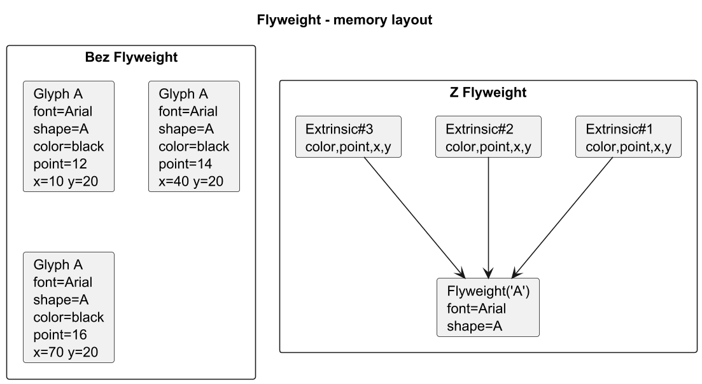

# 02. Intrinsic vs Extrinsic

## Cel rozdziału

Nauczyć się poprawnie dzielić stan obiektu i unikać najczęstszych błędów projektowych.

## Definicje

1. `Intrinsic state` - stan wspólny, niemutowalny, współdzielony.
1. `Extrinsic state` - stan zależny od kontekstu użycia, podawany przez klienta.

## Jak dzielić stan - procedura

1. Wypisz wszystkie pola obiektu.
1. Oznacz, które pola są identyczne dla wielu instancji.
1. Sprawdź, czy pola wspólne mogą być niemutowalne.
1. Pola kontekstowe usuń z flyweight i przekazuj w metodzie operacyjnej.

## Przykład: znak tekstowy

1. Intrinsic: symbol glifu, metryki czcionki, font family.
1. Extrinsic: pozycja `(x, y)`, kolor, rozmiar, warstwa.

## Typowe błędy

1. Wrzucenie mutowalnego stanu do intrinsic.
1. Zbyt duży klucz w factory (nadmierna liczba flyweightów).
1. Brak jednoznacznej odpowiedzialności klienta za extrinsic state.

## Diagram pamięci



Źródło: [diagrams/01-memory-layout.puml](diagrams/01-memory-layout.puml)

## Przykładowy program C#

Kod: [Examples/Program.cs](Examples/Program.cs)

Program pokazuje podział stanu na intrinsic (`iconType`, `colorTheme`) i extrinsic (`x`, `y`, `label`) na przykładzie ikon przycisków.
Factory zwraca ten sam obiekt dla identycznego klucza intrinsic.

```bash
cd src/11-pylek/02-intrinsic-vs-extrinsic/Examples
dotnet run
```

## Checklista przed implementacją

1. Czy liczba obiektów jest wystarczająco duża?
1. Czy intrinsic ma wysoki współczynnik powtarzalności?
1. Czy zespół rozumie konsekwencje dodatkowej warstwy factory?
