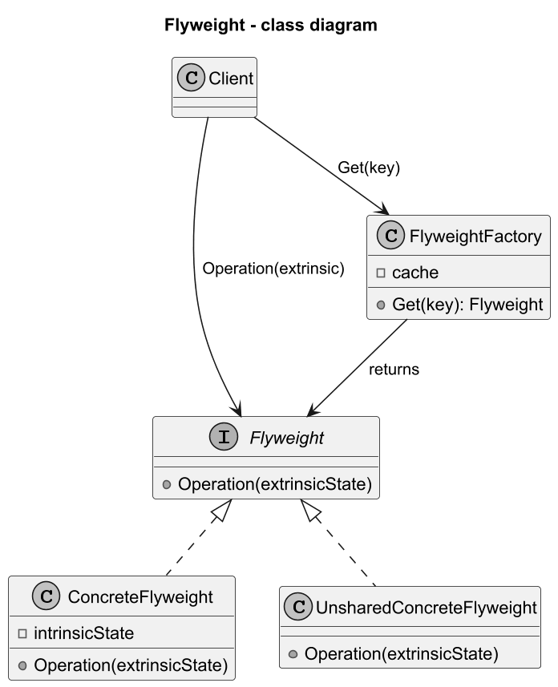
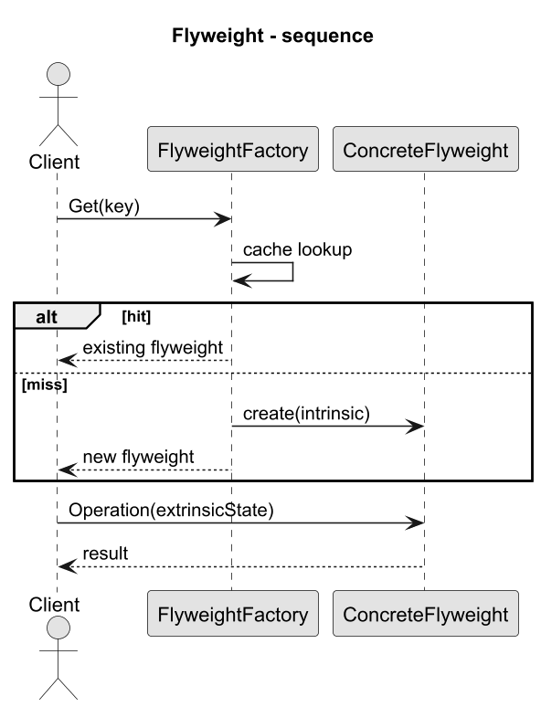

# 03. Struktura GoF Flyweight

## Szczegółowy opis

Wzorzec Pyłek definiuje mechanizm współdzielenia obiektów, aby zmniejszyć liczbę instancji i zużycie pamięci.

## Role we wzorcu

1. `Flyweight` - interfejs operacji przyjmujący extrinsic state.
1. `ConcreteFlyweight` - przechowuje intrinsic state.
1. `FlyweightFactory` - zwraca istniejący flyweight lub tworzy nowy.
1. `Client` - przechowuje extrinsic state i wywołuje operacje.

Jak działa współpraca ról:

1. `Client` prosi `FlyweightFactory` o obiekt po kluczu intrinsic.
1. Factory sprawdza cache i zwraca istniejący flyweight lub tworzy nowy.
1. `Client` wywołuje operacje na flyweight, przekazując extrinsic state.
1. `ConcreteFlyweight` łączy intrinsic z extrinsic tylko na czas operacji.

## Diagramy

### Diagram klas



Źródło: [diagrams/01-class.puml](diagrams/01-class.puml)

### Diagram sekwencji



Źródło: [diagrams/02-sequence.puml](diagrams/02-sequence.puml)

## Przykładowy program C#

Kod: [Examples/Program.cs](Examples/Program.cs)

Program demonstruje klasyczną strukturę GoF: `IFlyweight`, `ConcreteFlyweight`, `FlyweightFactory`.
Factory loguje każde tworzenie nowego flyweight — widoczna jest różnica między miss a hit.

```bash
cd src/11-pylek/03-struktura-gof/Examples
dotnet run
```

## Praktyczne konsekwencje

1. Mniej instancji i mniejsze zużycie pamięci.
1. Wyższa złożoność modelu przez rozdzielenie stanu.
1. Konieczność dbania o niemutowalność intrinsic.
