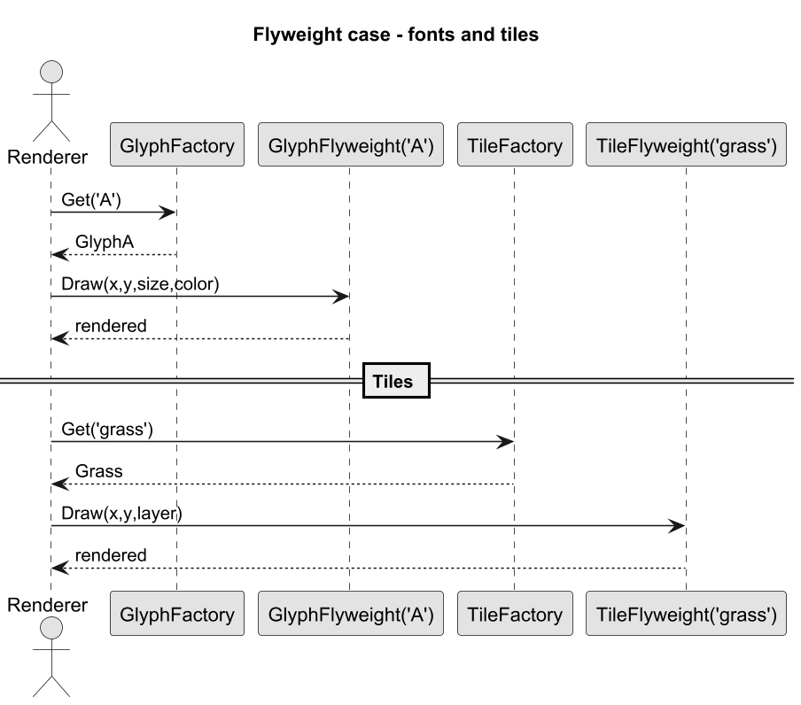

# 05. Case study: czcionki i tiles

## Cel rozdziału

Zobaczyć dwa realistyczne scenariusze, w których Flyweight daje duży zwrot: renderowanie znaków i mapy kafelkowe.

## Scenariusz A: znaki tekstu

Problem:

1. Dokument zawiera bardzo dużo znaków.
1. Każdy znak przechowuje podobne metryki glifu.

Podejście Flyweight:

1. Jeden flyweight na typ glifu (np. `A`, `B`, `C`).
1. Pozycja i rozmiar to extrinsic state podawany przy renderowaniu.

## Scenariusz B: tiles w grze

Problem:

1. Mapa ma miliony komórek.
1. Typ kafelka (trawa, woda, piasek) często się powtarza.

Podejście Flyweight:

1. Flyweight trzyma wspólną reprezentację typu kafelka.
1. Klient przekazuje współrzędne i stan runtime jako extrinsic.

## Jak prowadzić demo

1. Uruchom wersję naiwną i policz liczbę instancji.
1. Uruchom wersję flyweight i policz unikalne obiekty.
1. Porównaj pamięć i czas inicjalizacji.

## Diagram interakcji



Źródło: [diagrams/01-case-sequence.puml](diagrams/01-case-sequence.puml)

## Przykładowy program C#

Kod: [Examples/Program.cs](Examples/Program.cs)

Program zawiera dwa demo:

1. **Case study A** – `GlyphFactory` renderuje znaki tekstu `HELLO WORLD` (intrinsic: symbol + font).
1. **Case study B** – `TileFactory` renderuje mapę 4×4 (intrinsic: typ terenu).

```bash
cd src/11-pylek/05-case-study-czcionki-i-tiles/Examples
dotnet run
```

## Wnioski

1. Największy zysk jest przy dużej liczbie podobnych elementów.
1. Kluczowe jest poprawne zaprojektowanie klucza i granicy intrinsic/extrinsic.
