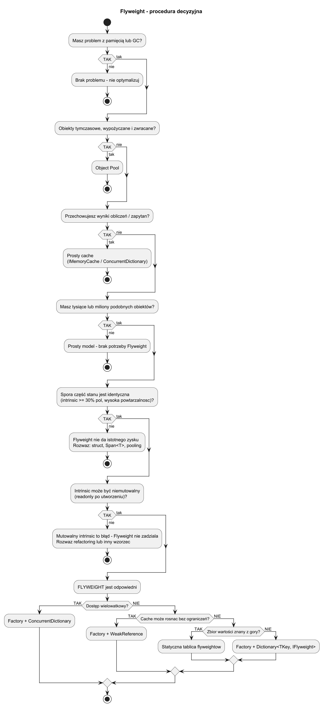

# 06. Kiedy stosować i alternatywy

## Cel rozdziału

Podjąć świadomą decyzję, czy Flyweight jest najlepszym wyborem, wybrać odpowiedni wariant i porównać go z alternatywami.

## Krok 1 — czy w ogóle jest problem?

Zanim sięgniesz po Flyweight, odpowiedz na trzy pytania:

1. **Czy liczba obiektów jest naprawdę duża?**
   Flyweight ma sens przy tysiącach–milionach instancji. Dla setek obiektów narzut złożoności nie opłaca się.

1. **Czy widać realny problem pamięciowy lub presję GC?**
   Sprawdź profilerem: czy masz wiele małych obiektów tego samego typu? Czy GC zbiera je zbyt często?

1. **Czy znaczna część stanu obiektów jest identyczna?**
   Policz, jaki procent pól ma tę samą wartość w wielu instancjach. Jeśli < 30% — Flyweight prawdopodobnie nie pomoże.

Jeśli na wszystkie trzy pytania odpowiedź brzmi TAK — przejdź do kroku 2.

## Krok 2 — czy możliwy jest podział na intrinsic / extrinsic?

1. Wypisz wszystkie pola obiektu.
1. Zaznacz te, które są **identyczne** dla wielu instancji → kandydaci na `intrinsic`.
1. Sprawdź, czy `intrinsic` może być **niemutowalny** (readonly po utworzeniu).
1. Pola unikalne per-instancja → `extrinsic`, przekazywane przy wywołaniu.

Jeśli nie możesz wydzielić niemutowalnego intrinsic — Flyweight nie zadziała. Rozważ inną optymalizację (struct, Object Pool, strumieniowanie danych).

## Krok 3 — który wariant Flyweight?

| Wariant | Kiedy | Uwagi |
|---|---|---|
| Prosty Factory + Dictionary | Mała liczba unikalnych kluczy, jednowątkowy dostęp | Najczytelniejszy, łatwy do testowania |
| Factory + ConcurrentDictionary | Dostęp wielowątkowy | `GetOrAdd` jest bezpieczne, ale nie gwarantuje unikalności tworzenia |
| Factory + WeakReference | Cache nie może rosnąć bez ograniczeń | GC może usunąć flyweight; factory musi go odtworzyć |
| Statyczna tablica flyweightów | Skończony i znany z góry zbiór wartości (np. ASCII) | Najszybszy dostęp, zero narzutu słownika |

## Procedura decyzyjna — drzewo



Źródło: [diagrams/02-decision-map.puml](diagrams/02-decision-map.puml)

## Scenariusze decyzyjne — przyklady z życia

### Scenariusz A: edytor tekstu — znaki w dokumencie (Flyweight TAK)

- 500 stron × 3000 znaków = 1 500 000 obiektów `Glyph`
- `Symbol + FontFamily + Metrics` powtarza się tysiące razy
- `X, Y, Color, PointSize` unikalne per znak

Decyzja: **Flyweight** (statyczna tablica per znak ASCII lub Dictionary per font).
Zysk: 1 500 000 obiektów → ~96 flyweightów + tablica pozycji.

### Scenariusz B: kafelki mapy w grze (Flyweight TAK)

- Mapa 2000×2000 = 4 mln komórek
- Typy terenu: Trawa, Woda, Piasek, Skała, Las = 5 flyweightów
- Każda komórka: `TileType tileRef, int x, int y, bool hasFog`

Decyzja: **Flyweight**.
Zysk: 4 mln obiektów → 5 flyweightów + tablica 4 mln strukturę `TileContext`.

### Scenariusz C: ikony UI w dashboardzie (Flyweight TAK)

- 10 000 przycisków, 6 typów ikon (bitmap 50 KB każda)
- Bez Flyweight: 10 000 × 50 KB = ~500 MB bitmap w pamięci
- Z Flyweight: 6 × 50 KB = 300 KB + 10 000 referencji

Decyzja: **Flyweight**.
Zysk: zmniejszenie bitmap w pamięci z ~500 MB do 300 KB.

### Scenariusz D: zamówienia w sklepie (Flyweight NIE)

- 50 000 zamówień, każde z unikalnym `OrderId`, `CustomerId`, `TotalPrice`, `Items[]`
- Żadne pole nie jest identyczne dla wielu zamówień
- Brak intrinsic state

Decyzja: **Nie stosować Flyweight** — prosty list/store.

### Scenariusz E: połączenia do bazy danych (Object Pool, nie Flyweight)

- Chcesz ograniczyć liczbę połączeń do DB (kosztowne tworzenie)
- Połączenia są wypożyczane i zwracane, nie współdzielone jednocześnie

Decyzja: **Object Pool**, nie Flyweight.
Różnica: Flyweight współdzieli obiekt jednocześnie (read-only intrinsic), Pool wypożycza i zwraca.

### Scenariusz F: cache wyników zapytań HTTP (zwykły cache, nie Flyweight)

- Chcesz pamiętać wyniki drogie obliczeniowo (`GetRate("EUR")`)
- Przechowujesz wyniki, nie obiekty modelu

Decyzja: **Prosty cache** (`IMemoryCache`, `ConcurrentDictionary<TKey, TValue>`), nie Flyweight.

## Checklista decyzyjna — szablon 10 sekund

```
Pytanie                                              TAK/NIE  Decyzja
---------------------------------------------------------------------------
Masz tysiące/miliony podobnych obiektów?             [ ]
Spora część stanu jest identyczna (intrinsic)?       [ ]
Intrinsic może być niemutowalny?                     [ ]
Profiler pokazuje presję GC lub duże zużycie RAM?    [ ]

--> Wszystkie TAK => Flyweight

Obiekty tymczasowe, wypożyczane i zwracane?          [ ]   --> Object Pool
Wyniki obliczeń/zapytań do przechowania?             [ ]   --> Cache
Każdy obiekt naprawdę unikatowy?                     [ ]   --> Prosty model
```

## Flyweight vs Object Pool vs Cache

| Kryterium | Flyweight | Object Pool | Cache |
|---|---|---|---|
| Cel | Zmniejszenie liczby obiektów przez współdzielenie | Ograniczenie kosztu tworzenia/niszczenia | Pamiętanie wyników obliczeń |
| Stan | Tylko intrinsic (read-only) | Pełny, mutowalny — zwracany po użyciu | Wynik (wartość), nie obiekt modelu |
| Jednoczesne użycie | Tak — wiele klientów używa tego samego flyweight | Nie — tylko jeden klient na raz | Tak — wiele klientów czyta ten sam wynik |
| Typowy przykład | Glifty czcionki, kafelki mapy | Połączenia DB, wątki, parsery XML | Kursy walut, wyniki API, tokeny JWT |


Źródło: [diagrams/01-flyweight-vs-pool.puml](diagrams/01-flyweight-vs-pool.puml)

## Kiedy NIE stosować Flyweight

1. Mała liczba obiektów (< tysiąca) — narzut złożoności nie opłaca się.
1. Stan obiektów jest w większości unikalny — brak intrinsic do współdzielenia.
1. Obiekty są mutowalny po utworzeniu — błędne wyniki przy współdzieleniu.
1. Masz już middleware/cache rozwiązujący problem na wyższym poziomie.

## Ryzyka i zabezpieczenia

1. **Ryzyko:** niekontrolowany rozrost cache → limit rozmiaru lub `WeakReference`.
1. **Ryzyko:** zły klucz (np. case-sensitive vs insensitive) → testy kontraktowe dla klucza.
1. **Ryzyko:** mutowalność intrinsic → `readonly` na polach, `record` lub `ImmutableXxx`.
1. **Ryzyko:** nadmierna złożoność dla małej skali → zmierz najpierw, optymalizuj potem.

## Przykładowy program C#

Kod: [Examples/Program.cs](Examples/Program.cs)

Program zestawia trzy warianty dla systemu cząstek:

1. **Naiwny** — każda cząstka przechowuje pełny stan (duplikaty type+color+texture).
1. **Flyweight** — typ cząstki jest współdzielony, pozycja to extrinsic state.
1. **Płaski model** — gdy obiekty są unikalne, Flyweight nic nie wnosi.

```bash
cd src/11-pylek/06-kiedy-stosowac-i-alternatywy/Examples
dotnet run
```
