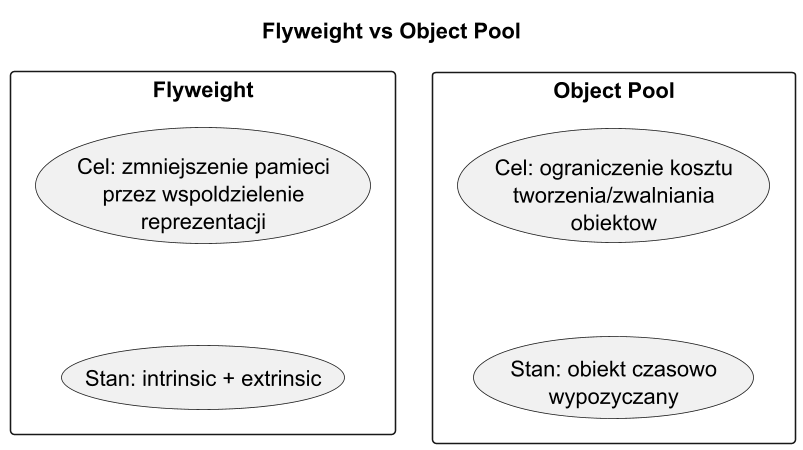

# 06. Kiedy stosować i alternatywy

## Cel rozdziału

Podjąć świadomą decyzję, czy Flyweight jest najlepszym wyborem dla danego problemu.

## Kiedy stosować Flyweight

1. Bardzo duża liczba obiektów.
1. Wysoki stopień wspólnego, niemutowalnego stanu.
1. Wyraźne oddzielenie kontekstu klienta od reprezentacji wspólnej.

## Kiedy nie stosować

1. Mała skala obiektów.
1. Niski poziom współdzielenia stanu.
1. Brak presji pamięciowej i brak problemów GC.

## Porównanie z alternatywami

1. `Object Pool`: recykling obiektów tymczasowych, nie współdzielenie reprezentacji.
1. Zwykły cache wyników: przechowuje rezultaty, niekoniecznie obiekty modelu.
1. Immutable value objects: upraszczają model, ale nie usuwają duplikatów same z siebie.

## Mini drzewo decyzyjne

1. Czy masz bardzo dużo podobnych obiektów? Jeśli nie, odpuść Flyweight.
1. Czy potrafisz wydzielić niemutowalny intrinsic? Jeśli nie, odpuść Flyweight.
1. Czy pomiar pokazuje problem pamięci? Jeśli tak, wdrażaj stopniowo.

## Ryzyka i zabezpieczenia

1. Ryzyko: niekontrolowany rozrost cache -> limit lub `WeakReference`.
1. Ryzyko: zły klucz -> testy kontraktowe dla klucza.
1. Ryzyko: nadmiarowa złożoność -> utrzymuj prosty interfejs klienta.

## Przykładowy program C#

Kod: [Examples/Program.cs](Examples/Program.cs)

Program zestawia trzy warianty dla systemu cząstek:

1. **Naiwny** – każda cząstka przechowuje pełny stan (duplikaty).
1. **Flyweight** – typ cząstki jest współdzielony, pozycja to extrinsic state.
1. **Płaski model** – gdy obiekty są unikalne, Flyweight nic nie wnosi.

```bash
cd src/11-pylek/06-kiedy-stosowac-i-alternatywy/Examples
dotnet run
```

## Diagram porównawczy



Źródło: [diagrams/01-flyweight-vs-pool.puml](diagrams/01-flyweight-vs-pool.puml)
