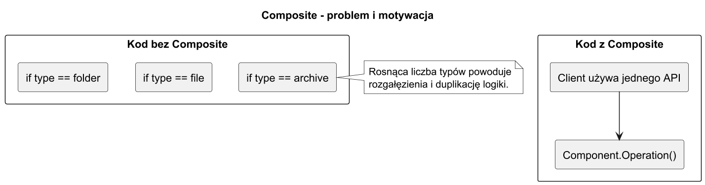
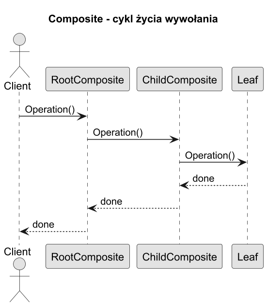

# 01. Idea i kontekst

## Cel rozdziału

Zrozumieć skąd wziął się wzorzec Kompozyt, jakie potrzeby adresuje i dlaczego jest tak często stosowany w strukturach drzewiastych.

## Rys historyczny

1. Przed formalizacją GoF podobne podejścia stosowano w systemach GUI i edytorach dokumentów.
1. W 1994 roku GoF opisało Composite jako wzorzec strukturalny dla relacji część-całość.
1. Współcześnie wzorzec jest podstawą m.in. w DOM, AST, systemach plików i drzewach sceny.

## Centralny problem: hierarchia bez jednolitego interfejsu

Wyobraź sobie menedżera plików. Chcesz obliczyć rozmiar dowolnego węzła — pliku lub katalogu. Bez Kompozytu piszesz:

```csharp
long GetSize(object node)
{
    if (node is FileNode f) return f.Size;
    if (node is DirectoryNode d) return d.Children.Sum(GetSize);
    throw new ArgumentException("Nieznany typ węzła");
}
```

Każda nowa operacja (`Print`, `Search`, `Move`) wymaga kolejnego `if/else` rozgałęzienia. Kompozyt eliminuje to przez wspólny interfejs: `node.GetSize()` działa identycznie dla pliku i katalogu.

## Pięć reprezentatywnych scenariuszy

### Scenariusz 1: System plików (klasyczny)

```
/ (DirectoryNode)
├── src/ (DirectoryNode)
│   ├── Program.cs (FileNode, 12 KB)
│   └── Helpers.cs (FileNode, 4 KB)
└── README.md (FileNode, 2 KB)
```

`GetSize()` na korzeniu sumuje rekurencyjnie wszystkie pliki. Klient nie wie, czy operuje na pliku, czy katalogu — zawsze wywołuje tę samą metodę.

### Scenariusz 2: Struktura organizacyjna firmy

```
CEO (Manager)
├── CTO (Manager)
│   ├── Dev Lead (Manager)
│   │   ├── Developer A (Employee)
│   │   └── Developer B (Employee)
│   └── QA Lead (Employee)
└── CFO (Employee)
```

`GetSalaryBudget()` na `CEO` zwraca sumę budżetu dla całej firmy. `GetSalaryBudget()` na `CTO` — tylko dla działu technicznego. Ten sam interfejs `IOrganizationUnit`, bez rozgałęziania po typie.

### Scenariusz 3: Drzewo wyrażeń matematycznych (AST)

Wyrażenie `(3 + 4) * (2 - 1)` modelowane jako:

```
Multiply (CompositeNode)
├── Add (CompositeNode)
│   ├── Number(3) (LeafNode)
│   └── Number(4) (LeafNode)
└── Subtract (CompositeNode)
    ├── Number(2) (LeafNode)
    └── Number(1) (LeafNode)
```

`Evaluate()` na korzeniu rekurencyjnie oblicza wynik. Kompilatory i kalkulatory budują tak AST. Dodanie nowego operatora nie wymaga zmian w istniejących węzłach.

### Scenariusz 4: Drzewo widgetów UI (React, WPF, Swing)

```
Window (CompositeWidget)
├── Toolbar (CompositeWidget)
│   ├── Button("Save") (LeafWidget)
│   └── Button("Cancel") (LeafWidget)
└── Panel (CompositeWidget)
    ├── Label("Name:") (LeafWidget)
    └── TextBox (LeafWidget)
```

`Render()` na `Window` renderuje całe drzewo. `SetEnabled(false)` na `Panel` wyłącza wszystkie widgety w panelu. Ten mechanizm to dosłowna implementacja Kompozytu w każdym frameworku GUI.

### Scenariusz 5: Bill of Materials — zestawienie materiałów (przemysł)

```
Rower (Product)
├── Rama (Component, 2 kg)
├── Koła (Subassembly)
│   ├── Koło przednie (Subassembly)
│   │   ├── Opona (Part, 0.8 kg)
│   │   └── Obręcz (Part, 1.2 kg)
│   └── Koło tylne (Subassembly)
│       ├── Opona (Part, 0.8 kg)
│       └── Obręcz (Part, 1.2 kg)
└── Napęd (Subassembly)
    ├── Łańcuch (Part, 0.3 kg)
    └── Zębatka (Part, 0.2 kg)
```

`GetTotalWeight()` oblicza wagę zestawu na każdym poziomie. Systemy ERP (SAP, Dynamics) modelują BOM dokładnie tak — jako Kompozyt.

## Intuicja — analogia z życia

Rosyjska matrioszka: każda lalka może zawierać inne lalki lub być ostatnią (liść). Pytasz "ile lalek tu jest?" — bez względu na to, czy trzymasz małą lalkę, czy dużą z dziesięcioma środkami, zawsze otrzymujesz liczbę. Interfejs jest jednolity, implementacja różna.

## Kiedy Kompozyt rozwiązuje realny problem

| Sytuacja | Bez Kompozytu | Z Kompozytem |
|---|---|---|
| Oblicz rozmiar katalogu | `if (file) ... else if (dir)...` w każdej operacji | `node.GetSize()` — zawsze to samo |
| Nowa operacja (np. Search) | Nowy `if/else` rozgałęziający | Nowa metoda w interfejsie |
| Nowy typ węzła | Zmiana kodu we wszystkich operacjach | Nowa klasa implementująca interfejs |
| Głębokość drzewa nieznana | Ręczna pętla z rozgałęzieniem | Rekurencja automatyczna |

## Diagramy

### Problem i motywacja



Źródło: [diagrams/01-problem-context.puml](diagrams/01-problem-context.puml)

### Cykl życia wywołania



Źródło: [diagrams/02-lifecycle-sequence.puml](diagrams/02-lifecycle-sequence.puml)

## Przykładowy program C#

Kod: [Examples/Program.cs](Examples/Program.cs)

```csharp
INode root = DemoTree.Build();
root.Print();
```

Jak działa:

1. `Build()` tworzy drzewo katalogów i plików.
1. `Print()` wywołane na korzeniu przechodzi przez całe poddrzewo.
1. Klient używa tylko interfejsu `INode`, bez wiedzy o szczegółach klas.

Uruchom:

```bash
cd src/12-kompozyt/01-idea-i-kontekst/Examples
dotnet run
```

## Co student powinien zapamiętać

1. Kompozyt eliminuje `if (leaf) / else (composite)` rozgałęzienia po stronie klienta.
1. Klucz to wspólny interfejs `Component` — implementowany zarówno przez liść, jak i gałąź.
1. Gałąź (`Composite`) deleguje operację do dzieci; liść (`Leaf`) wykonuje ją bezpośrednio.
1. Wzorzec pojawia się wszędzie tam, gdzie masz drzewo: DOM, AST, GUI, system plików, BOM.

## Literatura

1. GoF, Design Patterns, Composite.
1. Refactoring.Guru: https://refactoring.guru/design-patterns/composite
