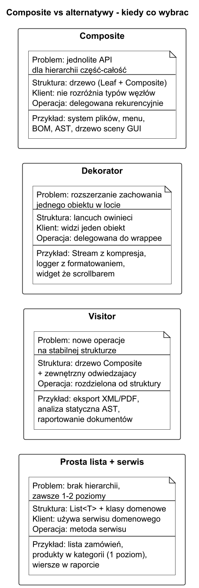

# 02. Kiedy stosować, zalety i wady

## Cel rozdziału

Nauczyć się podejmować decyzję, kiedy Kompozyt jest właściwym wyborem, a kiedy będzie nadmiarowy.

## Krok 1 — czy w ogóle masz problem dla Kompozytu?

Odpowiedź na trzy pytania:

1. **Czy dane tworzą naturalną strukturę drzewiastą (relacja część-całość)?**
   Katalogi zawierają pliki i inne katalogi. Grupy zawierają elementy i inne grupy. Jeśli nie ma hierarchii — Kompozyt nie ma zastosowania.

1. **Czy chcesz wykonywać te same operacje na liściach i gałęziach?**
   `GetSize()`, `Render()`, `Evaluate()`, `GetPrice()` — jeśli ta sama operacja ma działać identycznie na węźle prostym i złożonym, Kompozyt jest kandydatem.

1. **Czy liczba poziomów hierarchii jest zmienna lub nieznana z góry?**
   Gdy masz stałe 2 poziomy (np. zawsze: produkt w kategorii), często wystarczy prosta klasa z listą dzieci. Kompozyt opłaca się gdy głębokość jest dowolna.

Jeśli na wszystkie trzy odpowiedź brzmi TAK — przejdź do kroku 2.

## Krok 2 — który wariant Kompozytu?

| Wariant | Kiedy | Uwagi |
|---|---|---|
| **Transparent Composite** | Klient musi traktować liście i gałęzie absolutnie jednolicie | `Add/Remove` w interfejsie `Component`; liście rzucają `NotSupportedException` |
| **Safe Composite** | Chcesz bezpiecznego API i czytelnych błędów kompilacji | `Add/Remove` tylko w klasie `Composite`, nie ma ich w interfejsie |
| **Composite + Iterator (BFS/DFS)** | Bardzo głębokie drzewa lub potrzeba wielu strategii przejścia | Iterator zewnętrzny zamiast czystej rekurencji |

## Krok 3 — porównanie z alternatywami

| Wzorzec / podejście | Problem, który rozwiązuje | Kiedy wybrać zamiast Kompozytu |
|---|---|---|
| **Kompozyt** | Jednolite API dla hierarchii część-całość | Gdy dane są drzewiaste i operacje mają działać na każdym poziomie |
| **Dekorator** | Rozszerzanie zachowania pojedynczego obiektu w locie | Gdy nie ma hierarchii, tylko jeden obiekt do owinięcia |
| **Visitor** | Nowe operacje na stabilnej strukturze bez zmiany klas | Gdy struktura drzewa jest ustalona, ale często dodajesz nowe operacje |
| **Strategia** | Wymienne algorytmy dla jednego obiektu | Gdy zmieniasz zachowanie, nie strukturę |
| **Prosta lista + serwis** | Płaskie kolekcję bez hierarchii | Gdy masz zawsze 1 poziom lub dane nie są naprawdę drzewiaste |



Źródło: [diagrams/03-vs-patterns.puml](diagrams/03-vs-patterns.puml)

## Procedura decyzyjna — diagram


Źródło: [diagrams/01-decision-tree.puml](diagrams/01-decision-tree.puml)

## Scenariusze decyzyjne — przykłady z życia

### Scenariusz A: system plików (Kompozyt TAK)

- Pliki i katalogi tworzą drzewo.
- `GetSize()`, `Print()`, `Search()` mają działać na obu typach.
- Głębokość katalogu nieznana z góry.

Decyzja: **Kompozyt** (Safe lub Transparent w zależności od tego, czy klient musi obsługiwać `Add` przez interfejs).

### Scenariusz B: struktura organizacyjna firmy (Kompozyt TAK)

- Pracownicy i menedżerowie (menedżer to też pracownik + lista podwładnych).
- `GetSalaryBudget()` zsumuje budżet dla całego poddrzewa działu.
- Raportowanie: "znajdź wszystkich pracowników z projektu X w dziale IT".

Decyzja: **Kompozyt**. Liść: `Employee`, Gałąź: `Manager : Employee`.

### Scenariusz C: koszyk zakupów z pakietami (Kompozyt TAK)

- Koszyk może zawierać produkty oraz zestawy (Bundle).
- Zestaw może zawierać produkty i inne zestawy.
- `GetTotalPrice()` musi działać na kosztyku, zestawie i produkcie.

Decyzja: **Kompozyt**. Liść: `Product`, Gałąź: `Bundle`, Korzeń: `Cart`.

### Scenariusz D: lista zamówień w sklepie (Kompozyt NIE)

- Masz płaską listę zamówień, każde z pozycjami.
- Zawsze dokładnie 2 poziomy: `Order` → `OrderItem`.
- Nie potrzebujesz operacji na obu poziomach przez ten sam interfejs.

Decyzja: **Prosta klasa** `Order` z `List<OrderItem>`. Kompozyt dodałby złożoność bez zysku.

### Scenariusz E: renderowanie UI z Dekoratorem (Kompozyt NIE)

- Chcesz dodać ramkę, cień lub scroll do istniejącego widgetu.
- Nie tworzysz hierarchii, tylko owijasz jeden obiekt w kolejne warstwy.

Decyzja: **Dekorator**, nie Kompozyt. Dekorator rozszerza jeden obiekt; Kompozyt zarządza kolekcją dzieci.

### Scenariusz F: raportowanie z Visitorem (Kompozyt + Visitor)

- Masz stabilną hierarchię dokumentu (Kompozyt).
- Często dodajesz nowe raporty (XMLExport, PDFExport, StatisticsReport).

Decyzja: **Kompozyt + Visitor**. Kompozyt zarządza strukturą; Visitor dodaje operacje bez zmiany klas.

## Checklista decyzyjna — szablon 10 sekund

```
Pytanie                                                 TAK/NIE  Decyzja
------------------------------------------------------------------------
Dane tworzą drzewo (część-całość)?                      [ ]
Ta sama operacja na liściu i gałęzi?                    [ ]
Głębokość hierarchii zmienna lub nieznana?              [ ]

--> Wszystkie TAK => Kompozyt

Chcesz owijać jeden obiekt nowymi zachowaniami?         [ ]   --> Dekorator
Masz stałą strukturę, dużo nowych operacji?             [ ]   --> Visitor
Zawsze dokładnie 1-2 poziomy, różne API?                [ ]   --> Prosta klasa
```

## Zalety

1. Upraszcza kod klienta przez wspólny interfejs — brak `if (leaf) / else (composite)`.
1. Ułatwia rozbudowę hierarchii: nowy typ węzła = nowa klasa, brak zmiany kodu klienta.
1. Rekurencja automatycznie obsługuje dowolną głębokość drzewa.
1. Spójne API: `GetSize()` działa tak samo na pliku i katalogu.

## Wady

1. Trudniej narzucić ograniczenia typów dzieci (np. "folder może zawierać tylko pliki PDF").
1. API może być mniej intuicyjne dla liści jeśli używasz Transparent Composite (`Add/Remove` na liściu).
1. Bardzo głębokie drzewa mogą powodować przepełnienie stosu (Stack Overflow) przy czystej rekurencji.
1. Nadmiar wzorca dla hierarchii o stałej, małej głębokości.

## Przykład C#

Kod: [Examples/Program.cs](Examples/Program.cs)

Program porównuje dwie ścieżki:

1. Hierarchia menu z Kompozytem.
1. Płaska lista komend bez Kompozytu.

```bash
cd src/12-kompozyt/02-kiedy-stosować-zalety-wady/Examples
dotnet run
```

## Źródła

1. Refactoring.Guru Composite: https://refactoring.guru/design-patterns/composite
1. GoF, Design Patterns, Composite.
