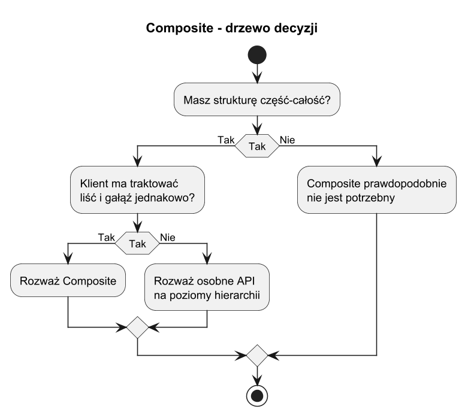
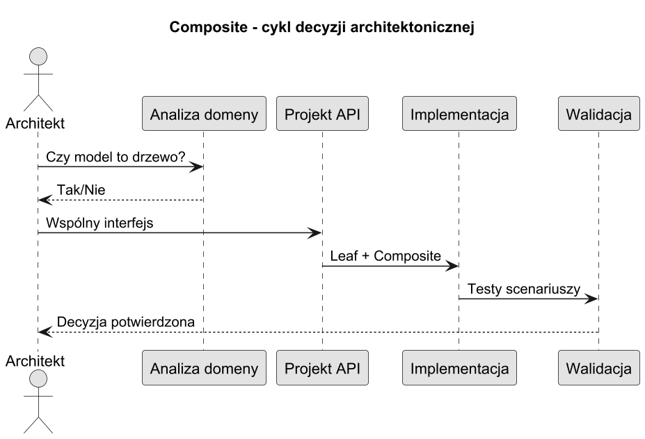

# 02. Kiedy stosować, zalety i wady

## Cel rozdziału

Nauczyć się podejmować decyzję, kiedy Kompozyt jest właściwym wyborem, a kiedy będzie nadmiarowy.

## Kiedy stosować

1. Gdy dane naturalnie tworzą drzewo (część-całość).
1. Gdy klient ma traktować liście i gałęzie jednolicie.
1. Gdy operacje mają działać na całych poddrzewach.

## Zalety

1. Upraszcza kod klienta przez wspólny interfejs.
1. Ułatwia rozbudowę hierarchii bez zmian w logice wywołań.
1. Wspiera rekurencyjne algorytmy agregujące.

## Wady

1. Trudniej narzucić ograniczenia typów dzieci.
1. API może być mniej intuicyjne dla liści (np. `Add/Remove`).
1. Bardzo głębokie drzewa mogą powodować problemy wydajnościowe.

## Diagram decyzji



Źródło: [diagrams/01-decision-tree.puml](diagrams/01-decision-tree.puml)

## Cykl decyzji architektonicznej



Źródło: [diagrams/02-decision-lifecycle.puml](diagrams/02-decision-lifecycle.puml)

## Przykład C#

Kod: [Examples/Program.cs](Examples/Program.cs)

Program porównuje dwie ścieżki:

1. Hierarchia menu z Kompozytem.
1. Płaska lista komend bez Kompozytu.

```bash
cd src/12-kompozyt/02-kiedy-stosowac-zalety-wady/Examples
dotnet run
```

## Wniosek praktyczny

Jeśli potrzebujesz operować na strukturze wielopoziomowej i zachować prostotę klienta, Kompozyt zwykle będzie dobrym wyborem.

## Źródła

1. Refactoring.Guru Composite: https://refactoring.guru/design-patterns/composite
1. GoF, Design Patterns, Composite.
