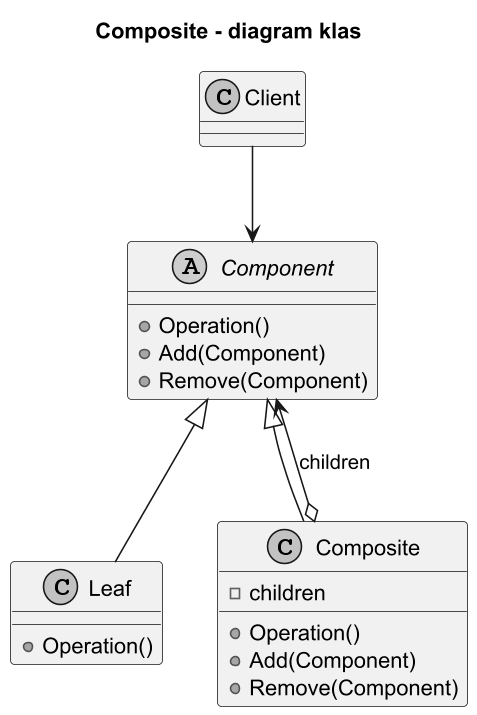
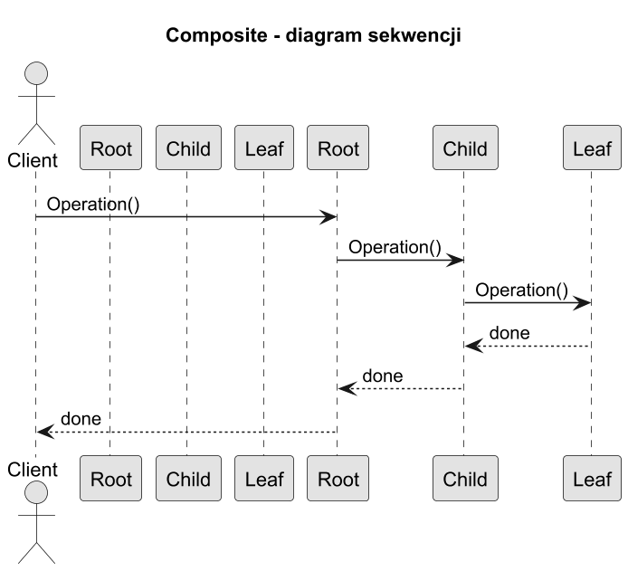

# 03. Jak działa Kompozyt (struktura GoF)

## Cel rozdziału

Poznać role uczestników wzorca i zrozumieć przepływ wywołań między klientem, kompozytem i liściem.

## Role we wzorcu

1. `Component` - wspólny kontrakt operacji.
1. `Leaf` - element końcowy, bez dzieci.
1. `Composite` - element złożony, delegujący operacje do dzieci.
1. `Client` - używa tylko `Component`.

## Diagram klas



Źródło: [diagrams/01-class-diagram.puml](diagrams/01-class-diagram.puml)

## Diagram sekwencji



Źródło: [diagrams/02-sequence.puml](diagrams/02-sequence.puml)

## Jak działa wywołanie

1. Klient uruchamia operację na korzeniu.
1. Kompozyt wykonuje logikę lokalną.
1. Kompozyt deleguje operację do każdego dziecka.
1. Proces powtarza się rekurencyjnie aż do liści.

## Przykład C#

Kod: [Examples/Program.cs](Examples/Program.cs)

Program pokazuje klasyczną strukturę GoF i uruchamia metodę `Operation()` na korzeniu.

```bash
cd src/12-kompozyt/03-struktura-gof-i-jak-dziala/Examples
dotnet run
```

## Źródła

1. Refactoring.Guru Composite: https://refactoring.guru/design-patterns/composite
1. Composite in C#: https://refactoring.guru/design-patterns/composite/csharp/example
