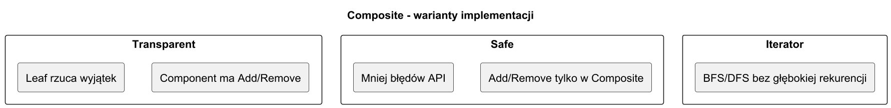
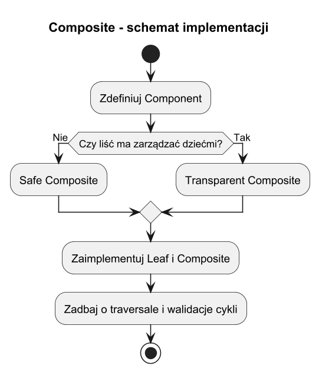

# 04. Typy implementacji i wybór wariantu

## Cel rozdziału

Poznać najczęściej spotykane warianty implementacji Kompozytu i świadomie dobrać właściwy do problemu.

## Typy implementacji

1. Transparent Composite:
Interfejs `Component` zawiera `Add/Remove`, a liście zwracają wyjątek.
2. Safe Composite:
Metody zarządzania dziećmi są tylko w `Composite`, co poprawia bezpieczeństwo API.
3. Composite + Iterator:
Do przejścia po drzewie używany jest iterator (np. BFS/DFS) zamiast czystej rekurencji.

## Jak wybrać właściwy wariant

1. Chcesz maksymalnej prostoty klienta? Rozważ transparent.
1. Chcesz bezpieczniejszego API i mniej błędów? Rozważ safe.
1. Masz bardzo głębokie drzewa lub potrzebę wielu strategii przejścia? Dodaj iterator.

## Diagram porównawczy



Źródło: [diagrams/01-variants.puml](diagrams/01-variants.puml)

## Schemat implementacji



Źródło: [diagrams/02-implementation-scheme.puml](diagrams/02-implementation-scheme.puml)

## Przykład C#

Kod: [Examples/Program.cs](Examples/Program.cs)

Program porównuje wszystkie trzy warianty na tym samym zestawie węzłów:

1. Transparent Composite — `Add/Remove` w bazowej klasie `TransparentComponent`, liść rzuca `NotSupportedException`.
1. Safe Composite — `Add` tylko w `SafeComposite`, liść `SafeLeaf` nie wie nic o dzieciach.
1. Composite + Iterator (BFS) — `IterNode` udostępnia `Children`, a statyczna klasa `BfsIterator` przechodzi drzewo kolejką zamiast czystą rekurencją.

```bash
cd src/12-kompozyt/04-typy-implementacji-i-wybor/Examples
dotnet run
```

## Źródła

1. Refactoring.Guru Composite: https://refactoring.guru/design-patterns/composite
1. Microsoft Learn IEnumerable<T>: https://learn.microsoft.com/dotnet/api/system.collections.generic.ienumerable-1
