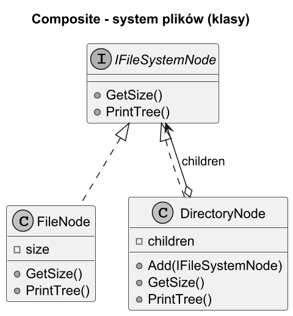
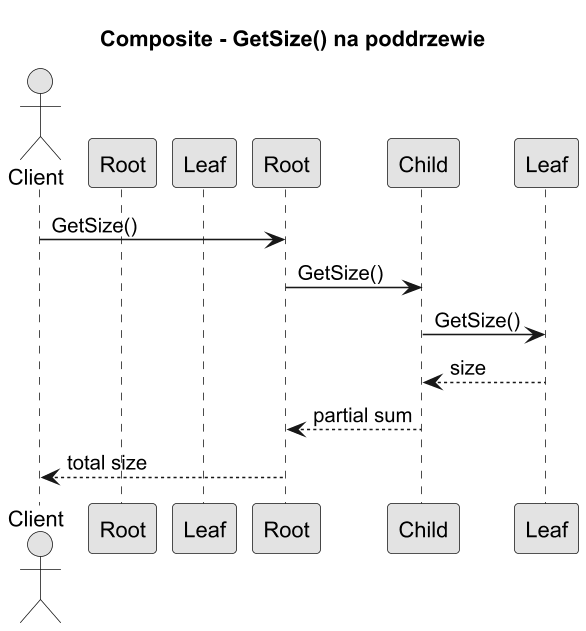

# 05. Duży przykład: system plików

## Cel rozdziału

Przećwiczyć wzorzec Kompozyt na większym, realistycznym przykładzie i zrozumieć konsekwencje projektowe.

## Kontekst

Modelujemy system plików:

1. `FileNode` to liść z rozmiarem.
1. `DirectoryNode` to kompozyt z listą dzieci.
1. `GetSize()` działa na każdym poziomie identycznie.

## Diagram klas



Źródło: [diagrams/01-class-filesystem.puml](diagrams/01-class-filesystem.puml)

## Diagram sekwencji



Źródło: [diagrams/02-sequence-filesystem.puml](diagrams/02-sequence-filesystem.puml)

## Kod C#

Kod: [Examples/Program.cs](Examples/Program.cs)

Najważniejsze fragmenty:

```csharp
long total = root.GetSize();
root.PrintTree();
```

Co pokazuje przykład:

1. Sumowanie rozmiaru całego poddrzewa.
1. Jednolity interfejs dla pliku i katalogu.
1. Brak instrukcji warunkowych po stronie klienta.

Uruchom:

```bash
cd src/12-kompozyt/05-duzy-przyklad-system-plikow/Examples
dotnet run
```

## Kiedy zastosować ten wzorzec tutaj

1. Gdy struktura jest drzewiasta i zagnieżdżona.
1. Gdy chcesz wykonywać operacje agregujące na poddrzewach.
1. Gdy obiekty mają wspólne API niezależnie od poziomu.

## Źródła

1. Refactoring.Guru Composite: https://refactoring.guru/design-patterns/composite
1. Composite in C#: https://refactoring.guru/design-patterns/composite/csharp/example
