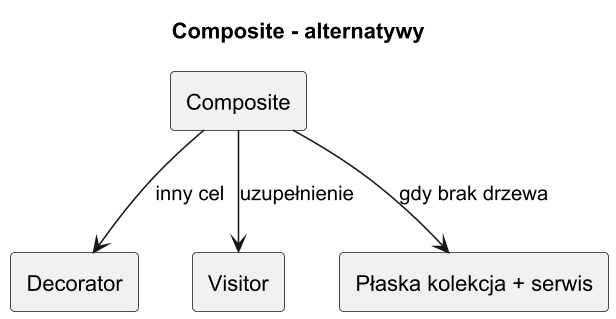
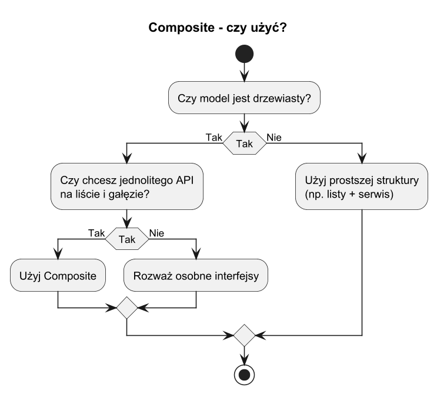

# 06. Alternatywy i kiedy nie wybierać Kompozytu

## Cel rozdziału

Świadomie odróżniać przypadki, w których Kompozyt jest najlepszy, od tych, gdzie lepiej wybrać inne podejście.

## Kiedy nie wybierać Kompozytu

1. Gdy struktura nie jest drzewiasta.
1. Gdy obiekty nie mają wspólnego sensownego interfejsu.
1. Gdy koszty utrzymania hierarchii przewyższają zysk z ujednolicenia API.

## Alternatywy

1. Prosta kolekcja + usługi domenowe (dla płaskich modeli).
1. Decorator (gdy chcesz rozszerzać zachowanie pojedynczych obiektów).
1. Visitor (gdy struktura jest stabilna, ale często dodajesz nowe operacje).
1. Strategy + drzewo danych (gdy zmienia się algorytm, nie struktura).

## Diagram porównawczy



Źródło: [diagrams/01-alternatives.puml](diagrams/01-alternatives.puml)

## Diagram decyzji



Źródło: [diagrams/02-decision.puml](diagrams/02-decision.puml)

## Przykład C#

Kod: [Examples/Program.cs](Examples/Program.cs)

Program pokazuje sytuację, gdzie prostsza lista z agregacją jest wystarczająca i Kompozyt byłby nadmiarowy.

```bash
cd src/12-kompozyt/06-alternatywy-i-kiedy-nie/Examples
dotnet run
```

## Literatura

1. Refactoring.Guru Composite: https://refactoring.guru/design-patterns/composite
1. Refactoring.Guru Visitor: https://refactoring.guru/design-patterns/visitor
1. Refactoring.Guru Decorator: https://refactoring.guru/design-patterns/decorator
