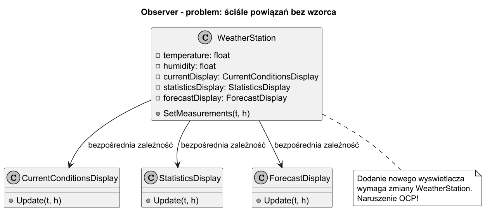
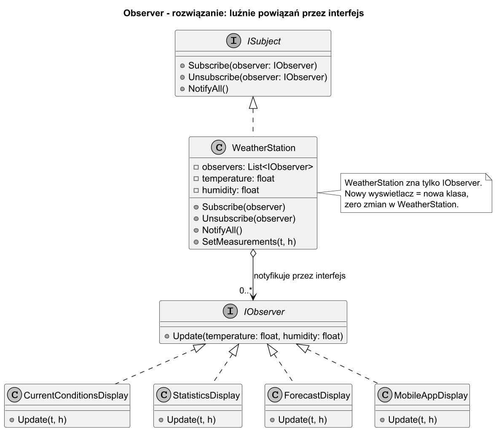

# 01. Idea i kontekst wzorca Obserwator

## Cel rozdziału

Zrozumieć skąd wziął się wzorzec Obserwator, jaki problem rozwiązuje i dlaczego naiwne podejście prowadzi do trudnego w utrzymaniu kodu.

## Rys historyczny

1. **Lata 70–80**: systemy GUI (Smalltalk-80) potrzebowały mechanizmu synchronizacji widoków z modelem danych. Zmiana modelu powinna automatycznie odświeżać wszystkie powiązane widoki.
1. **1987**: wzorzec MVC (Model-View-Controller) w Smalltalk-80 — pierwsza formalizacja relacji obserwator-obserwowany.
1. **1994**: GoF (Gang of Four) opisuje Observer jako wzorzec behawioralny w _Design Patterns_ — oficjalna nazwa i struktura.
1. **Lata 2000+**: w .NET pojawiają się delegaty i zdarzenia (`event`) jako wbudowany mechanizm Obserwatora.
1. **2010+**: Reactive Extensions (Rx), `IObservable<T>` — asynchroniczny, reaktywny Obserwator dla strumieni danych.

## Problem: ścisłe powiązanie (tight coupling)

### Naiwne podejście — bez wzorca

Wyobraź sobie stację pogodową, która mierzy temperaturę. Chcemy wyświetlać dane na trzech ekranach: bieżące warunki, statystyki i prognozę.

```csharp
// BEZ wzorca Obserwator — ścisłe powiązanie
public class WeatherStation
{
    private float _temperature;
    private float _humidity;

    // Stacja BEZPOŚREDNIO zna wszystkie wyświetlacze — tight coupling!
    private readonly CurrentConditionsDisplay _currentDisplay = new();
    private readonly StatisticsDisplay _statisticsDisplay = new();
    private readonly ForecastDisplay _forecastDisplay = new();

    public void SetMeasurements(float temperature, float humidity)
    {
        _temperature = temperature;
        _humidity = humidity;

        // Trzeba ręcznie wywołać każdy wyświetlacz:
        _currentDisplay.Update(_temperature, _humidity);
        _statisticsDisplay.Update(_temperature, _humidity);
        _forecastDisplay.Update(_temperature, _humidity);
        // Dodanie 4. wyświetlacza wymaga ZMIANY tej klasy!
    }
}
```

**Problemy tego podejścia:**

1. `WeatherStation` musi znać każdy wyświetlacz z góry → ścisłe powiązanie.
1. Dodanie nowego wyświetlacza wymaga modyfikacji `WeatherStation` → naruszenie OCP.
1. Nie można dynamicznie dodawać/usuwać wyświetłączy w runtime.
1. Testowanie `WeatherStation` wymaga stworzenia wszystkich wyświetłączy.

## Rozwiązanie: wzorzec Obserwator

Obserwator definiuje relację **jeden-do-wielu** między obiektami:
- **Subject** (Podmiot / Observable) — obiekt, który zmienia stan i powiadamia obserwatorów.
- **Observer** (Obserwator) — obiekt, który chce być powiadamiany o zmianach.

Kluczowa zasada: Subject nie zna konkretnych typów obserwatorów — zna tylko interfejs `IObserver`.

```csharp
// Z wzorcem Obserwator — luźne powiązanie
public interface IObserver
{
    void Update(float temperature, float humidity);
}

public class WeatherStation
{
    private readonly List<IObserver> _observers = new();
    private float _temperature;
    private float _humidity;

    public void Subscribe(IObserver observer) => _observers.Add(observer);
    public void Unsubscribe(IObserver observer) => _observers.Remove(observer);

    public void SetMeasurements(float temperature, float humidity)
    {
        _temperature = temperature;
        _humidity = humidity;
        NotifyAll();
    }

    private void NotifyAll()
    {
        foreach (IObserver obs in _observers)
            obs.Update(_temperature, _humidity);
    }
}
```

Teraz `WeatherStation` nie zna konkretnych wyświetłączy. Nowy wyświetlacz: tylko nowa klasa + `Subscribe()`. Zero zmian w `WeatherStation`.

## Cztery potrzeby, które zaspokaja wzorzec Obserwator

### Potrzeba 1: Luźne powiązanie (Loose Coupling)

Subject i Observer znają się tylko przez interfejs. Można je rozwijać niezależnie, testować osobno, wymieniać implementacje.

### Potrzeba 2: Dynamiczne zarządzanie subskrypcjami

Obserwatorzy mogą się subskrybować i wypisywać w trakcie działania programu. Nie trzeba z góry znać listy subskrybentów.

```csharp
var station = new WeatherStation();
var screen1 = new CurrentConditionsDisplay();

station.Subscribe(screen1);           // dynamicznie dodaj
station.SetMeasurements(22f, 65f);    // screen1 dostaje powiadomienie

station.Unsubscribe(screen1);         // dynamicznie usuń
station.SetMeasurements(18f, 70f);    // screen1 NIE dostaje powiadomienia
```

### Potrzeba 3: Powiadamianie wielu odbiorców jednocześnie

Jeden event/zmiana stanu → automatyczne powiadomienie N obserwatorów. Subject nie musi nic wiedzieć o tym, ilu obserwatorów jest aktualnie aktywnych.

### Potrzeba 4: Rozszerzalność bez modyfikacji

Nowy typ obserwatora (np. `MobileAppDisplay`) nie wymaga żadnych zmian po stronie Subject.

```csharp
// Nowa klasa, zero zmian w WeatherStation:
public class MobileAppDisplay : IObserver
{
    public void Update(float temperature, float humidity)
        => Console.WriteLine($"[Mobile] Temp: {temperature}°C  Hum: {humidity}%");
}

// Użycie:
station.Subscribe(new MobileAppDisplay());
```

## Trzy reprezentatywne scenariusze

### Scenariusz A: Stacja pogodowa z wieloma wyświetlaczami

```
WeatherStation (Subject)
    ├── CurrentConditionsDisplay (Observer)
    ├── StatisticsDisplay (Observer)
    ├── ForecastDisplay (Observer)
    └── MobileAppDisplay (Observer)
```

Gdy pomiar się zmienia → wszystkie wyświetlacze aktualizują się automatycznie.

### Scenariusz B: System notowań giełdowych

```
SharePrice("AAPL") (Subject)
    ├── Investor("Jan") (Observer) — sprzedaj jeśli > 200$
    ├── Investor("Anna") (Observer) — kup jeśli < 150$
    └── AuditLog (Observer) — zapisz każdą zmianę
```

Zmiana ceny akcji → natychmiastowe powiadomienie wszystkich inwestorów.

### Scenariusz C: System zdarzeń UI (click, submit)

```
Button "Wyślij" (Subject)
    ├── FormValidator (Observer) — zwaliduj formularz
    ├── LoadingSpinner (Observer) — pokaż kręcidło
    └── HttpClient (Observer) — wyślij żądanie
```

Kliknięcie przycisku → każdy handler reaguje niezależnie.

## Analogia z życia — tablica ogłoszeń

Gazeta (Subject) publikuje nowe wydanie. Abonenci (Observer) dostają gazetę automatycznie.
- Gazeta nie wie, kim są konkretni abonenci.
- Abonent może się prenumerować lub wypisać w dowolnym momencie.
- Nowy abonent nie wymaga zmian w redakcji.

## Diagramy

### Problem: ścisłe powiązanie bez wzorca



Źródło: [diagrams/01-problem.puml](diagrams/01-problem.puml)

### Rozwiązanie: wzorzec Obserwator



Źródło: [diagrams/02-solution.puml](diagrams/02-solution.puml)

## Przykładowy program C#

Kod: [Examples/Program.cs](Examples/Program.cs)

Uruchom:

```bash
cd src/13-obserwator/01-idea-i-kontekst/Examples
dotnet run
```

Program demonstruje:

1. Naiwne podejście że ścisłym powiązaniem (tight coupling).
1. Refaktoring do wzorca Obserwator.
1. Dynamiczne subskrybowanie i wypisywanie obserwatorów.

## Co student powinien zapamiętać

1. Obserwator rozwiązuje problem ścisłego powiązania przy powiadamianiu wielu obiektów.
1. Subject zna tylko interfejs `IObserver` — nigdy konkretne typy.
1. Subskrypcja i wypisanie działają w runtime dynamicznie.
1. Wzorzec jest fundamentem dla zdarzeń (.NET `event`), Rx, reaktywnych systemów.

## Literatura

1. GoF, Design Patterns, rozdział Observer, s. 293–313.
1. Head First Design Patterns, rozdział 2 — Observer Pattern.
1. Refactoring.Guru — Observer: https://refactoring.guru/design-patterns/observer
1. Microsoft Learn — Observer Design Pattern: https://learn.microsoft.com/en-us/dotnet/standard/events/observer-design-pattern
