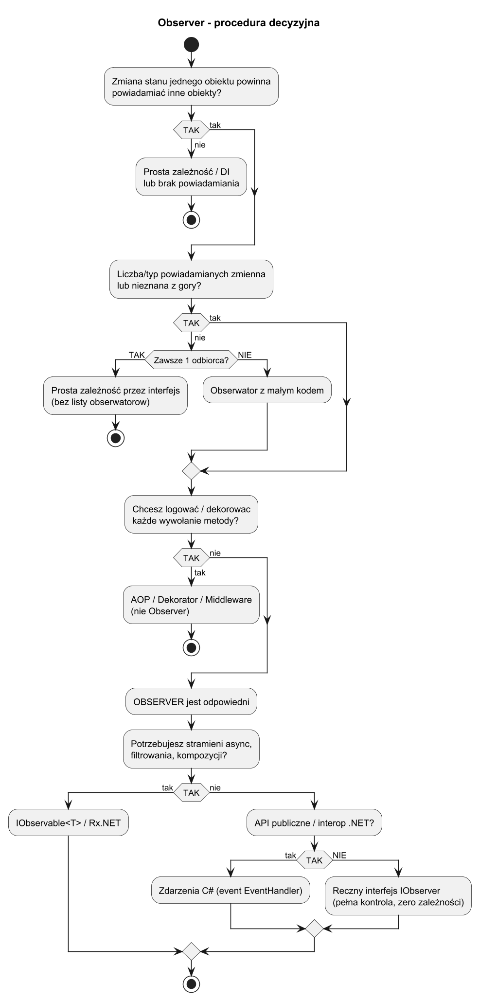

# 02. Kiedy stosować, zalety i wady

## Cel rozdziału

Nauczyć się podejmować świadomą decyzję: kiedy Obserwator jest właściwym narzędziem, a kiedy jest nadmiarowy lub zły.

## Krok 1 — sygnały, że Obserwator jest potrzebny

Odpowiedz na pytania:

1. **Czy zmiana stanu jednego obiektu powinna powiadamiać inne obiekty?**
   Jeśli po `SetValue()` chcesz automatycznie odświeżyć UI, zapisać do logu, wysłać event — to jest klasyczny sygnał dla Obserwatora.

1. **Czy liczba i typ powiadamianych obiektów jest zmienna lub nieznana z góry?**
   Jeśli powiadamiasz zawsze dokładnie 2 konkretne obiekty i to się nie zmienia — prosta bezpośrednia zależność może być czytelniejsza.

1. **Czy chcesz uniknąć ścisłego powiązania między producentem a konsumentem zdarzenia?**
   Subject nie powinien wiedzieć, co obserwatorzy z powiadomieniem zrobią.

1. **Czy potrzebna jest dynamiczna subskrypcja w runtime?**
   Obserwatorzy powinni móc dołączać i odłączać się bez modyfikacji Subject.

## Krok 2 — który wariant Obserwatora?

| Wariant | Kiedy | Zalety | Wady |
|---|---|---|---|
| **Ręczny interfejs** (`IObserver`) | Prosta domena, pełna kontrola | Czytelny, zero zależności | Boilerplate, nie async |
| **Zdarzenia C#** (`event`) | API publiczne, interop z .NET | Naturalny dla C#, BCL konwencja | Może powodować wycieki pamięci |
| **`IObservable<T>`** / Rx.NET | Strumienie danych, async, kompozycja | Potężny, reaktywny, LINQ | Krzywa uczenia Rx |

## Procedura decyzyjna



Źródło: [diagrams/01-decision-tree.puml](diagrams/01-decision-tree.puml)

## Scenariusze decyzyjne

### Scenariusz A: Stacja pomiarowa z dynamicznymi wyświetlaczami (Obserwator TAK)

- Czujnik zbiera dane (temp., wilg., ciśnienie).
- Liczba i typy wyświetlaczy zmieniają się w runtime (np. aplikacja mobilna włączona/wyłączona).
- Wyświetlacze są niezależne od siebie.

Decyzja: **Obserwator** — Subject powiadamia dynamiczną listę obserwatorów przez interfejs.

### Scenariusz B: Powiadamianie inwestorów o zmianie ceny akcji (Obserwator TAK)

- Cena akcji zmienia się → natychmiast powiadamiaj wszystkich zarejestrowanych inwestorów.
- Każdy inwestor ma własną strategię reagowania (sprzedaj/kup/log).
- Inwestorzy dołączają i odchodzą dynamicznie.

Decyzja: **Obserwator** z interfejsem `IInvestor`.

### Scenariusz C: System zdarzeń przycisku UI (zdarzenia C#)

- Przycisk "Wyślij" ma być obsłużony przez wiele handlerów (walidacja, spinner, HTTP).
- API jest publiczne, inne komponenty dołączają handlery przez `+=`.
- Standardowa konwencja .NET.

Decyzja: **Zdarzenia C#** (`event EventHandler`) — wbudowany mechanizm Obserwatora.

### Scenariusz D: Strumień danych GPS (IObservable\<T\>)

- GPS wysyła pozycję 10×/s.
- Chcesz filtrować (tylko ruch > 5 km/h), agregować (co 5 sek.) i wysyłać do API.
- Operacje reaktywne (throttle, debounce, buffer).

Decyzja: **`IObservable<T>` / Rx.NET** — natywne wsparcie dla strumieni i transformacji.

### Scenariusz E: Zapis do logu po każdej operacji (Obserwator NIE — AOP)

- Chcesz logować każde wywołanie każdej metody.
- Nie chcesz modyfikować każdej klasy aby implementowała `IObserver`.

Decyzja: **Aspektowe podejście** (AOP, Dekorator, Middleware) — Obserwator byłby nadmiarowy.

### Scenariusz F: Konfiguracja ładowana raz na start (Obserwator NIE)

- Plik konfiguracyjny jest odczytany raz przy starcie, nie zmienia się w runtime.
- Nie ma potrzeby powiadamiania.

Decyzja: **Prosta zależność** lub DI — Obserwator dodałby zbędny narzut.

## Checklista decyzyjna — 10 sekund

```
Pytanie                                                    TAK/NIE  Decyzja
---------------------------------------------------------------------------
Zmiana stanu powinna powiadamiać inne obiekty?             [ ]
Liczba/typ powiadamianych zmienna lub nieznana?            [ ]
Chcesz uniknąć bezpośredniej zależności?                   [ ]
Potrzebna dynamiczna subskrypcja?                          [ ]

--> Wszystkie TAK => Obserwator

Chcesz logować/transformować każde wywołanie?              [ ]   --> AOP/Dekorator
Powiadamiasz zawsze tylko 1 obiekt?                        [ ]   --> Prosta zależność
Potrzebujesz strumieni, async, filtrowania?                [ ]   --> IObservable<T>/Rx
```

## Zalety

1. **Luźne powiązanie** — Subject i Observer są niezależne; można je rozwijać osobno.
1. **Otwartość na rozszerzenie (OCP)** — nowy Observer = nowa klasa, zero zmian w Subject.
1. **Dynamiczna subskrypcja** — Observer może dołączyć/odłączyć się w dowolnym momencie.
1. **Separacja odpowiedzialności** — Subject generuje zdarzenie, Observer decyduje co z nim zrobić.

## Wady

1. **Nieoczekiwana kolejność powiadamiania** — kolejność notyfikacji zależy od kolejności rejestracji; nie ma gwarancji co do porządku.
1. **Wycieki pamięci** — Observer zarejestrowany, ale nigdy nie wypisany trzyma Subject przy życiu (szczególnie z `event`).
1. **Kaskadowe aktualizacje** — Observer A po powiadomieniu modyfikuje Subject → kolejna rundia notyfikacji → możliwe nieskończone pętle.
1. **Trudność debugowania** — łańcuch powiadamiania jest niejawny; trudno śledzić kto i kiedy reaguje na zdarzenie.
1. **Wydajność** — przy bardzo wielu Observatorach lub bardzo częstych zmianach stanu, notyfikacje mogą być kosztowne.

## Porównanie z powiązanymi wzorcami

| Wzorzec | Główna różnica od Obserwatora |
|---|---|
| **Mediator** | Mediator centralizuje komunikację między wieloma stronami; Obserwator jest jednostronny (Subject → Observer) |
| **Łańcuch zobowiązań** | Łańcuch przekazuje żądanie do pierwszego obsługującego; Obserwator powiadamia wszystkich |
| **Zdarzenia C#** | Wbudowany syntactic sugar dla Obserwatora; konwencja .NET |
| **Pub/Sub (Message Bus)** | Broker pośredniczy między wydawcą a subskrybentami; Subject i Observer nie znają się bezpośrednio |

## Przykład C#

Kod: [Examples/Program.cs](Examples/Program.cs)

Program pokazuje:

1. Scenariusz z poprawnym użyciem Obserwatora (giełda akcji).
1. Demonstrację potencjalnego wycieku pamięci przy użyciu `event` bez wypisania.

```bash
cd src/13-obserwator/02-kiedy-stosowac-zalety-wady/Examples
dotnet run
```

## Literatura

1. GoF, Design Patterns, Observer — s. 293–313.
1. Refactoring.Guru — Observer: https://refactoring.guru/design-patterns/observer
1. Microsoft Learn — Observer Design Pattern: https://learn.microsoft.com/en-us/dotnet/standard/events/observer-design-pattern
