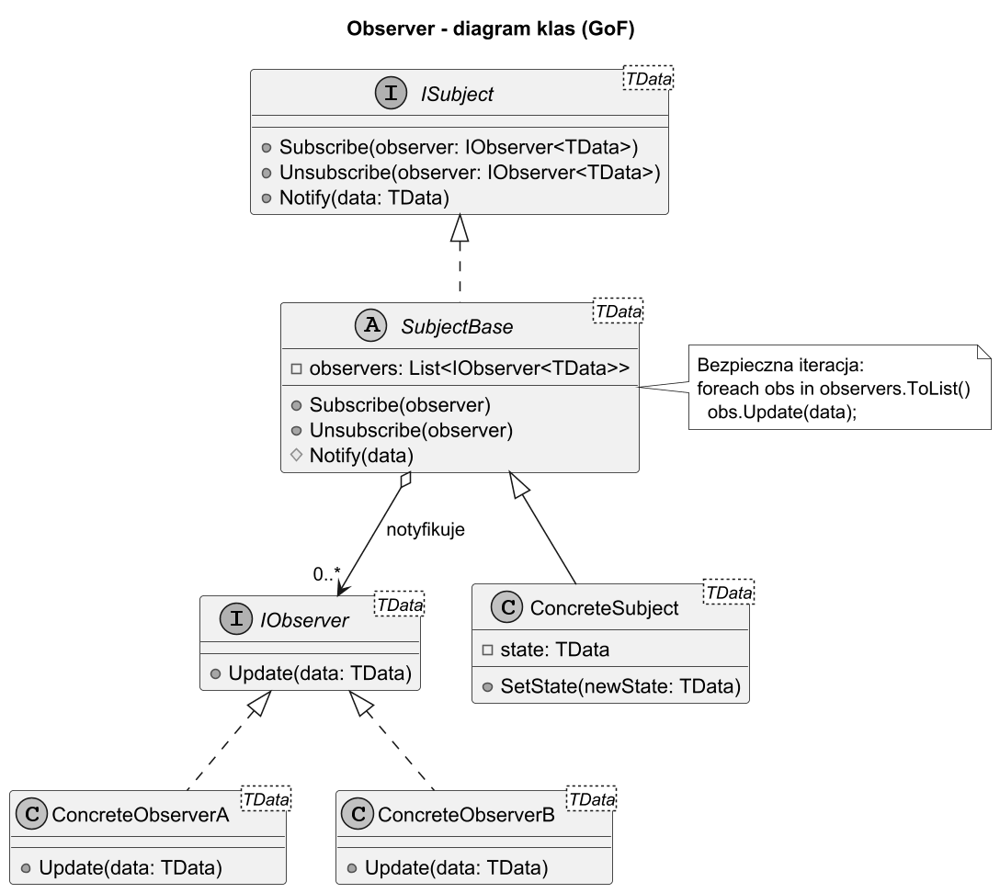
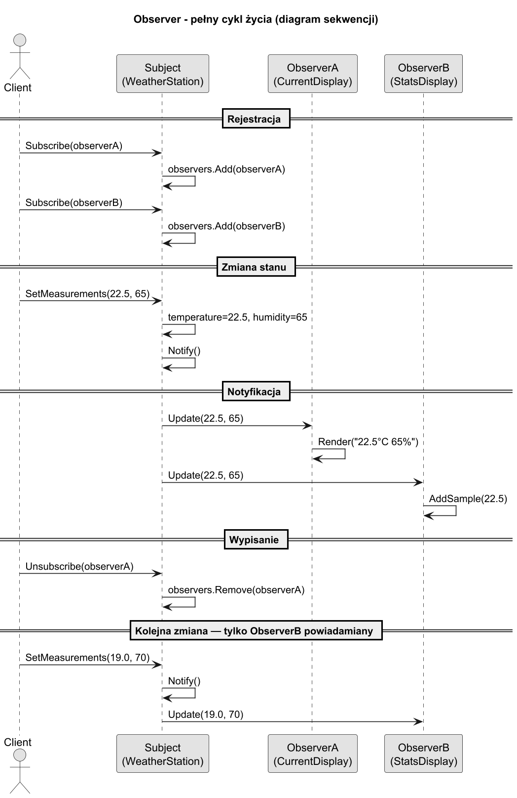
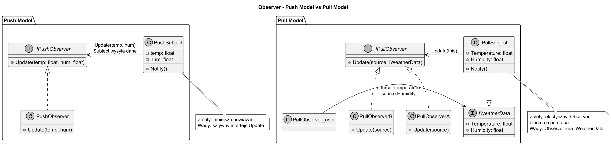

# 03. Struktura GoF i jak działa

## Cel rozdziału

Poznać formalne rolę wzorca Obserwator według GoF, zobaczyć diagramy klas i sekwencji oraz zrozumieć różnicę między modelem Push i Pull.

## Rolę wzorca według GoF

| Rola | Opis | Przykład |
|---|---|---|
| **Subject** (Observable) | Przechowuje stan; zarządza listą obserwatorów; wywołuje `Notify()` | `WeatherStation`, `Share` |
| **ConcreteSubject** | Konkretna implementacja Subject z własnym stanem | `ConcreteWeatherStation` |
| **Observer** | Interfejs z metodą `Update()` | `IWeatherObserver`, `IObserver<T>` |
| **ConcreteObserver** | Konkretna implementacja obserwatora; reaguje na zmianę | `CurrentConditionsDisplay`, `Investor` |

## Diagram klas GoF



Źródło: [diagrams/01-class-gof.puml](diagrams/01-class-gof.puml)

## Diagram sekwencji — pełny cykl życia



Źródło: [diagrams/02-sequence.puml](diagrams/02-sequence.puml)

Kroki:

1. **Rejestracja**: `Observer.Subscribe(self)` → Subject dodaje do listy.
1. **Zmiana stanu**: klient wywołuje `Subject.SetState(newValue)`.
1. **Notyfikacja**: Subject iteruje listę i wywołuje `observer.Update(...)` na każdym.
1. **Reakcja**: ConcreteObserver przetwarza dane (odświeża UI, zapisuje do logu, itp.).
1. **Wypisanie**: `Observer.Unsubscribe(self)` → Subject usuwa z listy.

## Model Push vs Pull

Kluczowe pytanie projektowe: **kto dostarcza dane do obserwatora?**

### Model Push — Subject wysyła dane w `Update()`

Subject przekazuje dane bezpośrednio przez parametry `Update()`. Observer dostaje to, co Subject zdecyduje wysłać.

```csharp
// Push: Subject decyduje co wysłać
public interface IObserverPush
{
    void Update(float temperature, float humidity, float pressure);
}

// Wywołanie w Subject:
foreach (var obs in _observers)
    obs.Update(_temperature, _humidity, _pressure);
```

**Zalety:**
- Observer nie musi "wracać" do Subject po dane → mniejsze powiązanie.
- Prosto w implementacji.

**Wady:**
- Interfejs `Update()` jest sztywny — dodanie nowego pola wymaga zmiany wszystkich Observer.
- Observer dostaje dane których może nie potrzebować.

### Model Pull — Observer pobiera dane że Subject

Subject wysyła tylko powiadomienie "coś się zmieniło". Observer sam pobiera potrzebne dane.

```csharp
// Pull: Observer sam pobiera dane
public interface IObserverPull
{
    void Update(IWeatherData source);
}

public interface IWeatherData
{
    float Temperature { get; }
    float Humidity { get; }
    float Pressure { get; }
}

// Wywołanie w Subject:
foreach (var obs in _observers)
    obs.Update(this);  // przekazujemy siebie jako IWeatherData

// Observer pobiera tylko to, czego potrzebuje:
public class TemperatureDisplay : IObserverPull
{
    public void Update(IWeatherData source)
        => Console.WriteLine($"Temp: {source.Temperature}°C");
    // Nie interesuje go humidity ani pressure
}
```

**Zalety:**
- Observer bierze tylko potrzebne dane.
- Dodanie nowych pól do Subject nie zmienia interfejsu `Update()`.
- Łatwiejsze rozszerzanie.

**Wady:**
- Observer jest powiązany z interfejsem/typem Subject (musi go znać).
- Wymaga dostępu do Subject w czasie `Update()`.

### Porównanie Push vs Pull

| Kryterium | Push | Pull |
|---|---|---|
| Kto dostarcza dane | Subject | Observer |
| Interfejs `Update` | `Update(data1, data2, ...)` | `Update(ISubject source)` |
| Spójność danych | Gwarantowana (snapshot w momencie notify) | Observer może odczytać inny stan po notify |
| Zależność Observer→Subject | Brak (lub słabsza) | Observer zna typ/interfejs Subject |
| Rozszerzalność | Zmiana parametrów → zmiana wszystkich Observer | Dodanie pola do Subject — Observer bierze co chce |
| Kiedy użyć | Mały zestaw zawsze potrzebnych danych | Observer potrzebuje różnych danych; Subject ewoluuje |

## Diagram Push vs Pull



Źródło: [diagrams/03-push-pull.puml](diagrams/03-push-pull.puml)

## Implementacja bazowa w C#

```csharp
// Interfejsy
public interface IObserver<TData>
{
    void Update(TData data);
}

public interface ISubject<TData>
{
    void Subscribe(IObserver<TData> observer);
    void Unsubscribe(IObserver<TData> observer);
    void Notify(TData data);
}

// Bazowa klasa Subject — boilerplate do wielokrotnego użycia
public abstract class SubjectBase<TData> : ISubject<TData>
{
    private readonly List<IObserver<TData>> _observers = new();

    public void Subscribe(IObserver<TData> observer)
    {
        if (!_observers.Contains(observer))
            _observers.Add(observer);
    }

    public void Unsubscribe(IObserver<TData> observer)
        => _observers.Remove(observer);

    protected void Notify(TData data)
    {
        // Kopia listy — bezpieczna iteracja gdy Unsubscribe w Update
        foreach (IObserver<TData> obs in _observers.ToList())
            obs.Update(data);
    }
}
```

## Implementacja Pull z `IWeatherData`

```csharp
public interface IWeatherData
{
    float Temperature { get; }
    float Humidity { get; }
}

public interface IWeatherObserver
{
    void Update(IWeatherData source);
}

public class WeatherStation : IWeatherData
{
    private readonly List<IWeatherObserver> _observers = new();
    public float Temperature { get; private set; }
    public float Humidity { get; private set; }

    public void Subscribe(IWeatherObserver obs) => _observers.Add(obs);

    public void SetMeasurements(float temp, float hum)
    {
        Temperature = temp;
        Humidity = hum;
        foreach (var obs in _observers.ToList())
            obs.Update(this);  // Pull: przekazujemy siebie
    }
}
```

## Przykładowy program C#

Kod: [Examples/Program.cs](Examples/Program.cs)

Program porównuje oba modele (Push i Pull) na tym samym scenariuszu (stacja pogodowa):

```bash
cd src/13-obserwator/03-struktura-gof-i-jak-działa/Examples
dotnet run
```

## Co student powinien zapamiętać

1. Subject zarządza listą Observer przez interfejs — nigdy przez konkretne klasy.
1. Push: Subject wysyła dane w parametrach `Update()` — prosto, ale mniej elastycznie.
1. Pull: Observer pobiera dane że Subject — bardziej rozszerzalne, ale wymaga zależności od Subject.
1. Bezpieczna iteracja: kopiuj listę przed `foreach` gdy obserwator może się wypisać w `Update()`.

## Literatura

1. GoF, Design Patterns, Observer — s. 293–313.
1. Head First Design Patterns, rozdział 2 — Observer Pattern.
1. Refactoring.Guru — Observer: https://refactoring.guru/design-patterns/observer
