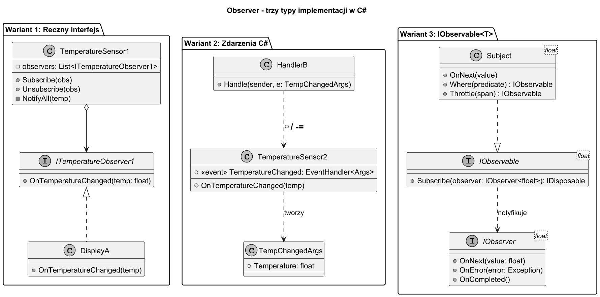
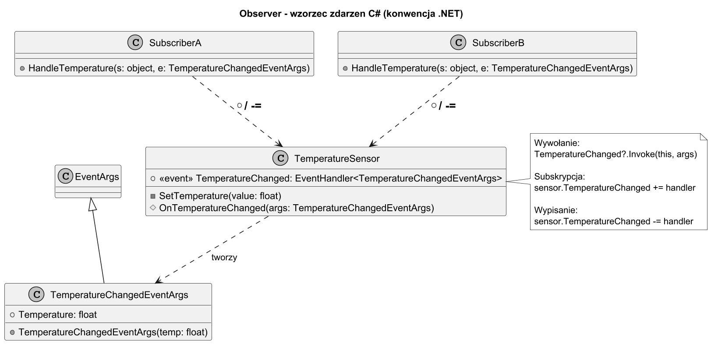

# 04. Typy implementacji i wybór

## Cel rozdziału

Poznać trzy warianty implementacji wzorca Obserwator w C# i wiedzieć, kiedy wybrać każdy z nich.

## Trzy warianty w C#

### Wariant 1 — Ręczny interfejs (`IObserver`)

Klasyczna implementacja GoF. Definiujemy własny interfejs obserwatora.

```csharp
public interface ITemperatureObserver
{
    void OnTemperatureChanged(float temperature);
}

public class TemperatureSensor
{
    private readonly List<ITemperatureObserver> _observers = new();

    public void Subscribe(ITemperatureObserver obs) => _observers.Add(obs);
    public void Unsubscribe(ITemperatureObserver obs) => _observers.Remove(obs);

    private void NotifyAll(float temp)
    {
        foreach (var obs in _observers.ToList())
            obs.OnTemperatureChanged(temp);
    }
}
```

**Kiedy użyć:**
- Prosta domena z pełną kontrolą.
- Brak zależności zewnętrznych (zero NuGet).
- Interfejs obserwatora ma więcej niż jedną metodę (np. `OnStart()`, `OnStop()`, `OnError()`).

**Wady:** Boilerplate kodu. Nie obsługuje `async/await` bez dodatkowej pracy.

---

### Wariant 2 — Zdarzenia C# (`event EventHandler<T>`)

Wbudowany mechanizm Obserwatora. Konwencja .NET z `EventArgs`.

```csharp
public class TemperatureChangedEventArgs : EventArgs
{
    public float Temperature { get; }
    public TemperatureChangedEventArgs(float temp) => Temperature = temp;
}

public class TemperatureSensor
{
    public event EventHandler<TemperatureChangedEventArgs>? TemperatureChanged;

    protected virtual void OnTemperatureChanged(float temp)
        => TemperatureChanged?.Invoke(this, new TemperatureChangedEventArgs(temp));
}

// Subskrypcja:
sensor.TemperatureChanged += (sender, e) => Console.WriteLine($"Temp: {e.Temperature}°C");

// Wypisanie:
sensor.TemperatureChanged -= handler;
```

**Kiedy użyć:**
- API publiczne (biblioteka, framework) — to jest konwencja .NET.
- Chcesz korzystać z lambdy jako handlera.
- Interop z WinForms, WPF, ASP.NET.

**Wady:**
- Potencjalny wyciek pamięci jeśli nie wypisano (`-=`).
- Trudność z `async` w handlerach zdarzeń.
- Kolejność handlerów nie jest gwarantowana.

---

### Wariant 3 — `IObservable<T>` / Rx.NET

Reaktywny model z LINQ i kompozycją operatorów. Część Reactive Extensions (System.Reactive).

```csharp
using System.Reactive.Subjects;
using System.Reactive.Linq;

var subject = new Subject<float>();

// Subskrypcja z filtrowaniem
IDisposable sub = subject
    .Where(temp => temp > 25f)
    .Throttle(TimeSpan.FromMilliseconds(500))
    .Subscribe(temp => Console.WriteLine($"Upał! {temp}°C"));

subject.OnNext(22f);  // zignorowane (< 25)
subject.OnNext(30f);  // powiadomi po 500ms
subject.OnNext(35f);  // resetuje throttle

sub.Dispose();  // bezpieczne wypisanie
```

**Kiedy użyć:**
- Strumienie danych (GPS, sensory, WebSocket).
- Potrzebujesz operatorów: `Where`, `Select`, `Throttle`, `Debounce`, `Buffer`, `Merge`.
- Integracja z `async/await` (`.ToTask()`, `await foreach`).

**Wady:**
- Krzywa uczenia Rx.NET (operatory, marble diagrams).
- Dodatkowa zależność NuGet (`System.Reactive`).
- Debugowanie strumieni bywa trudne.

---

## Tabela wyboru wariantu

| Kryterium | Interfejs | Zdarzenia C# | IObservable/Rx |
|---|---|---|---|
| Złożoność implementacji | Niska | Niska | Wysoka |
| Zależność NuGet | Brak | Brak | System.Reactive |
| Async/await | Manualne | Trudne | Natywne |
| LINQ / filtrowanie | Nie | Nie | Tak |
| Konwencja .NET | Nie | **Tak** | Tak |
| Wycieki pamięci | Niskie ryzyko | Ryzyko z `event` | IDisposable chroni |
| Wiele metod w obserwatorze | Łatwe | Osobne eventy | Nie |
| Debugowalność | Wysoka | Średnia | Niska |

## Diagram — typy implementacji



Źródło: [diagrams/01-impl-types.puml](diagrams/01-impl-types.puml)

## Diagram — wzorzec zdarzeń C#



Źródło: [diagrams/02-event-pattern.puml](diagrams/02-event-pattern.puml)

## Przykładowy program C#

Kod: [Examples/Program.cs](Examples/Program.cs)

Ten sam scenariusz (czujnik temperatury) zaimplementowany trzema sposobami:

```bash
cd src/13-obserwator/04-typy-implementacji-i-wybor/Examples
dotnet run
```

## Reguła praktyczna

> Zacznij od **interfejsu** (wariant 1) — prosto i czytelnie.
> Użyj **zdarzeń C#** (wariant 2) gdy piszesz publiczne API lub chcesz lambda handlerów.
> Sięgnij po **`IObservable<T>`** (wariant 3) gdy potrzebujesz transformacji, filtrowania lub async strumieni.

## Literatura

1. Microsoft Docs — Events (C#): https://learn.microsoft.com/en-us/dotnet/standard/events/
1. Reactive Extensions (Rx.NET): https://github.com/dotnet/reactive
1. Microsoft Learn — Observer Design Pattern: https://learn.microsoft.com/en-us/dotnet/standard/events/observer-design-pattern
