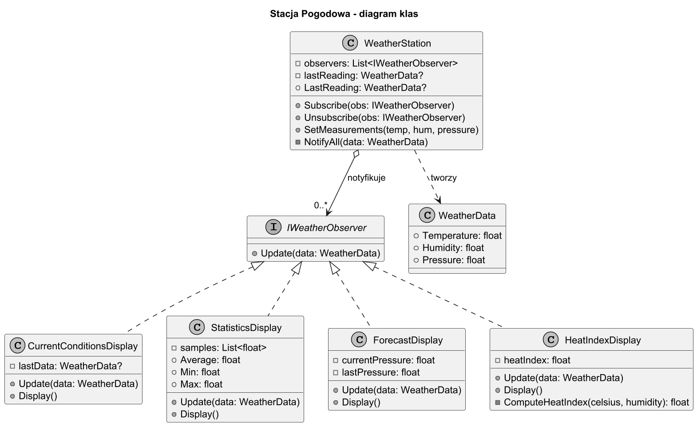
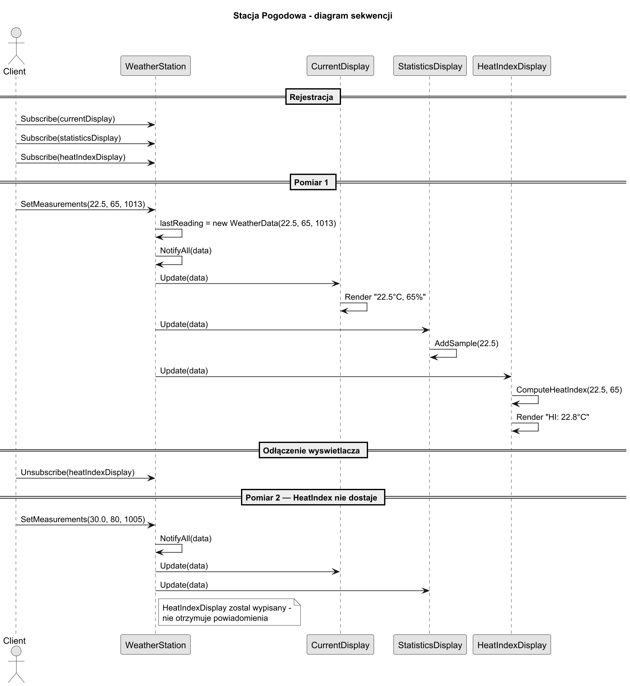
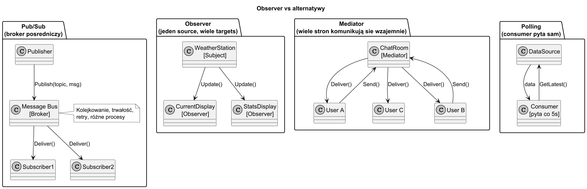

# 05. Duży przykład i alternatywy

## Cel rozdziału

Zobaczyć kompletny projekt korzystający z wzorca Obserwator, oraz poznać alternatywne wzorce i wiedzieć kiedy ich użyć zamiast Obserwatora.

## Studium przypadku: Stacja Pogodowa

### Opis domeny

System zbiera pomiary z czujników (temperatura, wilgotność, ciśnienie) i wysyła je do różnych wyświetłączy. Wymagania:

1. Wyświetlacze dołączają i odłączają się w runtime (np. aplikacja mobilna otwierana i zamykana).
1. Każdy wyświetlacz przetwarza dane inaczej (bieżące, statystyki, prognoza, indeks ciepła).
1. Dodanie nowego wyświetlacza nie może wymagać modyfikacji czujnika.
1. Czujnik nie może "wiedzieć" co wyświetlacze z danymi zrobią.

### Decyzja projektowa

Wzorzec Obserwator (model Push):

- Subject: `WeatherStation` — zarządza listą `IWeatherObserver`.
- Observer: `IWeatherObserver` z metodą `Update(WeatherData)`.
- ConcreteObserver: `CurrentConditionsDisplay`, `StatisticsDisplay`, `ForecastDisplay`, `HeatIndexDisplay`.

### Diagram klas



Źródło: [diagrams/01-class-diagram.puml](diagrams/01-class-diagram.puml)

### Diagram sekwencji



Źródło: [diagrams/02-sequence.puml](diagrams/02-sequence.puml)

## Obliczenie Heat Index

Indeks ciepła (Heat Index) łączy temperaturę i wilgotność:

$$HI = c_1 + c_2 T + c_3 R + c_4 TR + c_5 T^2 + c_6 R^2 + c_7 T^2 R + c_8 TR^2 + c_9 T^2 R^2$$

gdzie $T$ = temperatura (°F), $R$ = wilgotność (%), stałe $c_1..c_9$ z NOAA.

W kodzie używamy uproszczonej wersji (Head First Design Patterns, s. 68):

```csharp
static float ComputeHeatIndex(float celsius, float humidity)
{
    float t = celsius * 9f / 5f + 32f; // Fahrenheit
    float heatIndex =
        16.923f + 0.185212f * t + 5.37941f * humidity
        - 0.100254f * t * humidity
        + 0.00941695f * (t * t)
        + 0.00728898f * (humidity * humidity)
        + 0.000345372f * (t * t * humidity)
        - 0.000814971f * (t * humidity * humidity)
        + 0.0000102102f * (t * t * humidity * humidity)
        - 0.000038646f * (t * t * t)
        + 0.0000291583f * (humidity * humidity * humidity)
        + 0.00000142721f * (t * t * t * humidity)
        + 0.000000197483f * (t * humidity * humidity * humidity)
        - 0.0000000218429f * (t * t * t * humidity * humidity)
        + 0.000000000843296f * (t * t * humidity * humidity * humidity)
        - 0.0000000000481975f * (t * t * t * humidity * humidity * humidity);

    return (heatIndex - 32f) * 5f / 9f; // z powrotem do Celsius
}
```

## Implementacja C#

Kod: [Examples/Program.cs](Examples/Program.cs)

Testy: [Tests/WeatherStationTests.cs](Tests/WeatherStationTests.cs)

```bash
cd src/13-obserwator/05-duży-przykład-i-alternatywy/Examples
dotnet run

cd src/13-obserwator/05-duży-przykład-i-alternatywy/Tests
dotnet test
```

## Alternatywne wzorce

### Kiedy Obserwator nie wystarczy?

Obserwator jest jednostronny: Subject → Observer. W bardziej złożonych scenariuszach potrzebujemy innych wzorców.

### Mediator

**Problem**: Obserwatorzy muszą komunikować się ze sobą (nie tylko z Subject).

**Przykład**: Panel kontrolny z wieloma czujnikami, gdzie wyświetlacz temperatury musi wiedzieć o stanie czujnika wilgotności, i vice versa.

```
Obserwator:       Subject → Observer1, Observer2
Mediator:         Observer1 ↔ Mediator ↔ Observer2
```

Użyj **Mediatora** gdy:
- Komponenty muszą komunikować się ze sobą, nie tylko z jednym źródłem.
- Chcesz centralizować i kontrolować logikę interakcji między komponentami.

### Pub/Sub (Message Bus)

**Problem**: Subject i Observer nie mogą się znać bezpośrednio (różne moduły, mikroserwisy).

```
Obserwator:       Subject trzyma referencję do Observerów
Pub/Sub:          Publisher → Bus → Subscriber (broker pośredniczy)
```

Użyj **Pub/Sub** gdy:
- Producent i konsument żyją w różnych procesach lub serwisach.
- Potrzebujesz kolejkowania, trwałości, ponawiania wiadomości.
- Przykłady: RabbitMQ, Azure Service Bus, Apache Kafka.

### Polling

**Problem**: Notyfikacje push są zbyt częste lub kosztowne.

```
Obserwator: Subject pushuje → Observer przy każdej zmianie
Polling:    Observer pyta Subject co określony czas
```

Użyj **Pollingu** gdy:
- Dane zmieniają się rzadko, ale pytania są tanie.
- Nie możesz zmodyfikować Subjectu aby wspierał subskrypcję.
- Dopuszczasz opóźnienie w odcżycie danych.

### Diagram porównawczy



Źródło: [diagrams/03-alternatives.puml](diagrams/03-alternatives.puml)

## Tabela decyzyjna: Observer vs alternatywy

| Pytanie | Observer | Mediator | Pub/Sub | Polling |
|---|---|---|---|---|
| Jeden subject, wiele observerów? | **TAK** | Nie | Nie | Nie |
| Observerzy komunikują się ze sobą? | Nie | **TAK** | Nie | Nie |
| Różne procesy/serwisy? | Nie | Nie | **TAK** | Czasem |
| Dopuszczasz opóźnienie? | Nie | Nie | Nie | **TAK** |
| Kolejkowanie / trwałość? | Nie | Nie | **TAK** | Nie |

## Testy jednostkowe

Scenariusze testów: [Tests/WeatherStationTests.cs](Tests/WeatherStationTests.cs)

1. Subskrypcja i powiadamianie — obserwator otrzymuje dane po `SetMeasurements`.
1. Wypisanie — obserwator nie otrzymuje danych po `Unsubscribe`.
1. Wiele obserwatorów — każdy otrzymuje niezależnie.
1. Spójność stanu — `WeatherStation.LastReading` odzwierciedla ostatnie pomiary.
1. Wypisanie w trakcie powiadamiania — bezpieczna iteracja nie rzuca wyjątku.

## Literatura

1. GoF, Design Patterns, Observer — s. 293–313.
1. Head First Design Patterns, rozdział 2 — Observer Pattern + Heat Index.
1. Refactoring.Guru — Observer: https://refactoring.guru/design-patterns/observer
1. Enterprise Integration Patterns — Publish-Subscribe Channel: https://www.enterpriseintegrationpatterns.com/patterns/messaging/PublishSubscribeChannel.html
