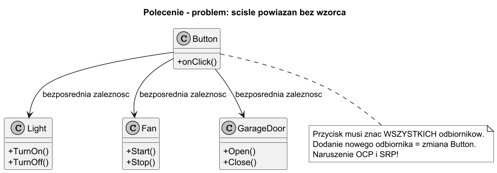
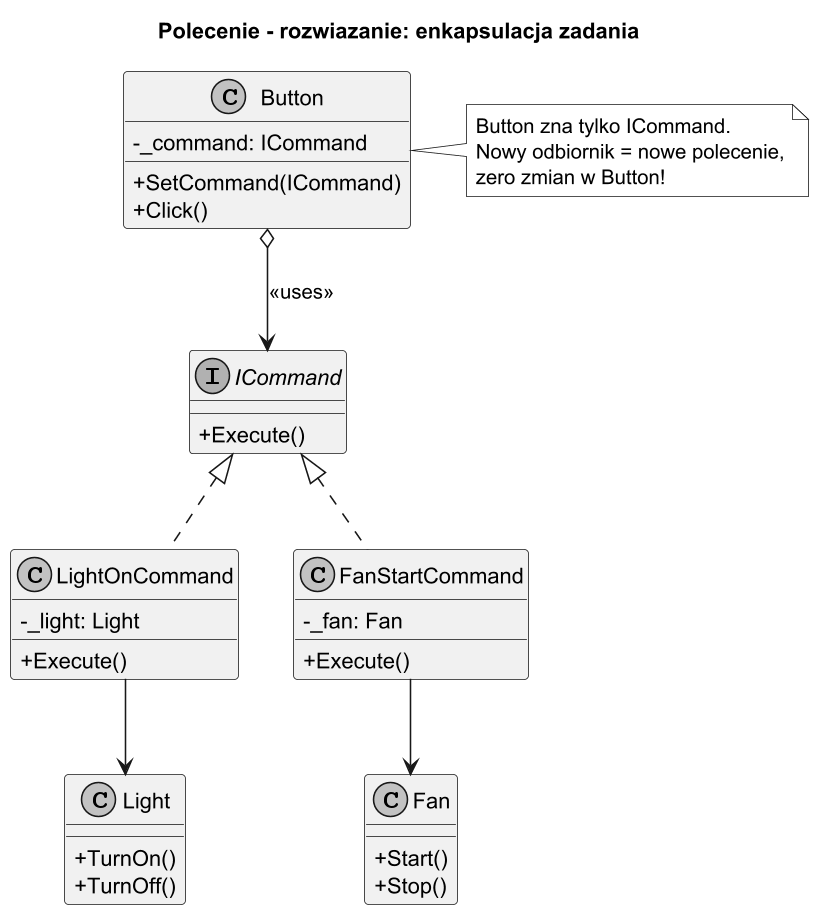

# 01. Idea i kontekst wzorca Polecenie

## Cel rozdziału

Zrozumieć skąd wziął się wzorzec Polecenie, jaki problem rozwiązuje i dlaczego naiwne podejście prowadzi do trudnego w utrzymaniu kodu.

## Rys historyczny

1. **Lata 70–80**: systemy GUI (Smalltalk-80, Xerox Star) wymagały możliwości przypisania dowolnej akcji do przycisku lub skrótu klawiszowego. Akcja nie powinna być „wbudowana" w widget.
1. **1988**: Brad Cox i Tom Love opisują w Objective-C wzorzec przekazywania komunikatów (message passing) — prekursor Polecenia.
1. **1994**: GoF (Gang of Four) formalizuje wzorzec jako *Command* w rozdziale wzorców behawioralnych (*Design Patterns*, str. 233–242). Klasycznym przykładem jest system menu i pasek narzędzi edytora tekstu.
1. **Lata 2000+**: .NET Framework wprowadza `System.Windows.Input.ICommand` (WPF) — gotową implementację wzorca w ekosystemie Microsoft.
1. **Lata 2010+**: wzorzec staje się fundamentem **event sourcing** i **CQRS** (Command Query Responsibility Segregation) w architekturach rozproszonych.

## Problem: ścisłe powiązanie (tight coupling)

### Naiwne podejście — bez wzorca

Wyobraź sobie panel sterowania z przyciskami. Każdy przycisk powinien wykonywać inną akcję: włączyć światło, uruchomić wentylator, otworzyć bramę garażową.

```csharp
// BEZ wzorca Polecenie — ścisłe powiązanie (tight coupling)
public class NaiveButton
{
    // Przycisk bezpośrednio zna WSZYSTKICH odbiorców — problem!
    private readonly Light _light = new("Salon");
    private readonly Fan _fan = new();
    private readonly GarageDoor _door = new();

    // Każda nowa akcja = nowa metoda w Button — naruszenie SRP i OCP!
    public void ClickTurnOnLight()  => _light.TurnOn();
    public void ClickStartFan()     => _fan.Start();
    public void ClickOpenDoor()     => _door.Open();
}
```

**Problemy tego podejścia:**

1. `Button` zna każdy odbiornik z góry — zmiana odbiornika = zmiana `Button`.
1. Dodanie nowej akcji (np. sterowanie muzyką) wymaga modyfikacji `Button` — naruszenie **OCP**.
1. `Button` odpowiada za więcej niż za jedno zadanie — naruszenie **SRP**.
1. Akcji nie można kolejkować, rejestrować ani cofać.
1. Testowanie `Button` bez uruchamiania sprzętu jest niemożliwe.

Diagram poniżej ilustruje te zależności:



## Rozwiązanie: wzorzec Polecenie

Wzorzec Polecenie enkapsuluje żądanie (request) jako obiekt, oddzielając **nadawcę** (kto inicjuje akcję) od **odbiorcy** (kto ją wykonuje).

Kluczowa zasada: Invoker (Button) zna tylko interfejs `ICommand` — nie wie, czym jest polecenie ani kto je wykona.

```csharp
// Interfejs Polecenia — jeden kontrakt dla wszystkich akcji
public interface ICommand
{
    void Execute();
}

// Invoker — zna tylko interfejs, nie konkretne klasy
public class SmartButton(string name)
{
    private ICommand? _command;
    public void SetCommand(ICommand command) => _command = command;
    public void Click() => _command?.Execute();
}

// Konkretne polecenie — łączy Invoker z Receiver
public class LightOnCommand(Light light) : ICommand
{
    public void Execute() => light.TurnOn();  // deleguje do Receiver
}

// Receiver — zawiera faktyczną logikę biznesową
public class Light(string room)
{
    public void TurnOn()  => Console.WriteLine($"Światło w [{room}] WŁĄCZONE");
    public void TurnOff() => Console.WriteLine($"Światło w [{room}] WYŁĄCZONE");
}
```

Diagram rozwiązania:



### Jak to działa w praktyce

```csharp
// Client konfiguruje wszystko
var light = new Light("Salon");
var fan = new Fan();

var btn1 = new SmartButton("Przycisk 1");
var btn2 = new SmartButton("Przycisk 2");

// Podłącz polecenia — można zmieniać w runtime!
btn1.SetCommand(new LightOnCommand(light));
btn2.SetCommand(new FanStartCommand(fan));

// Użytkownik klika — Invoker nie wie, co się stanie
btn1.Click();   // → "Światło w [Salon] WŁĄCZONE"
btn2.Click();   // → "Wentylator URUCHOMIONY"

// Późniejsza zmiana polecenia — zero zmian w SmartButton!
btn1.SetCommand(new LightOffCommand(light));
btn1.Click();   // → "Światło w [Salon] WYŁĄCZONE"
```

## Cztery potrzeby, które zaspokaja wzorzec Polecenie

### Potrzeba 1: Luźne powiązanie (Loose Coupling)

Invoker i Receiver znają się tylko przez `ICommand`. Można je rozwijać niezależnie, testować osobno i wymieniać implementacje.

### Potrzeba 2: Parametryzacja akcji

Akcję (polecenie) można przekazywać jak wartość: do konstruktora, przez settera, do kolekcji. Przyciski, menu i skróty klawiszowe mogą być konfigurowane w runtime.

### Potrzeba 3: Kolejkowanie i harmonogramowanie

Polecenia jako obiekty można przechowywać w kolejce i wykonywać z opóźnieniem, w tle lub w określonej kolejności.

```csharp
var queue = new Queue<ICommand>();
queue.Enqueue(new LightOnCommand(light));
queue.Enqueue(new FanStartCommand(fan));

// Wykonaj wszystko później
while (queue.TryDequeue(out var cmd))
    cmd.Execute();
```

### Potrzeba 4: Cofanie operacji (Undo/Redo)

Ponieważ polecenie jest obiektem, można zapamiętać jego stan sprzed wykonania i dodać metodę `Undo()`.

```csharp
public interface IUndoableCommand : ICommand
{
    void Undo();
}

public class LightOnCommand(Light light) : IUndoableCommand
{
    public void Execute() => light.TurnOn();
    public void Undo()    => light.TurnOff();   // odwraca akcję
}
```

## Uruchomienie przykładu

```bash
cd src/14-polecenie/01-idea-i-kontekst/Examples
dotnet run
```

Przykładowe wyjście:
```
=== CZĘŚĆ 1: Problem bez wzorca Polecenie ===
[NaiveButton] Kliknięto → bezpośrednie wywołanie Light.TurnOn()
Światło w [Salon] WŁĄCZONE
...

=== CZĘŚĆ 2: Rozwiązanie z wzorcem Polecenie ===
[Przycisk 1] Kliknięto → Światło w [Salon] WŁĄCZONE
[Przycisk 2] Kliknięto → Wentylator URUCHOMIONY
[Przycisk 3] Kliknięto → Brama garażowa OTWARTA
```

## Literatura i źródła

1. Gamma E. i in. — *Design Patterns* (1994), str. 233–242 — Command pattern.
1. Freeman E. i in. — *Head First Design Patterns* (2021), rozdz. 6 — pilot zdalnego sterowania.
1. [Refactoring Guru — Command](https://refactoring.guru/design-patterns/command) — wizualne wyjaśnienie wzorca.
1. [Microsoft — ICommand interface](https://docs.microsoft.com/en-us/dotnet/api/system.windows.input.icommand) — implementacja w .NET/WPF.
