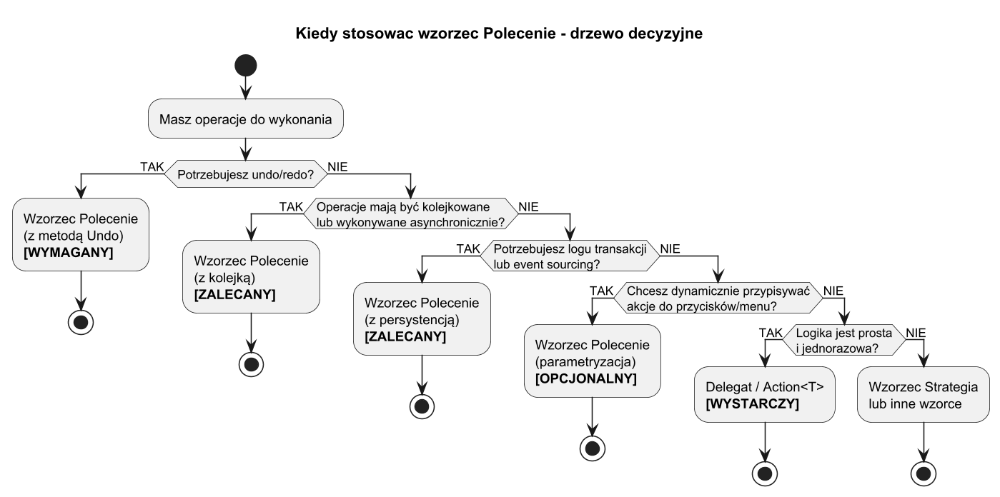
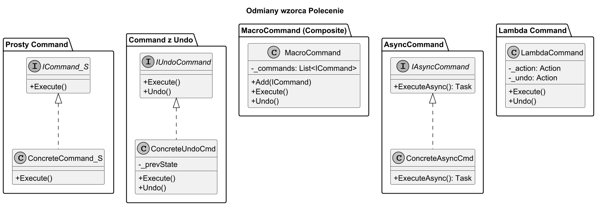

# 02. Kiedy stosować wzorzec Polecenie — zalety, wady i odmiany

## Sygnały, że potrzebujesz wzorca Polecenie

Rozważ użycie wzorca, gdy w projekcie pojawia się przynajmniej jeden z poniższych sygnałów:

| Sygnał | Przykład |
| --- | --- |
| Potrzebujesz **cofania operacji** (Undo/Redo) | Edytor tekstu, aplikacja graficzna |
| Akcje mają być **kolejkowane lub opóźnione** | Harmonogram zadań, serwer żądań |
| Chcesz **rejestrować historię** operacji | Logi transakcji, audit trail |
| Akcje mają być **konfigurowane w runtime** | Konfigurowalne przyciski, skróty klawiszowe |
| Potrzebujesz **makropoleceń** (sekwencji akcji) | Nagrywanie makr, skrypty automatyzacji |
| Chcesz **odizolować** wywołującego od wykonawcy | Testowanie, plug-iny, wielowątkowość |

Drzewo decyzyjne:



---

## Zalety wzorca Polecenie

### 1. Łatwe cofanie i ponawianie (Undo/Redo)

Każde polecenie przechowuje stan potrzebny do cofnięcia operacji. Historia poleceń to naturalny stos Undo.

```csharp
public interface IUndoCommand
{
    void Execute();
    void Undo();
}

// Historia zarządza stosem operacji
public class CommandHistory
{
    private readonly Stack<IUndoCommand> _stack = new();

    public void Execute(IUndoCommand cmd)
    {
        cmd.Execute();
        _stack.Push(cmd);
    }

    public void Undo()
    {
        if (_stack.TryPop(out var cmd))
            cmd.Undo();
    }
}
```

### 2. Parametryzacja i konfiguracja w runtime

Polecenie to obiekt — można je przekazać jako argument, zapisać w kolekcji, przypisać do przycisku dynamicznie:

```csharp
var button = new SmartButton();
button.SetCommand(new LightOnCommand(light));   // zmiana bez modyfikacji klasy Button
```

### 3. Kolejkowanie i transakcje

Polecenia mogą być umieszczone w kolejce i wykonane w odpowiednim momencie — np. gdy zasób jest dostępny lub w wątku roboczym:

```csharp
var queue = new Queue<ICommand>();
queue.Enqueue(new SendEmailCommand(email));
queue.Enqueue(new GenerateReportCommand(report));

// Wykonaj wszystkie gdy serwer jest gotowy
while (queue.TryDequeue(out var cmd))
    cmd.Execute();
```

### 4. Makropolecenia (kompozyt akcji)

Klasa `MacroCommand` implementuje `ICommand` i przechowuje listę poleceń — to dosłowne zastosowanie wzorca Composite:

```csharp
public class MacroCommand(IUndoCommand[] commands) : IUndoCommand
{
    public void Execute()
    {
        foreach (var cmd in commands) cmd.Execute();
    }
    public void Undo()
    {
        // Cofamy w odwrotnej kolejności!
        foreach (var cmd in commands.Reverse()) cmd.Undo();
    }
}
```

### 5. Logowanie i audyt

Ponieważ polecenia to obiekty, można je serializować i rejestrować przed lub po wykonaniu — podstawa event sourcing:

```csharp
public class LoggingInvoker(ILogger logger)
{
    public void Execute(ICommand cmd)
    {
        logger.LogInformation("Executing {Command} at {Time}", cmd.GetType().Name, DateTime.UtcNow);
        cmd.Execute();
    }
}
```

---

## Wady wzorca Polecenie

### 1. Eksplozja klas

Każda unikalna akcja wymaga osobnej klasy ConcreteCommand. Przy 50 akcjach masz 50+ klas:

```
LightOnCommand, LightOffCommand, FanStartCommand, FanStopCommand,
DoorOpenCommand, DoorCloseCommand, ThermostatSetCommand...
```

**Obejście:** użyj wzorca lambda command (temat 04) lub delegatów dla prostych, jednorazowych akcji.

### 2. Złożoność przy prostych przypadkach

Jeśli nie potrzebujesz Undo, kolejkowania ani logowania — wzorzec dodaje zbędną warstwę abstrakcji. Zwykły delegat lub `Action` wystarczy:

```csharp
// Prosta akcja — delegat wystarczy, wzorzec jest nadmiarowy
Action turnOn = () => light.TurnOn();
turnOn();
```

### 3. Zarządzanie pamięcią historii

Historia poleceń przechowuje referencje do obiektów i ich stanu. Przy długiej historii może zużywać dużo pamięci.

**Obejście:** ograniczenie głębokości historii lub użycie wzorca Memento dla snapshots.

### 4. Trudność implementacji Undo dla złożonych operacji

Cofanie operacji na strukturach bazodanowych lub operacjach nieodwracalnych (np. wysłanie e-mail) jest trudne lub niemożliwe.

---

## Odmiany wzorca Polecenie



| Odmiana | Interfejs | Zastosowanie |
| --- | --- | --- |
| **Prosty Command** | `Execute()` | GUI, menu, triggery bez Undo |
| **Command z Undo** | `Execute()` + `Undo()` | Edytory, transakcje |
| **MacroCommand** | `Execute()` + `Undo()` + lista | Automatyzacja, makra |
| **Async Command** | `ExecuteAsync(): Task` | Operacje sieciowe, I/O |
| **Lambda Command** | Wrapper na `Action` | Szybkie, jednorazowe akcje |

---

## Porównanie: wzorzec Polecenie vs. delegaty/Action

| Kryterium | `Action<T>` / delegat | Wzorzec Polecenie |
| --- | --- | --- |
| Undo/Redo | Niemożliwe | Wbudowane |
| Stan (snapshot) | Brak | Przechowywany w obiekcie |
| Serializacja | Niemożliwa | Możliwa |
| Logowanie | Trudne | Łatwe |
| Testowanie | Proste | Proste (mocki przez interfejs) |
| Liczba klas | Minimalna | Duża (1 klasa / akcja) |
| Czytelność kodu | Wysoka | Średnia (więcej plików) |

**Reguła praktyczna:** zacznij od delegata; przejdź na pełny wzorzec gdy potrzebujesz Undo lub historii.

---

## Uruchomienie przykładu

```bash
cd src/14-polecenie/02-kiedy-stosowac-zalety-wady/Examples
dotnet run
```

## Literatura i źródła

1. Gamma E. i in. — *Design Patterns* (1994), str. 236–238 — omówienie zastosowań wzorca.
1. Freeman E. i in. — *Head First Design Patterns* (2021), str. 219–226 — zalety i wady.
1. [Refactoring Guru — Command](https://refactoring.guru/design-patterns/command) — sekcja "Applicability".
1. [SourceMaking — Command Pattern](https://sourcemaking.com/design_patterns/command) — porównanie odmian.
