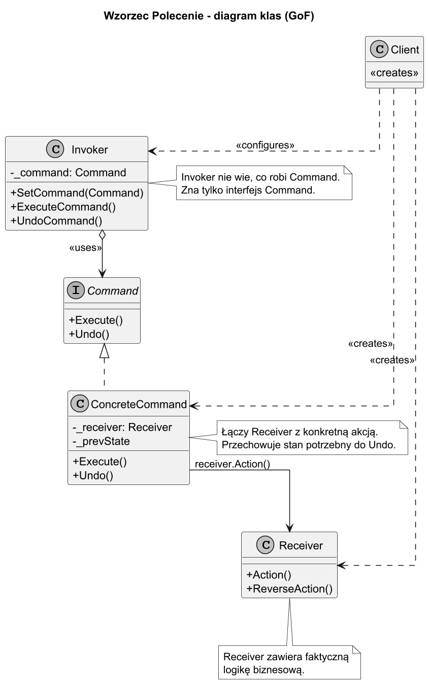
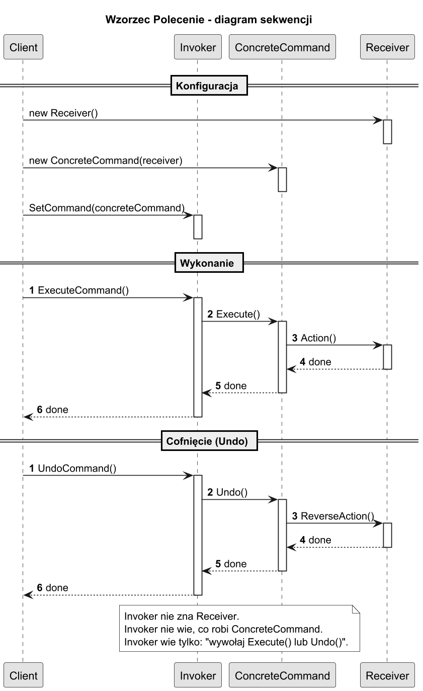
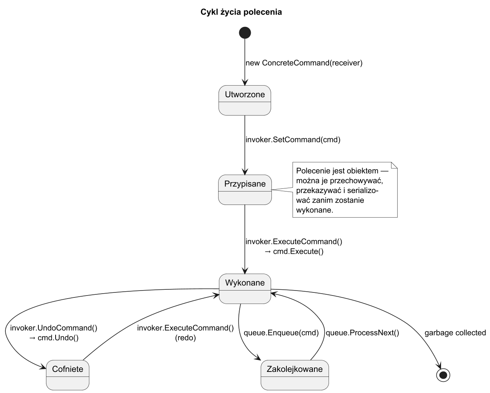

# 03. Jak działa wzorzec Polecenie — struktura GoF, diagramy i mechanizm

## Pięć ról GoF

Wzorzec Polecenie definiuje pięć ról, które razem tworzą luźno powiązany system:

| Rola GoF | Opis | Przykład |
| --- | --- | --- |
| **Command** | Interfejs z `Execute()` i `Undo()` | `ICommand` |
| **ConcreteCommand** | Implementuje Command; wiąże Receiver z akcją | `LightOnCommand` |
| **Invoker** | Inicjuje żądanie; zna tylko `ICommand` | `RemoteContról`, `Button` |
| **Receiver** | Zawiera faktyczną logikę biznesową | `Light`, `RobotArm` |
| **Client** | Tworzy ConcreteCommand i konfiguruje Invoker | `Program`, fabryka |

## Diagram klas



### Kluczowe relacje

- `Invoker` **agreguje** `Command` przez interfejs (`o-->`) — luźne powiązanie.
- `ConcreteCommand` **zna** `Receiver` — zależność wewnętrzna ukryta przed Invoker.
- `Client` **tworzy** zarówno `Receiver`, jak i `ConcreteCommand` — odpowiada za konfigurację.

## Diagram sekwencji



### Przepływ wykonania (krok po kroku)

```
1. Client tworzy Receiver
2. Client tworzy ConcreteCommand(receiver)
3. Client przekazuje command do Invoker.SetCommand(command)
4. [Trigger] Użytkownik klika / timer / zdarzenie
5. Invoker.ExecuteCommand() → wywołuje command.Execute()
6. ConcreteCommand.Execute() → wywołuje receiver.Action()
7. [Opcjonalnie] Invoker.UndoCommand() → command.Undo() → receiver.ReverseAction()
```

## Cykl życia polecenia



Polecenie jest **obiektywem** — po utworzeniu może być:
- przypisane do Invokera (konfiguracja),
- zakolejkowane (harmonogramowanie),
- wykonane (`Execute()`),
- cofnięte (`Undo()`),
- ponownie wykonane (redo = `Execute()`).

## Implementacja czystego szkieletu GoF

```csharp
// ── Rola: Command ───────────────────────────────────────────────────────────
public interface ICommand
{
    void Execute();
    void Undo();
}

// ── Rola: Receiver ──────────────────────────────────────────────────────────
// Zawiera faktyczną logikę — Invoker nigdy go nie widzi bezpośrednio
public class Receiver
{
    public void DoAction(string name)
        => Console.WriteLine($"[Receiver] Wykonuję: {name}");

    public void ReverseAction(string name)
        => Console.WriteLine($"[Receiver] Cofam: {name}");
}

// ── Rola: ConcreteCommand ────────────────────────────────────────────────────
// Łączy Receiver z konkretną akcją; przechowuje parametry
public class ConcreteCommand(Receiver receiver, string actionName) : ICommand
{
    public void Execute() => receiver.DoAction(actionName);
    public void Undo()    => receiver.ReverseAction(actionName);
}

// ── Rola: Invoker ────────────────────────────────────────────────────────────
// Inicjuje żądanie; zna TYLKO interfejs ICommand
public class Invoker
{
    private ICommand? _command;
    private readonly Stack<ICommand> _history = new();

    public void SetCommand(ICommand command) => _command = command;

    public void ExecuteCommand()
    {
        _command?.Execute();
        if (_command is not null) _history.Push(_command);
    }

    public void UndoCommand()
    {
        if (_history.TryPop(out var cmd)) cmd.Undo();
    }
}

// ── Rola: Client ─────────────────────────────────────────────────────────────
// Tworzy i konfiguruje wszystkie obiekty
var receiver = new Receiver();
ICommand cmd = new ConcreteCommand(receiver, "Alpha");
var invoker = new Invoker();

invoker.SetCommand(cmd);
invoker.ExecuteCommand();  // → Receiver.DoAction("Alpha")
invoker.UndoCommand();     // → Receiver.ReverseAction("Alpha")
```

## Konkretny przykład: sterowanie robotem

Ramię robota (`RobotArm`) jest Receiverem. Kontroler (`RobotController`) jest Invokerem.
Polecenia `MoveCommand`, `PickUpCommand` są ConcreteCommands.

```csharp
var arm = new RobotArm();
var controller = new RobotController();

// Client buduje sekwencję poleceń
controller.Queue(new MoveCommand(arm, Direction.Left,  50));
controller.Queue(new PickUpCommand(arm, "śrubka M4"));
controller.Queue(new MoveCommand(arm, Direction.Right, 30));
controller.Queue(new PutDownCommand(arm));

controller.RunAll();      // Invoker wykonuje całą kolejkę
controller.UndoLast();    // Cofnij ostatnią operację
```

## Uruchomienie przykładu

```bash
cd src/14-polecenie/03-struktura-gof-i-jak-działa/Examples
dotnet run
```

## Najważniejsze reguły implementacji

1. **Receiver zawiera logikę** — ConcreteCommand tylko **deleguje** do Receivera. Nie umieszczaj logiki w `Execute()`.
1. **Invoker nie zna Receivera** — zna tylko `ICommand`. Dzięki temu Invoker jest wielokrotnego użytku.
1. **Client zarządza zależnościami** — tworzy Receiver, ConcreteCommand i Invoker; „drut" łączący je wszystkie.
1. **Stan do Undo w ConcreteCommand** — jeśli potrzebujesz cofnąć, zapamiętaj stan w polu prywatnym podczas `Execute()`.

## Literatura i źródła

1. Gamma E. i in. — *Design Patterns* (1994), str. 233–242 — oryginalna struktura wzorca.
1. Freeman E. i in. — *Head First Design Patterns* (2021), str. 191–218 — szczegółowe diagramy.
1. [Refactoring Guru — Command: Structure](https://refactoring.guru/design-patterns/command) — animacje i opisy ról.
1. [DofFactory — Command in C#](https://www.dofactory.com/net/command-design-pattern) — implementacja GoF w C#.
