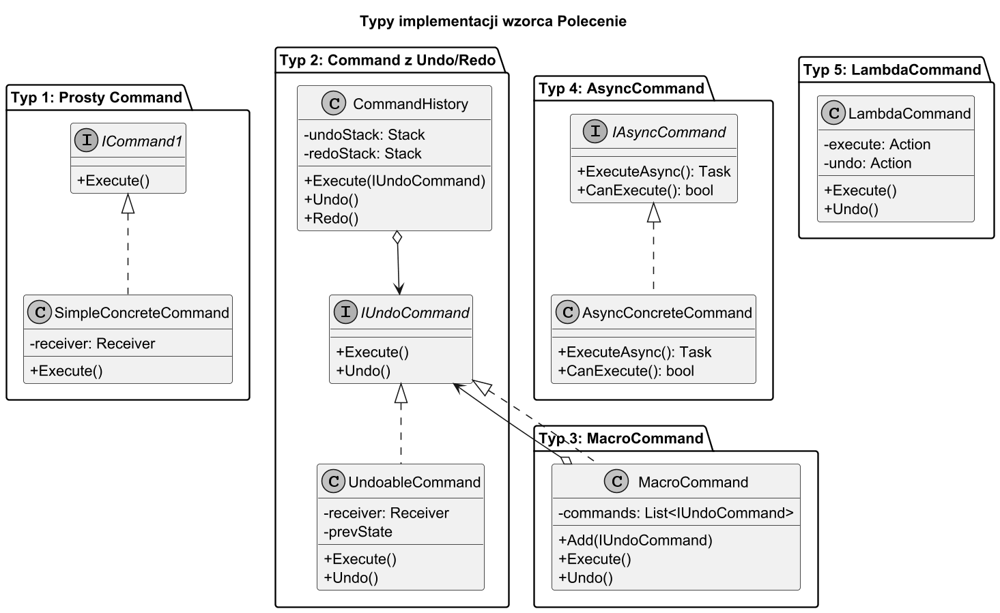
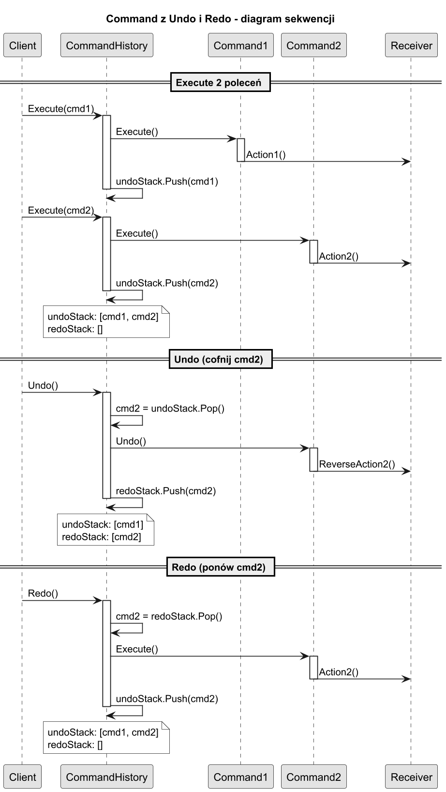

# 04. Typy implementacji wzorca Polecenie i jak wybrać właściwy

## Przegląd typów



Wzorzec Polecenie ma kilka wariantów, które różnią się złożonością i zastosowaniem. Poniżej opisano każdy z nich z kodem wzorcowym i wskazaniem kiedy używać.

---

## Typ 1: Prosty Command (tylko Execute)

**Interfejs:**
```csharp
public interface ISimpleCommand
{
    void Execute();
}
```

**Kiedy stosować:**
- Nie potrzebujesz cofania (Undo).
- Akcje są jednorazowe: wyślij, zapisz, wydrukuj.
- Chcesz parametryzować przyciski lub menu.

**Przykład — harmonogram akcji:**
```csharp
class CommandScheduler
{
    private readonly List<ISimpleCommand> _commands = [];

    public void Schedule(ISimpleCommand cmd) => _commands.Add(cmd);
    public void RunAll() { foreach (var c in _commands) c.Execute(); }
}

var scheduler = new CommandScheduler();
scheduler.Schedule(new LampOnCommand(lamp));
scheduler.Schedule(new LampOffCommand(lamp));
scheduler.RunAll();
```

---

## Typ 2: Command z Undo/Redo

**Interfejs:**
```csharp
public interface IUndoCommand
{
    void Execute();
    void Undo();
}
```

**Klucz sukcesu — historia z dwoma stosami:**



```csharp
public class UndoRedoHistory
{
    private readonly Stack<IUndoCommand> _undo = new();
    private readonly Stack<IUndoCommand> _redo = new();

    public void Execute(IUndoCommand cmd)
    {
        cmd.Execute();
        _undo.Push(cmd);
        _redo.Clear();   // WAŻNE: nowa akcja kasuje stos Redo
    }

    public void Undo()
    {
        if (_undo.TryPop(out var cmd)) { cmd.Undo(); _redo.Push(cmd); }
    }

    public void Redo()
    {
        if (_redo.TryPop(out var cmd)) { cmd.Execute(); _undo.Push(cmd); }
    }
}
```

**Kiedy stosować:** edytory tekstu, aplikacje graficzne, transakcje bazodanowe.

**Zapamiętywanie stanu przed wykonaniem:**
```csharp
class LampDimCommand(Lamp lamp, int targetLevel) : IUndoCommand
{
    private int _prevLevel = 100;  // zapamiętaj stan przed Execute!

    public void Execute()
    {
        _prevLevel = lamp.CurrentBrightness;  // snapshot
        lamp.Dim(targetLevel);
    }

    public void Undo() => lamp.Restore(_prevLevel);
}
```

---

## Typ 3: MacroCommand (Composite Command)

`MacroCommand` to `IUndoCommand` implementujący wzorzec Composite — lista poleceń zachowuje się jak jedno polecenie.

```csharp
public class MacroCommand(IUndoCommand[] commands) : IUndoCommand
{
    public void Execute()
    {
        foreach (var cmd in commands)
            cmd.Execute();
    }

    public void Undo()
    {
        // Cofamy w ODWROTNEJ kolejności — kluczowe!
        foreach (var cmd in commands.Reverse())
            cmd.Undo();
    }
}

// Użycie:
IUndoCommand goodEvening = new MacroCommand([
    new LampDimCommand(livingRoomLamp, 40),
    new TvOnCommand(tv, "Netflix"),
    new SpeakerVolumeCommand(speaker, 30)
]);

goodEvening.Execute();  // włącz tryb wieczorny
goodEvening.Undo();     // cofnij tryb wieczorny (w odwrotnej kolejności!)
```

**Dlaczego odwrotna kolejność w Undo?**  
Jeśli polecenie B modyfikuje stan ustawiony przez polecenie A, cofanie B musi nastąpić *przed* cofnięciem A, aby przywrócić spójny stan.

---

## Typ 4: Async Command

Dla operacji I/O (sieć, baza danych, plik) polecenia muszą być asynchroniczne:

```csharp
public interface IAsyncCommand
{
    Task ExecuteAsync();
    bool CanExecute();  // Guard — czy można wykonać teraz?
}

public class SendEmailAsyncCommand(EmailService service, string to, string subject)
    : IAsyncCommand
{
    public bool CanExecute() => !string.IsNullOrEmpty(to);

    public async Task ExecuteAsync()
    {
        if (!CanExecute()) return;
        await service.SendAsync(to, subject);
    }
}

// Użycie:
if (cmd.CanExecute())
    await cmd.ExecuteAsync();
```

**Uwaga:** `CanExecute()` to wzorzec z `System.Windows.Input.ICommand` (.NET WPF/MAUI).

**Kiedy stosować:** REST API calls, zapis do bazy danych, operacje na plikach.

---

## Typ 5: LambdaCommand (Command z delegatów)

Unikaj tworzenia osobnych klas dla prostych, jednorazowych akcji. Zamiast tego użyj wrappera:

```csharp
public class LambdaCommand(Action execute, Action undo) : IUndoCommand
{
    public void Execute() => execute();
    public void Undo()    => undo();
}

// Użycie bez osobnej klasy:
var counter = new AtomicCounter();
IUndoCommand increment = new LambdaCommand(
    execute: () => counter.Add(10),
    undo:    () => counter.Sub(10)
);

var history = new UndoRedoHistory();
history.Execute(increment);
history.Undo();
```

**Kiedy stosować:** prototypy, testowanie, akcje bez złożonego stanu.

---

## Jak wybrać właściwy typ?

```
Potrzebujesz Undo/Redo?
  NIE → Typ 1 (prosty) lub delegat Action
  TAK → Typ 2 (UndoCommand)
        Masz sekwencję akcji? → Typ 3 (MacroCommand)
        Akcja jest asynchroniczna? → Typ 4 (AsyncCommand)
        Nie chcesz tworzyć osobnej klasy? → Typ 5 (LambdaCommand)
```

| Typ | Złożoność | Undo | Async | Bez nowych klas |
| --- | --- | --- | --- | --- |
| 1 — Prosty | ★ | ✗ | ✗ | ✗ |
| 2 — Undo/Redo | ★★ | ✓ | ✗ | ✗ |
| 3 — MacroCommand | ★★ | ✓ | ✗ | ✗ |
| 4 — Async | ★★★ | ✗ | ✓ | ✗ |
| 5 — Lambda | ★ | ✓ | ✗ | ✓ |

---

## Uruchomienie przykładu

```bash
cd src/14-polecenie/04-typy-implementacji-i-wybor/Examples
dotnet run
```

## Literatura i źródła

1. Gamma E. i in. — *Design Patterns* (1994), str. 239–241 — omówienie wariantów.
1. [Microsoft — ICommand interface (WPF)](https://docs.microsoft.com/en-us/dotnet/api/system.windows.input.icommand) — AsyncCommand w .NET.
1. [Async Command Pattern (Thomas Levesque)](https://thomaslevesque.com/2015/11/04/async-and-await-in-the-command-pattern/) — szczegółowy opis async command.
1. [Refactoring Guru — Command](https://refactoring.guru/design-patterns/command) — porównanie implementacji.
