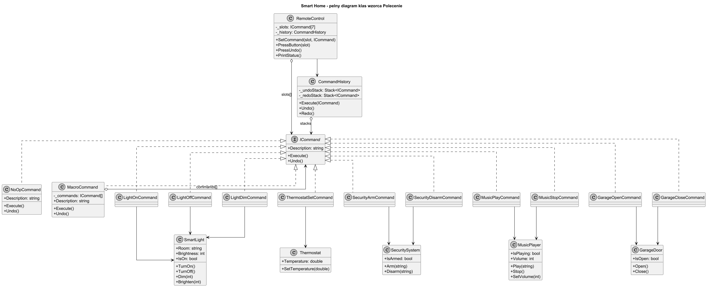
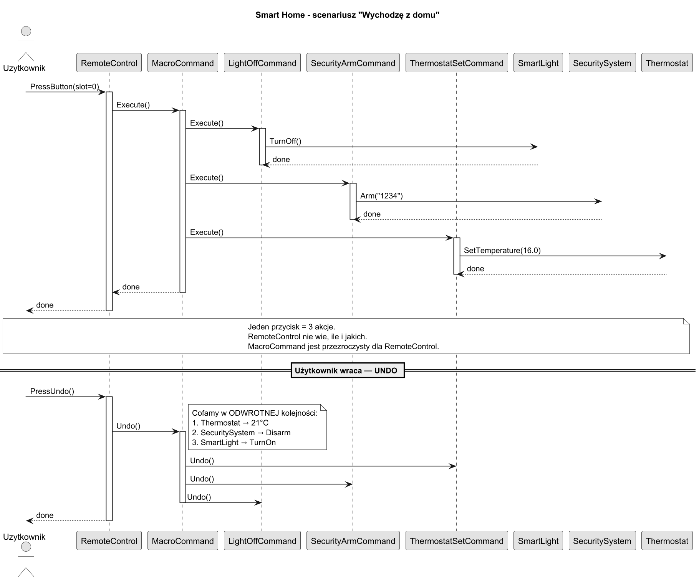
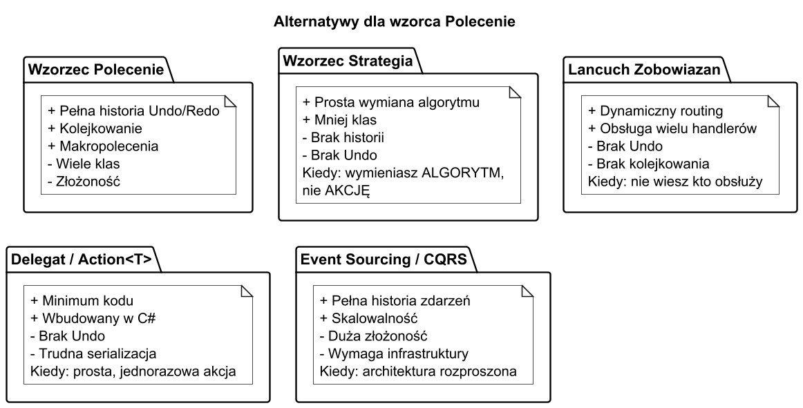

# 05. Duży przykład — System Smart Home i alternatywy dla wzorca Polecenie

## Opis przykładu

Implementujemy system sterowania inteligentnym domem (Smart Home) za pomocą pilota zdalnego sterowania z 7 slotami. Każdy slot może mieć przypisane polecenie ON i OFF. System obsługuje:

- Sterowanie lampami (włącz, wyłącz, przyciemnij)
- Sterowanie termostatem
- Uzbrajanie/rozbrajanie alarmu
- Sterowanie muzyką
- Sterowanie bramą garażową
- Makropolecenia (scenariusze: "Wychodzę", "Dobry wieczór", "SOS")
- Pełne cofanie ostatniej operacji

## Diagram klas



### Analiza ról GoF w przykładzie

| Rola GoF | Klasa w przykładzie |
| --- | --- |
| **Command** | `ICommand` |
| **ConcreteCommand** | `LightOnCommand`, `ThermostatSetCommand`, ... |
| **Invoker** | `RemoteControl` |
| **Receiver** | `SmartLight`, `Thermostat`, `SecuritySystem`, ... |
| **Client** | `Program.cs` — konfiguracja pilota |
| **Null Object** | `NoOpCommand` — pusty slot bez akcji |
| **Composite** | `MacroCommand` — sekwencja poleceń |

## Diagram sekwencji — scenariusz "Wychodzę z domu"



### Co się dzieje:

1. Użytkownik naciska przycisk ON na slocie 5.
1. `RemoteControl.PressOn(5)` wywołuje `MacroCommand.Execute()`.
1. `MacroCommand` sekwencyjnie wywołuje `Execute()` na każdym podpoleceniu.
1. Każde polecenie deleguje do swojego Receivera.
1. `RemoteControl` zapamiętuje polecenie na stosie Undo.
1. Użytkownik naciska UNDO → `MacroCommand.Undo()` cofa w odwrotnej kolejności.

## Kluczowe fragmenty kodu

### Null Object Pattern — pusty slot

Zamiast sprawdzać `if (command != null)`, używamy wzorca Null Object:

```csharp
class NoOpCommand : ICommand
{
    public string Description => "(brak akcji)";
    public void Execute() { /* nic nie rób */ }
    public void Undo()    { /* nic nie rób */ }
}

// Pilot inicjalizuje wszystkie sloty z NoOpCommand
private readonly ICommand[] _onCommands  =
    Enumerable.Range(0, slotCount)
              .Select(_ => (ICommand)new NoOpCommand())
              .ToArray();
```

Dzięki temu kod Invokera jest zawsze bezpieczny:
```csharp
public void PressOn(int slot) => _onCommands[slot].Execute();  // nigdy NPE!
```

### MacroCommand z zapamiętywaniem stanu

```csharp
class LightDimCommand(SmartLight light, int targetLevel) : ICommand
{
    private int _prevLevel = 100;  // stan sprzed Execute

    public void Execute()
    {
        _prevLevel = light.GetBrightness();  // snapshot
        light.Dim(targetLevel);
    }

    public void Undo() => light.Dim(_prevLevel);  // przywróć snapshot
}
```

### Konfiguracja pilota (rola Klienta)

```csharp
// Scenariusz "Wychodzę z domu" = 6 poleceń w jednym makro
ICommand leaveHome = new MacroCommand("Wychodzę z domu", [
    new LightOffCommand(livingRoomLight),
    new LightOffCommand(bedroomLight),
    new LightOffCommand(kitchenLight),
    new ThermostatSetCommand(thermostat, 16.0),
    new SecurityArmCommand(security, "1234"),
    new GarageCloseCommand(garage)
]);

remote.SetCommand(5, on: leaveHome, off: arriveHome);
remote.PressOn(5);   // uruchamia cały scenariusz
remote.PressUndo();  // cofa cały scenariusz
```

## Kiedy stosować wzorzec Polecenie w tym kontekście?

**STOSUJ gdy:**
- Masz N urządzeń i M możliwych akcji — kombinatoryczna konfiguracja bez wzorca byłaby niemożliwa.
- Użytkownik oczekuje cofania (UNDO) — np. "przypadkowo wyłączyłem wszystkie światła".
- Akcje mają być konfigurowalne w runtime (drag-and-drop asystenta AI do slotów).
- Potrzebujesz nagrywania scenariuszy (makr) i ich odtwarzania.

**ZASTANÓW SIĘ NAD ALTERNATYWĄ gdy:**
- Masz jedną prostą akcję — delegat `Action` wystarczy.
- Potrzebujesz tylko routingu żądań — rozważ Łańcuch Zobowiązań.
- Logika decyzyjna jest głównym problemem — rozważ Strategię.

---

## Alternatywy dla wzorca Polecenie



### Wzorzec Strategia

**Kiedy:** wymieniasz **algorytm**, nie **akcję z historią**.

```csharp
// Strategia — decyduje jak, nie zapamiętuje historii
public interface ISortStrategy
{
    void Sort(int[] data);
}

// Polecenie — decyduje co, kiedy i wobec kogo; może być cofnięte
public interface ISortCommand
{
    void Execute();
    void Undo();
}
```

**Różnica kluczowa:** `ISortStrategy` wie, JAK sortować. `ISortCommand` wie, KIEDY posortować i może cofnąć operację.

### Łańcuch Zobowiązań (Chain of Responsibility)

**Kiedy:** nie wiesz z góry, kto obsłuży żądanie.

```csharp
// Polecenie → jeden odbiorca, znany z góry
// Łańcuch → żądanie przechodzi przez handlery aż ktoś obsłuży

var request = new SmartHomeRequest(RequestType.TurnOnLight, "Salon");
chain.Handle(request);  // może obsłużyć dowolny handler w łańcuchu
```

### Delegat / Action<T>

**Kiedy:** prosta, jednorazowa akcja bez stanu ani Undo.

```csharp
// Delegat zamiast pełnego wzorca — OK dla prostych przypadków
Action turnOn = () => light.TurnOn();
button.Click += (s, e) => turnOn();
```

**Limitacja:** brak Undo, brak serializacji, trudna wielowątkowość.

### Event Sourcing / CQRS

**Kiedy:** architektura mikrousługowa, pełna historia zdarzeń, skalowalność.

```csharp
// Command w CQRS to DTO z intencją, nie obiekt z logiką
public record TurnOnLightCommand(string Room, DateTime Timestamp);
public record TurnOffLightCommand(string Room, DateTime Timestamp);

// Handler w MediatR
public class TurnOnLightHandler : IRequestHandler<TurnOnLightCommand>
{
    public Task Handle(TurnOnLightCommand cmd, CancellationToken ct)
        => _lightService.TurnOnAsync(cmd.Room);
}
```

**Event sourcing** = każda zmiana stanu to polecenie zapisane w logu → pełna historia, replay, audit.

---

## Uruchomienie przykładu i testów

```bash
# Uruchom przykład
cd src/14-polecenie/05-duzy-przyklad-i-alternatywy/Examples
dotnet run

# Uruchom testy jednostkowe
cd src/14-polecenie/05-duzy-przyklad-i-alternatywy/Tests
dotnet test --verbosity normal
```

## Literatura i źródła

1. Freeman E., Freeman E. — *Head First Design Patterns* (2021), rozdz. 6 — pilot zdalnego sterowania (inspiracja tego przykładu).
1. Gamma E. i in. — *Design Patterns* (1994), str. 233–242 — oryginalna implementacja GoF.
1. Fowler M. — *Patterns of Enterprise Application Architecture* (2002), rozdz. Command — CQRS i event sourcing.
1. [Microsoft MAUI — ICommand](https://docs.microsoft.com/en-us/dotnet/maui/fundamentals/data-binding/commanding) — wzorzec Polecenie w aplikacjach mobilnych .NET.
1. [Refactoring Guru — Command](https://refactoring.guru/design-patterns/command) — porównanie z innymi wzorcami.
1. [CQRS / Event Sourcing (Martin Fowler)](https://martinfowler.com/bliki/CQRS.html) — architektoniczne zastosowanie wzorca.
1. [Null Object Pattern](https://refactoring.guru/introduce-null-object) — eliminacja sprawdzania null w Invokerze.
