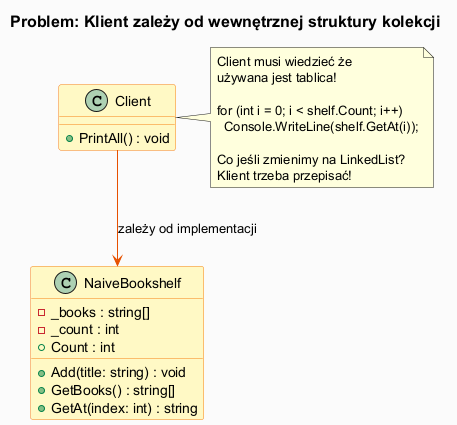
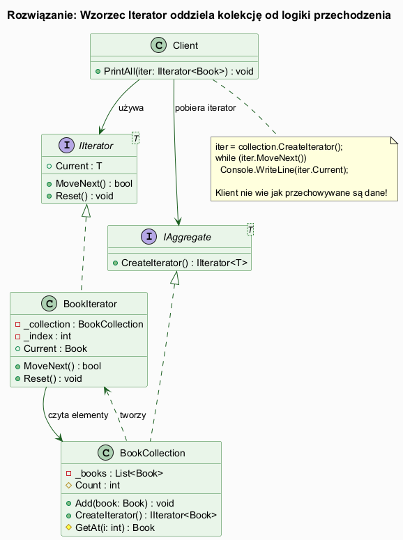

# 01 — Idea i Kontekst Wzorca Iterator

## Spis treści

1. [Problem — po co istnieje Iterator?](#1-problem)
2. [Rys historyczny](#2-historia)
3. [Koncepcja rozwiązania](#3-koncepcja)
4. [Implementacja podstawowa](#4-implementacja)
5. [Iterator w .NET — IEnumerable\<T\>](#5-dotnet)
6. [Uruchamianie przykładu](#6-uruchamianie)
7. [Literatura](#7-literatura)

---

## 1. Problem — po co istnieje Iterator? <a name="1-problem"></a>

Rozważmy klasę `NaiveBookshelf`:

```csharp
class NaiveBookshelf
{
    private string[] _books = new string[100];
    private int _count;

    public void Add(string title) => _books[_count++] = title;
    public string[] GetBooks() => _books;  // ujawnia tablicę!
    public int Count => _count;
}
```

Klient, który chce wypisać wszystkie książki, musi wiedzieć, że `NaiveBookshelf` używa **tablicy**:

```csharp
string[] books = shelf.GetBooks();
for (int i = 0; i < shelf.Count; i++)
    Console.WriteLine(books[i]);
```

**Problemy:**
- Zmiana tablicy na `LinkedList` → klient musi być przepisany
- Klient zna szczegóły implementacji (indeksowanie, długość)
- Nie można mieć dwóch niezależnych "kursorów" w kolekcji
- Nie można łatwo zmienić kolejności przechodzenia



---

## 2. Rys historyczny <a name="2-historia"></a>

| Rok | Wydarzenie |
|-----|-----------|
| 1979 | Alexander Stepanov tworzy koncepcję iteratorów jako uogólnienia wskaźników |
| 1994 | STL (C++) standaryzuje iteratory — 5 kategorii (Input, Output, Forward, Bidirectional, RandomAccess) |
| 1994 | Gang of Four opisuje wzorzec Iterator w *Design Patterns* |
| 2000 | Java wprowadza `Iterator<E>` (wcześniej `Enumeration`) |
| 2005 | C# 2.0 wprowadza `yield return` — generatory upraszczają implementację |
| 2007 | C# 3.0 / LINQ — iteratory jako fundament zapytań strumieniowych |
| 2016 | C# 8.0 — `IAsyncEnumerable<T>` dla asynchronicznych sekwencji |

> **Ciekawostka:** `foreach` w C# to syntaktyczny cukier. Kompilator przekształca go w wywołania `GetEnumerator()`, `MoveNext()`, `Current` i `Dispose()`. Nie wymaga implementacji `IEnumerable<T>` — wystarczy, że klasa ma odpowiednie metody!

---

## 3. Koncepcja rozwiązania <a name="3-koncepcja"></a>

Wzorzec Iterator rozdziela **dwie odpowiedzialności**:
- `BookCollection` — przechowuje dane
- `BookIterator` — zna sposób przechodzenia przez dane

Klient wie tylko tyle, że może przechodzić przez elementy — nie wie jak są przechowywane.



### Kluczowe właściwości

| Właściwość | Opis |
|-----------|------|
| **Enkapsulacja** | Kolekcja ukrywa wewnętrzną strukturę |
| **Wielokrotna iteracja** | Wiele niezależnych iteratorów dla tej samej kolekcji |
| **Uniformny interfejs** | Tablice, listy, drzewa — jednolity sposób przechodzenia |
| **Wymienność** | Można podmienić iterator (inny porządek) bez zmiany klientów |

---

## 4. Implementacja podstawowa <a name="4-implementacja"></a>

### Interfejsy

```csharp
interface IIterator<T>
{
    bool MoveNext();
    T Current { get; }
    void Reset();
}

interface IAggregate<T>
{
    IIterator<T> CreateIterator();
}
```

### Kolekcja (Aggregate)

```csharp
class BookCollection : IAggregate<Book>
{
    private readonly List<Book> _books = [];

    public void Add(Book book) => _books.Add(book);
    internal int Count => _books.Count;
    internal Book GetAt(int index) => _books[index];

    public IIterator<Book> CreateIterator() => new BookIterator(this);
}
```

### Iterator (ConcreteIterator)

```csharp
class BookIterator(BookCollection collection) : IIterator<Book>
{
    private int _index = -1;

    public bool MoveNext()
    {
        _index++;
        return _index < collection.Count;
    }

    public Book Current => collection.GetAt(_index);
    public void Reset() => _index = -1;
}
```

### Użycie

```csharp
var collection = new BookCollection();
collection.Add(new Book("Wzorce projektowe", "GoF", 1994));
collection.Add(new Book("Clean Code", "Martin", 2008));

IIterator<Book> iter = collection.CreateIterator();
while (iter.MoveNext())
    Console.WriteLine(iter.Current.Title);
```

---

## 5. Iterator w .NET — IEnumerable\<T\> <a name="5-dotnet"></a>

.NET ma wbudowany wzorzec Iterator jako `IEnumerable<T>` + `IEnumerator<T>`:

```csharp
// IAggregate<T> w .NET = IEnumerable<T>
// IIterator<T> w .NET = IEnumerator<T>

class DotNetBookCollection : IEnumerable<Book>
{
    private readonly List<Book> _books = [];
    public void Add(Book book) => _books.Add(book);

    // Odpowiednik CreateIterator()
    public IEnumerator<Book> GetEnumerator() => _books.GetEnumerator();
    IEnumerator IEnumerable.GetEnumerator() => GetEnumerator();
}
```

Dzięki `IEnumerable<T>` możemy używać `foreach`:

```csharp
foreach (Book book in collection)
    Console.WriteLine(book.Title);
```

`foreach` jest rozwijany przez kompilator do:

```csharp
IEnumerator<Book> e = collection.GetEnumerator();
try {
    while (e.MoveNext())
        Console.WriteLine(e.Current.Title);
} finally {
    e.Dispose();
}
```

### Uproszczenie przez yield return

Zamiast ręcznej klasy iteratora wystarczy:

```csharp
public IEnumerator<Book> GetEnumerator()
{
    foreach (var book in _books)
        yield return book;
    // Kompilator generuje maszynę stanów automatycznie!
}
```

---

## 6. Uruchamianie przykładu <a name="6-uruchamianie"></a>

```bash
cd src/15-iterator/01-idea-i-kontekst/Examples
dotnet run
```

Przykład demonstruje:
1. Problem bez iteratora (`NaiveBookshelf`)
2. Rozwiązanie z własnym `IIterator<T>`
3. Dwa niezależne iteratory tej samej kolekcji
4. Styl .NET z `IEnumerable<T>` i `foreach`
5. Iterator DFS dla struktury drzewiastej

---

## 7. Literatura <a name="7-literatura"></a>

1. Gamma E. et al. — *Design Patterns* (1994), s. 257–271
2. [Iterator pattern — refactoring.guru](https://refactoring.guru/design-patterns/iterator)
3. [IEnumerable\<T\> — Microsoft Docs](https://learn.microsoft.com/en-us/dotnet/api/system.collections.generic.ienumerable-1)
4. [Iterators in C# — Microsoft Docs](https://learn.microsoft.com/en-us/dotnet/csharp/programming-guide/concepts/iterators)
5. Skeet J. — *C# in Depth*, rozdz. 6 (iterators and yield)
