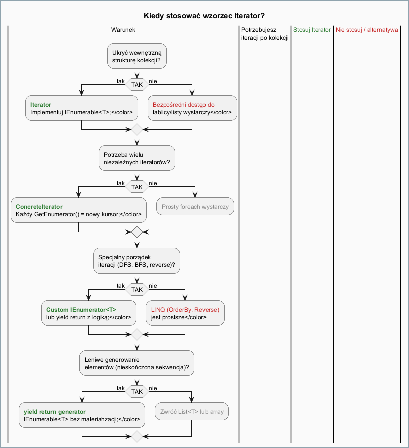
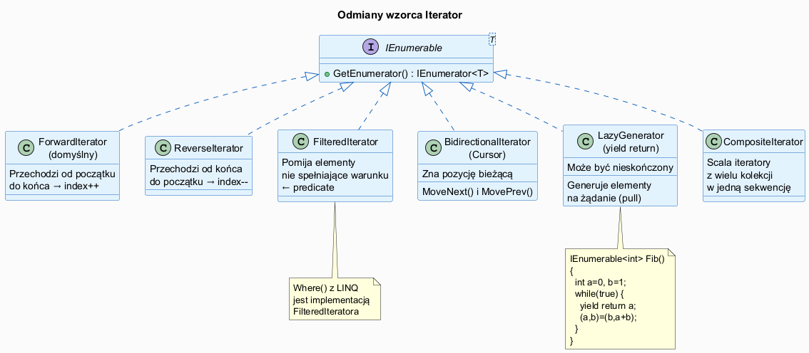

# 02 — Kiedy Stosować, Zalety i Wady

## Spis treści

1. [Kiedy stosować Iterator](#1-kiedy)
2. [Zalety wzorca](#2-zalety)
3. [Wady i pułapki](#3-wady)
4. [Odmiany wzorca](#4-odmiany)
5. [Iterator vs LINQ — kiedy co wybrać](#5-linq)
6. [Uruchamianie przykładu](#6-uruchamianie)

---

## 1. Kiedy stosować Iterator <a name="1-kiedy"></a>



### Stosuj Iterator gdy:

| Sytuacja | Uzasadnienie |
|---------|--------------|
| Kolekcja ma złożoną strukturę wewnętrzną | Klient nie powinien znać implementacji (tablica, drzewo, graf) |
| Potrzebujesz wielu niezależnych iteracji | Każdy `GetEnumerator()` zwraca nowy, niezależny kursor |
| Chcesz niestandardowego porządku przechodzenia | DFS, BFS, in-order, odwrotny, filtrowany |
| Generujesz elementy leniwie | `yield return` — tylko tyle obliczeń ile potrzeba |
| Udostępniasz kolekcję jako API | `IEnumerable<T>` jako zwracany typ — elastyczna enkapsulacja |

### Nie stosuj (lub użyj LINQ) gdy:

| Sytuacja | Lepsza alternatywa |
|---------|-------------------|
| Proste filtrowanie i sortowanie | `LINQ` — `Where()`, `OrderBy()` |
| Transformacja (map/reduce) | `LINQ` — `Select()`, `Aggregate()` |
| Jednorazowe przejście przez prostą listę | Bezpośrednia pętla `for` |
| Operacje na różnych typach węzłów | Wzorzec **Visitor** |

---

## 2. Zalety wzorca <a name="2-zalety"></a>

### Zasada jednej odpowiedzialności (SRP)
Kolekcja zajmuje się **przechowywaniem**, iterator — **przechodzeniem**.

```csharp
// Kolekcja — tylko dane
class BookCollection
{
    private List<Book> _books = [];
    public void Add(Book b) => _books.Add(b);
    internal Book GetAt(int i) => _books[i];
    internal int Count => _books.Count;
}

// Iterator — tylko logika przechodzenia
class ReverseBookIterator : IEnumerator<Book>
{
    private int _index;
    public ReverseBookIterator(BookCollection c) => _index = c.Count;
    public bool MoveNext() { _index--; return _index >= 0; }
    public Book Current => _collection.GetAt(_index);
    // ...
}
```

### Zasada otwarte/zamknięte (OCP)
Nowy porządek iteracji (np. filtrowany) nie wymaga modyfikacji kolekcji:

```csharp
class FilteredBookIterator : IEnumerator<Book>
{
    // Implementacja nie zmienia BookCollection
}
```

### Wielokrotna iteracja

```csharp
var col = new BookCollection();
// ...

// Dwa niezależne kursory — niemożliwe bez wzorca
using var iter1 = col.GetEnumerator(); // kursor na pozycji 0
using var iter2 = col.GetEnumerator(); // kursor na pozycji 0 — niezależnie!

iter1.MoveNext(); iter1.MoveNext(); // iter1 → 2. element
iter2.MoveNext();                    // iter2 → 1. element

Console.WriteLine(iter1.Current); // 2. element
Console.WriteLine(iter2.Current); // 1. element
```

### Leniwe generowanie

```csharp
// Nieskończona sekwencja — nie materiahzuje wszystkiego w pamięci
static IEnumerable<int> Fibonacci()
{
    int a = 0, b = 1;
    while (true)
    {
        yield return a;
        (a, b) = (b, a + b);
    }
}

// Tylko pierwsze 10 elementów jest obliczanych
foreach (int fib in Fibonacci().Take(10))
    Console.Write(fib + " "); // 0 1 1 2 3 5 8 13 21 34
```

---

## 3. Wady i pułapki <a name="3-wady"></a>

### Modyfikacja kolekcji podczas iteracji

```csharp
var list = new List<int> { 1, 2, 3 };
foreach (int item in list)
{
    list.Add(99); // ← InvalidOperationException!
}
```

**Rozwiązanie:** Iteruj po kopii lub używaj indeksowania wstecz.

### Nadmiarowa złożoność dla prostych kolekcji

Jeśli kolekcja to prosta `List<T>` i potrzebujesz tylko `foreach` — nie pisz własnego iteratora. Deleguj do wbudowanego:

```csharp
public IEnumerator<Book> GetEnumerator() => _books.GetEnumerator();
```

### Koszt alokacji

Każde `GetEnumerator()` alokuje nowy obiekt na stercie (heap). W pętlach o wysokiej częstotliwości może to być problem. **Rozwiązanie:** struct enumerators (używane wewnętrznie przez `List<T>`).

---

## 4. Odmiany wzorca <a name="4-odmiany"></a>



| Odmiana | Opis | Przykład w C# |
|---------|------|---------------|
| **Forward** | Przechodzenie od początku do końca | `List<T>.GetEnumerator()` |
| **Reverse** | Przechodzenie od końca do początku | `Enumerable.Reverse()` |
| **Filtered** | Pomija elementy wg predykatu | `Enumerable.Where()` |
| **Bidirectional** | MoveNext() + MovePrev() | `LinkedListNode<T>` |
| **Lazy generator** | Elementy generowane na żądanie | `yield return` |
| **Composite** | Scala wiele kolekcji w jedną | `Enumerable.Concat()` |

---

## 5. Iterator vs LINQ — kiedy co wybrać <a name="5-linq"></a>

```csharp
var employees = new List<Employee> { ... };

// ─── Własny iterator: dobry dla specjalnego porządku przechodzenia
class DepartmentFirstIterator : IEnumerator<Employee>
{
    // IT najpierw, potem reszta — logika trudna w LINQ
}

// ─── LINQ: dobry dla kompozycji filter + sort + project
var result = employees
    .Where(e => e.Department == "IT")
    .OrderByDescending(e => e.Salary)
    .Select(e => new { e.Name, e.Salary });
```

**Zasada:** Gdy możesz wyrazić to jako `Where/Select/OrderBy` — użyj LINQ. Gdy masz specjalną logikę przechodzenia (DFS, BFS, in-order) — zaimplementuj własny iterator.

---

## 6. Uruchamianie przykładu <a name="6-uruchamianie"></a>

```bash
cd src/15-iterator/02-kiedy-stosowac-zalety-wady/Examples
dotnet run
```

Przykład demonstruje:
1. Ukrywanie struktury kolekcji
2. Wiele niezależnych iteratorów
3. Różne odmiany (forward, reverse, filter, generator)
4. Kiedy LINQ jest lepszy od własnego iteratora
5. Leniwe generowanie (Fibonacci, liczby pierwsze)
6. Pułapkę modyfikacji podczas iteracji
