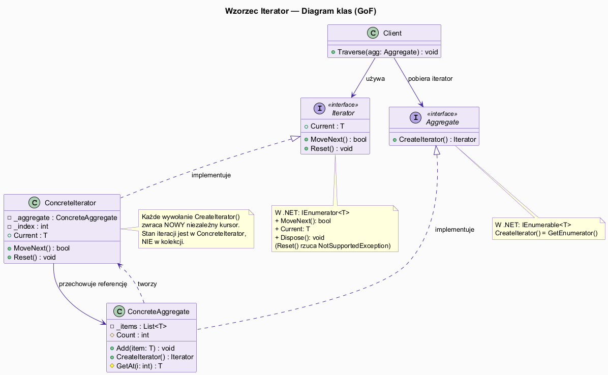
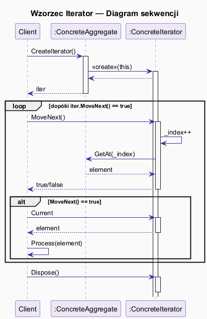
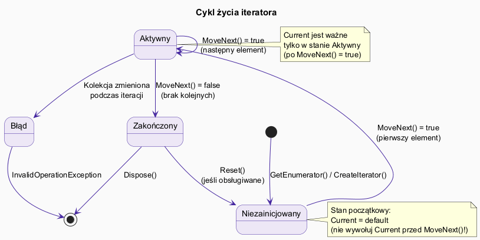

# 03 — Struktura GoF i Jak Działa

## Spis treści

1. [Rolę wzorca — GoF](#1-rolę)
2. [Diagram klas](#2-klasy)
3. [Diagram sekwencji](#3-sekwencja)
4. [Cykl życia iteratora](#4-cykl)
5. [Struktura w .NET](#5-dotnet)
6. [Konsekwencje stosowania](#6-konsekwencje)
7. [Uruchamianie przykładu](#7-uruchamianie)

---

## 1. Rolę wzorca — GoF <a name="1-rolę"></a>

Wzorzec Iterator definiuje cztery rolę:

| Rola | Odpowiednik w .NET | Opis |
|------|-------------------|------|
| **Iterator** | `IEnumerator<T>` | Interfejs: `MoveNext()`, `Current`, `Reset()` |
| **ConcreteIterator** | `List<T>.Enumerator` | Implementacja dla konkretnej kolekcji |
| **Aggregate** | `IEnumerable<T>` | Interfejs fabrykujący iterator: `CreateIterator()` / `GetEnumerator()` |
| **ConcreteAggregate** | `List<T>`, `Array` | Kolekcja — zwraca własny iterator |
| **Client** | kod używający `foreach` | Używa iteratora przez interfejs |

---

## 2. Diagram klas <a name="2-klasy"></a>



### Klasyczny szkielet GoF (C#)

```csharp
// Rola: Iterator
interface IIterator<T>
{
    T?  First();
    T?  Next();
    bool IsDone();
    T?  CurrentItem();
}

// Rola: Aggregate
interface IAggregate<T>
{
    IIterator<T> CreateIterator();
}

// Rola: ConcreteAggregate
class BookShelf : IAggregate<Book>
{
    private List<Book> _books = [];
    public void Append(Book b) => _books.Add(b);
    internal int Count => _books.Count;
    internal Book GetBookAt(int i) => _books[i];
    public IIterator<Book> CreateIterator() => new BookShelfIterator(this);
}

// Rola: ConcreteIterator
class BookShelfIterator(BookShelf shelf) : IIterator<Book>
{
    private int _index = 0;
    public Book? First()  { _index = 0; return IsDone() ? null : shelf.GetBookAt(0); }
    public Book? Next()   { _index++;   return IsDone() ? null : shelf.GetBookAt(_index); }
    public bool  IsDone() => _index >= shelf.Count;
    public Book? CurrentItem() => IsDone() ? null : shelf.GetBookAt(_index);
}
```

---

## 3. Diagram sekwencji <a name="3-sekwencja"></a>



Typowa sekwencja wywołań:

```csharp
// 1. Klient pobiera iterator od kolekcji
IIterator<Book> iter = shelf.CreateIterator();

// 2. Pętla z MoveNext / Current
while (iter.MoveNext())           // 3. Iterator przesuwa kursor
{
    Book book = iter.Current;     // 4. Klient czyta bieżący element
    Console.WriteLine(book.Title);
}
```

---

## 4. Cykl życia iteratora <a name="4-cykl"></a>



| Stan | Warunek | `Current` |
|------|---------|-----------|
| **Niezainicjowany** | Po `GetEnumerator()`, przed `MoveNext()` | `default` (niezdefiniowany!) |
| **Aktywny** | Po `MoveNext()` == `true` | Bieżący element |
| **Zakończony** | Po `MoveNext()` == `false` | `default` (niezdefiniowany!) |
| **Błąd** | Kolekcja zmieniona podczas iteracji | `InvalidOperationException` |

> **Reguła:** Nigdy nie odczytuj `Current` bez poprzedniego `MoveNext()` zwracającego `true`!

---

## 5. Struktura w .NET <a name="5-dotnet"></a>

.NET mapuje rolę GoF na `IEnumerable<T>` i `IEnumerator<T>`:

```csharp
// .NET: Aggregate = IEnumerable<T>
public interface IEnumerable<out T>
{
    IEnumerator<T> GetEnumerator();  // ← CreateIterator()
}

// .NET: Iterator = IEnumerator<T>
public interface IEnumerator<out T> : IDisposable
{
    bool MoveNext();
    T Current { get; }
    void Reset();  // opcjonalne — większość rzuca NotSupportedException
}
```

`foreach` jest tłumaczony przez kompilator na:

```csharp
// Przed kompilacją
foreach (Book b in shelf)
    Console.WriteLine(b.Title);

// Po kompilacji (uproszczone)
IEnumerator<Book> e = shelf.GetEnumerator();
try {
    while (e.MoveNext())
        Console.WriteLine(e.Current.Title);
} finally {
    e.Dispose();
}
```

---

## 6. Konsekwencje stosowania <a name="6-konsekwencje"></a>

### Pozytywne

- **Odseparowanie kolekcji od logiki przechodzenia** — Single Responsibility Principle
- **Wiele aktywnych iteratorów jednocześnie** — niezależne kursory
- **Jednolity interfejs** dla różnych kolekcji (tablica, lista, drzewo)
- **Uproszczenie interfejsu kolekcji** — kolekcja nie musi mieć `First()`, `Next()`, itp.

### Negatywne

- **Dodatkowe klasy** — ConcreteIterator dla każdej kolekcji
- **Modyfikacja kolekcji** podczas iteracji jest niebezpieczna
- **Reset()** jest często nieobsługiwany (yield return nie obsługuje)
- **Alokacje** — każdy `GetEnumerator()` alokuje obiekt (rozwiązanie: struct enumerators)

---

## 7. Uruchamianie przykładu <a name="7-uruchamianie"></a>

```bash
cd src/15-iterator/03-struktura-i-działanie/Examples
dotnet run
```

Przykład demonstruje:
1. Czysty szkielet GoF z API `First/Next/IsDone`
2. Nowoczesne API `MoveNext/Current`
3. Cykl życia iteratora — stany
4. Bezpieczna iteracja po kolekcji modyfikowalnej
5. Wersja .NET z `IEnumerable<T>` i yield return
