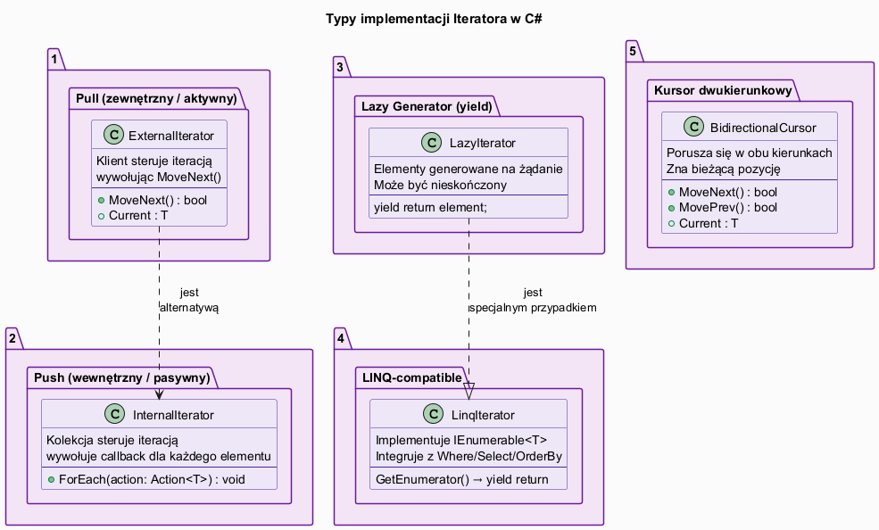
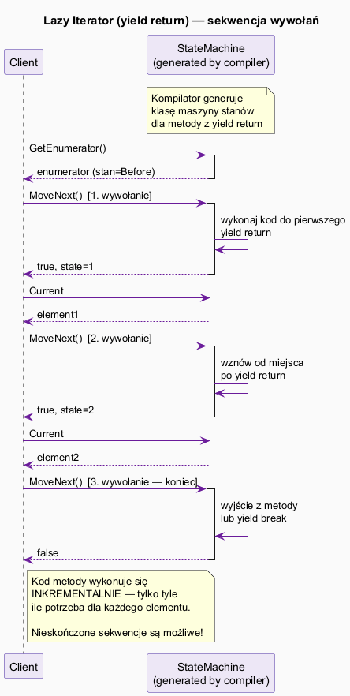

# 04 — Typy Implementacji i Jak Wybrać

## Spis treści

1. [Przegląd typów](#1-przeglad)
2. [Typ 1: Pull (zewnętrzny/aktywny)](#2-pull)
3. [Typ 2: Push (wewnętrzny/pasywny)](#3-push)
4. [Typ 3: Lazy Generator (yield return)](#4-lazy)
5. [Typ 4: LINQ-compatible](#5-linq)
6. [Typ 5: Kursor dwukierunkowy](#6-kursor)
7. [Jak wybrać właściwy typ](#7-wybor)
8. [Uruchamianie przykładu](#8-uruchamianie)

---

## 1. Przegląd typów <a name="1-przeglad"></a>



| Typ | Model | Kontrola | C# |
|-----|-------|----------|-----|
| Pull | zewnętrzny | klient | `IEnumerator<T>.MoveNext()` |
| Push | wewnętrzny | kolekcja | `ForEach(Action<T>)` |
| Lazy | generator | — | `yield return` |
| LINQ | pull+lazy | klient | `IEnumerable<T>` + operatory |
| Kursor | dwukierunkowy | klient | własna klasa |

---

## 2. Typ 1: Pull Iterator (zewnętrzny/aktywny) <a name="2-pull"></a>

Klient samodzielnie wywołuje `MoveNext()` — ma pełną kontrolę nad iteracją.

```csharp
class ProductCatalog : IEnumerable<Product>
{
    private List<Product> _products = [];

    public IEnumerator<Product> GetEnumerator()
        => new ProductIterator(_products);
    IEnumerator IEnumerable.GetEnumerator() => GetEnumerator();
}

// Użycie — klient steruje:
using var iter = catalog.GetEnumerator();
while (iter.MoveNext())
{
    if (iter.Current.Price > 500) break; // ← można zatrzymać wcześnie
    Process(iter.Current);
}
```

**Kiedy:** Gdy potrzebujesz wczesnego przerwania, wstrzymania iteracji, synchronizacji z inną iteracją.

---

## 3. Typ 2: Push Iterator (wewnętrzny/pasywny) <a name="3-push"></a>

Kolekcja kontroluje iterację, wywołując callback dla każdego elementu.

```csharp
class PushCatalog
{
    private List<Product> _products = [];

    // Iterator wewnętrzny: kolekcja "pushuje" do klienta
    public void ForEach(Action<Product> action)
    {
        foreach (var p in _products)
            action(p);
    }
}

// Użycie — prosty, ale brak kontroli nad przepływem:
catalog.ForEach(p => Console.WriteLine(p.Name));
```

**Kiedy:** Gdy potrzebujesz prostego przetworzenia wszystkich elementów bez możliwości wstrzymania.

---

## 4. Typ 3: Lazy Generator (yield return) <a name="4-lazy"></a>



`yield return` to kompilatorowa magia — generuje maszynę stanów implementującą `IEnumerator<T>`:

```csharp
// Prosta implementacja — kompilator generuje klasę maszyny stanów!
public IEnumerator<Product> GetEnumerator()
{
    foreach (var p in _products)
        yield return p;   // ← wstrzymaj i zwróć element
}

// Nieskończony generator — niemożliwy bez yield!
static IEnumerable<int> Fibonacci()
{
    int a = 0, b = 1;
    while (true)          // ← nieskończona pętla
    {
        yield return a;   // ← generator nie "zawiesza się" permanentnie
        (a, b) = (b, a + b);
    }
}

// Użycie — Take() ogranicza ile elementów pobieramy
var first10 = Fibonacci().Take(10).ToList();
```

**Co generuje kompilator dla `yield return`:**

```csharp
// Uproszczony ekwiwalent maszyny stanów:
class FibonacciStateMachine : IEnumerator<int>
{
    private int _state = 0;
    private int _a = 0, _b = 1;

    public bool MoveNext()
    {
        switch (_state)
        {
            case 0:
                Current = _a;
                (_a, _b) = (_b, _a + _b);
                _state = 1;
                return true;
            case 1:
                Current = _a;
                (_a, _b) = (_b, _a + _b);
                return true;
            default:
                return false;
        }
    }
    public int Current { get; private set; }
    // ...
}
```

**Kiedy:** Generowanie elementów jest kosztowne/nieskończone, chcemy leniowości, uproszczonej implementacji.

---

## 5. Typ 4: LINQ-compatible <a name="5-linq"></a>

Implementacja `IEnumerable<T>` daje dostęp do całej przestrzeni LINQ:

```csharp
class ProductCatalog : IEnumerable<Product>
{
    private List<Product> _products = [];

    public IEnumerator<Product> GetEnumerator()
    {
        foreach (var p in _products)
            yield return p;
    }
    IEnumerator IEnumerable.GetEnumerator() => GetEnumerator();
}

// Bogaty zestaw operacji z LINQ:
var result = catalog
    .Where(p => p.Price < 1000)
    .OrderBy(p => p.Name)
    .Select(p => p.Name)
    .Take(5);
```

**Kiedy:** Gdy chcemy integracji z `Where/Select/OrderBy/GroupBy` i pełnym ekosystemem LINQ.

---

## 6. Typ 5: Kursor dwukierunkowy <a name="6-kursor"></a>

Rozszerzenie o `MovePrev()` — poruszanie się w obu kierunkach:

```csharp
class BidirectionalCursor<T>
{
    private List<T> _items;
    private int _index = 0;

    public T Current => _items[_index];
    public void MoveNext() { if (_index < _items.Count - 1) _index++; }
    public void MovePrev() { if (_index > 0) _index--; }
    public void MoveToFirst() => _index = 0;
    public void MoveToLast() => _index = _items.Count - 1;
}
```

**Kiedy:** Edytory tekstu, historia przeglądarki, wizard UI (następny/poprzedni krok).

---

## 7. Jak wybrać właściwy typ <a name="7-wybor"></a>

```
Czy potrzebujesz poruszać się wstecz?
  TAK → Kursor dwukierunkowy
  NIE ↓

Czy elementy są generowane lazily lub mogą być nieskończone?
  TAK → yield return (Lazy generator)
  NIE ↓

Czy chcesz integracji z LINQ (Where/Select/OrderBy)?
  TAK → IEnumerable<T> z yield return
  NIE ↓

Czy klient potrzebuje kontroli nad przepływem (wczesne przerwanie, wstrzymanie)?
  TAK → Pull iterator (IEnumerator<T>)
  NIE → Push iterator (ForEach z callbackiem)
```

---

## 8. Uruchamianie przykładu <a name="8-uruchamianie"></a>

```bash
cd src/15-iterator/04-typy-implementacji/Examples
dotnet run
```
