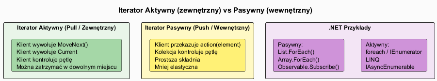

# 05 — Iterator Aktywny vs Pasywny

## Spis treści

1. [Definicje](#1-definicje)
2. [Porównanie](#2-porownanie)
3. [Iterator aktywny — szczegóły](#3-aktywny)
4. [Iterator pasywny — szczegóły](#4-pasywny)
5. [Zastosowania w technologiach](#5-technologie)
6. [Kiedy co wybrać](#6-wybor)
7. [Uruchamianie przykładu](#7-uruchamianie)

---

## 1. Definicje <a name="1-definicje"></a>



| | Iterator Aktywny (Pull) | Iterator Pasywny (Push) |
|--|------------------------|------------------------|
| **Kto steruje** | Klient | Kolekcja |
| **Model** | Pull — klient ciągnie elementy | Push — kolekcja pcha do klienta |
| **Przepływ** | Klient wywołuje `MoveNext()` | Kolekcja wywołuje callback |
| **Synonim** | Iterator zewnętrzny | Iterator wewnętrzny |

---

## 2. Porównanie <a name="2-porownanie"></a>

| Cecha | Aktywny | Pasywny |
|-------|---------|---------|
| **Wczesne przerwanie** | ✓ `break` w pętli | ✗ Tylko z dodatkowym sygnałem |
| **Równoległa iteracja (zip)** | ✓ Naturalna | ✗ Trudna |
| **Przeplatanie kolekcji** | ✓ Łatwe | ✗ Trudne |
| **Prostota kodu klienta** | Umiarkowana | Wysoka |
| **Kontrola przepływu** | Pełna | Ograniczona |
| **Przykład w C#** | `foreach`, LINQ | `List<T>.ForEach()`, Rx |

---

## 3. Iterator aktywny — szczegóły <a name="3-aktywny"></a>

### Implementacja

```csharp
// Klient steruje — pełna kontrola
using var iter = collection.GetEnumerator();
while (iter.MoveNext())
{
    if (iter.Current.IsSpecial)
        break;  // ← wczesne przerwanie
    Process(iter.Current);
}
```

### Synchronizacja dwóch iteratorów (Zip)

```csharp
// Niemożliwe z iteratorem pasywnym bez koordynacji zewnętrznej
static IEnumerable<(T1, T2)> Zip<T1, T2>(
    IEnumerable<T1> col1, IEnumerable<T2> col2)
{
    using var i1 = col1.GetEnumerator();
    using var i2 = col2.GetEnumerator();
    while (i1.MoveNext() && i2.MoveNext())
        yield return (i1.Current, i2.Current);
}
```

### Przeplatanie

```csharp
static IEnumerable<T> Interleave<T>(IEnumerable<T> a, IEnumerable<T> b)
{
    using var ia = a.GetEnumerator();
    using var ib = b.GetEnumerator();
    while (ia.MoveNext() && ib.MoveNext())
    {
        yield return ia.Current;
        yield return ib.Current;
    }
}
// Wynik: [a1, b1, a2, b2, a3, b3, ...]
```

---

## 4. Iterator pasywny — szczegóły <a name="4-pasywny"></a>

### Implementacja

```csharp
class OrderCollection
{
    private List<Order> _orders = [];

    // Iterator wewnętrzny — kolekcja steruje
    public void ForEach(Action<Order> action)
    {
        foreach (var order in _orders)
            action(order);
    }
}

// Użycie — prosty, deklaratywny:
orders.ForEach(o => Console.WriteLine(o.Id));
orders.ForEach(o => total += o.Amount);
```

### Rozszerzony push z możliwością przerwania

```csharp
// Kompromis: pasywny z możliwością przerwania
public void ForEachUntil(Func<Order, bool> action)
{
    foreach (var order in _orders)
        if (!action(order)) break;
}

// Użycie:
orders.ForEachUntil(o => {
    Process(o);
    return o.Amount < 1000; // false = przerwij
});
```

---

## 5. Zastosowania w technologiach <a name="5-technologie"></a>

### .NET — oba modele

```csharp
// Pull — IEnumerable<T> / foreach / LINQ
foreach (int n in collection) { ... }
collection.Where(x => x > 5).Select(x => x * 2);

// Push — delegates / events / Rx
list.ForEach(item => Process(item));
observable.Subscribe(value => Console.WriteLine(value));
```

### LINQ — leniwy pull

LINQ implementuje **leniwy pull** — żaden element nie jest obliczany dopóki nie zostanie poproszony:

```csharp
// Zbudowanie pipeline — nic nie jest obliczone
var query = collection
    .Where(x => x.IsActive)
    .Select(x => x.Name)
    .OrderBy(x => x);

// Materializacja — dopiero teraz obliczane są elementy
var result = query.ToList();

// Lub leniwa konsumpcja
foreach (string name in query)
    Console.WriteLine(name);
```

### IObservable\<T\> — reaktywne rozszerzenia (Rx)

`IObservable<T>` to **push-based, asynchroniczny** iterator. Kolekcja "emituje" zdarzenia do subskrybentów:

```csharp
// IObservable<T> — dualny do IEnumerable<T>
//   IEnumerable:  GetEnumerator() → client calls MoveNext()
//   IObservable:  Subscribe()     → source calls OnNext()

observable
    .Where(x => x > 5)          // jak LINQ, ale asynchroniczne
    .Subscribe(x => Console.WriteLine(x));

// Symulacja — Source publikuje bez pytania klienta
source.Publish(42);    // → OnNext(42) wywołany u wszystkich subskrybentów
source.Complete();     // → OnCompleted() wywołany u wszystkich
```

**Tabela technologii:**

| Technologia | Model | Przykład |
|------------|-------|---------|
| `foreach` | Pull, sync | Iteracja po kolekcji |
| `LINQ` | Pull, lazy, sync | Zapytania strumieniowe |
| `IAsyncEnumerable<T>` | Pull, lazy, async | Streaming z bazy danych |
| `IObservable<T>` (Rx) | Push, async | Zdarzenia UI, dane IoT |
| `Channel<T>` | Push, async | Producer-consumer |

---

## 6. Kiedy co wybrać <a name="6-wybor"></a>

```
Czy potrzebujesz wczesnego przerwania (break)?
  TAK → Iterator aktywny (foreach / IEnumerator<T>)

Czy synchronizujesz dwie sekwencje (zip, interleave)?
  TAK → Iterator aktywny (oba kursory niezależnie)

Czy operacja jest prosta (zastosuj akcję do każdego elementu)?
  TAK → Iterator pasywny (ForEach / List.ForEach)

Czy sekwencja jest asynchroniczna / event-driven?
  TAK → IObservable<T> (Reactive Extensions)

Czy sekwencja jest asynchroniczna ale pull-based?
  TAK → IAsyncEnumerable<T> + await foreach
```

---

## 7. Uruchamianie przykładu <a name="7-uruchamianie"></a>

```bash
cd src/15-iterator/05-iterator-aktywny-vs-pasywny/Examples
dotnet run
```
