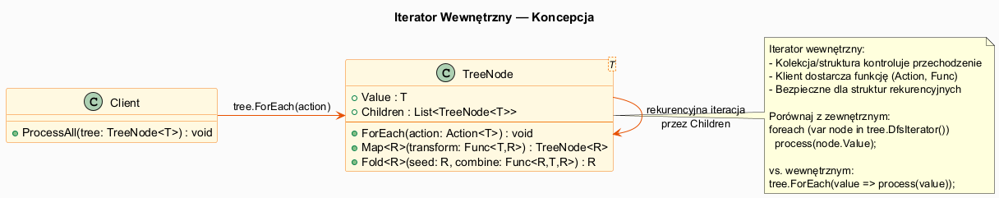

# 06 — Iterator Wewnętrzny

## Spis treści

1. [Koncepcja](#1-koncepcja)
2. [Implementacja podstawowa (ForEach)](#2-foreach)
3. [Operacje wyższego rzędu: Map, Fold, Filter](#3-funkcyjne)
4. [Iterator wewnętrzny na drzewie](#4-drzewo)
5. [Wady i zalety](#5-wadyzalety)
6. [Porównanie z zewnętrznym](#6-porownanie)
7. [Uruchamianie przykładu](#7-uruchamianie)

---

## 1. Koncepcja <a name="1-koncepcja"></a>



**Iterator wewnętrzny** to odmiana wzorca, w której **kolekcja kontroluje przechodzenie** zamiast klienta. Klient dostarcza tylko akcję do wykonania na każdym elemencie.

```
Iterator zewnętrzny:                Iterator wewnętrzny:
while (iter.MoveNext())             collection.ForEach(element =>
{                                   {
    Process(iter.Current);              Process(element);
}                                   });
```

---

## 2. Implementacja podstawowa (ForEach) <a name="2-foreach"></a>

```csharp
class TaskList
{
    private List<Task> _tasks = [];

    // Iterator wewnętrzny — kolekcja steruje
    public void ForEach(Action<Task> action)
    {
        foreach (var task in _tasks)
            action(task);  // wywołaj callback klienta
    }
}

// Użycie:
tasks.ForEach(t => Console.WriteLine(t.Name));
tasks.ForEach(t => { if (!t.Done) total++; });
```

---

## 3. Operacje wyższego rzędu: Map, Fold, Filter <a name="3-funkcyjne"></a>

Iterator wewnętrzny naturalnie prowadzi do operacji funkcyjnych:

### Map — transformacja

```csharp
public TaskList<TResult> Map<TResult>(Func<Task, TResult> transform)
{
    var result = new TaskList<TResult>();
    foreach (var t in _tasks)
        result.Add(transform(t));
    return result;
}

// Użycie:
TaskList<string> names = tasks.Map(t => t.Name.ToUpper());
names.ForEach(Console.WriteLine);
```

### Fold (Reduce) — agregacja

```csharp
public TResult Fold<TResult>(TResult seed, Func<TResult, Task, TResult> combine)
{
    TResult acc = seed;
    foreach (var t in _tasks)
        acc = combine(acc, t);
    return acc;
}

// Użycie:
int doneCount = tasks.Fold(0, (acc, t) => t.Done ? acc + 1 : acc);
```

### Filter

```csharp
public TaskList<T> Filter(Func<T, bool> predicate)
{
    var result = new List<T>();
    foreach (var item in _items)
        if (predicate(item)) result.Add(item);
    return new TaskList<T>(result);
}

// Użycie — komponowanie:
int result = list
    .Filter(n => n % 2 == 0)
    .Map(n => n * n)
    .Fold(0, (acc, n) => acc + n);
```

---

## 4. Iterator wewnętrzny na drzewie <a name="4-drzewo"></a>

Szczególnie naturalny dla **struktur rekurencyjnych** (drzewa, grafy):

```csharp
class TreeNode<T>
{
    public T Value { get; }
    private List<TreeNode<T>> _children = [];

    // Iterator wewnętrzny DFS preorder — kolekcja kontroluje rekurencję
    public void ForEach(Action<T> action)
    {
        action(Value);                              // odwiedź bieżący węzeł
        foreach (var child in _children)
            child.ForEach(action);                 // rekurencja
    }

    // Map — tworzy nowe drzewo z przetransformowanymi wartościami
    public TreeNode<TResult> Map<TResult>(Func<T, TResult> transform)
    {
        var newNode = new TreeNode<TResult>(transform(Value));
        foreach (var child in _children)
            newNode.AddChild(child.Map(transform));
        return newNode;
    }
}

// Użycie:
tree.ForEach(v => Console.WriteLine(v));
TreeNode<int> lengths = wordTree.Map(w => w.Length);
```

---

## 5. Wady i zalety <a name="5-wadyzalety"></a>

### Zalety iteratora wewnętrznego

| Zaleta | Opis |
|--------|------|
| **Prostota** | Mniej kodu klienta — tylko akcja do wykonania |
| **Bezpieczna rekurencja** | Kolekcja zarządza stanem, nie klient |
| **Enkapsulacja** | Kolekcja może optymalizować przechodzenie |
| **Styl funkcyjny** | Natural Map/Filter/Fold |

### Wady iteratora wewnętrznego

| Wada | Opis |
|------|------|
| **Brak wczesnego przerwania** | Callback nie może zatrzymać pętli (bez flag) |
| **Brak stanu kontekstu** | Nie dostarcza głębokości, ścieżki, sąsiadów |
| **Brak synchronizacji** | Nie można przeplatać dwóch iteratorów |
| **Trudne debugowanie** | Stos wywołań z callbackami może być mylący |

---

## 6. Porównanie z zewnętrznym <a name="6-porownanie"></a>

```csharp
// Iterator wewnętrzny — prosty
tree.ForEach(v => Console.WriteLine(v));

// Iterator zewnętrzny — głębokość dostępna
foreach ((string v, int depth) in tree.DfsWithDepth())
    Console.WriteLine($"{"  ".PadLeft(depth * 2)}{v}");

// Problem iteratora wewnętrznego — brak stanu:
// tree.ForEach(v => /* jak wiemy na jakiej głębokości jesteśmy? */);
// Trzeba modyfikować kolekcję lub używać closure!
```

**Reguła:** Jeśli potrzebujesz tylko "wykonaj akcję na każdym elemencie" — użyj wewnętrznego. Jeśli potrzebujesz stanu iteracji (pozycja, głębokość, ścieżka) — zewnętrzny.

---

## 7. Uruchamianie przykładu <a name="7-uruchamianie"></a>

```bash
cd src/15-iterator/06-iterator-wewnetrzny/Examples
dotnet run
```
