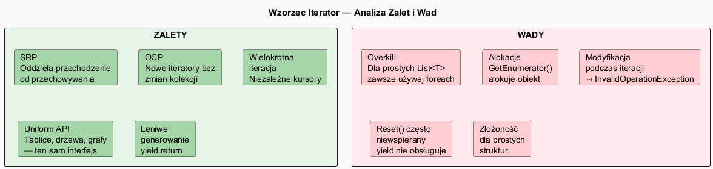

# 07 — Wady i Zalety Stosowania Wzorca Iterator

## Spis treści

1. [Podsumowanie](#1-podsumowanie)
2. [Zalety szczegółowo](#2-zalety)
3. [Wady i pułapki szczegółowo](#3-wady)
4. [Analiza wydajności](#4-wydajność)
5. [Kiedy użyć, kiedy zrezygnować](#5-kiedy)
6. [Uruchamianie przykładu](#6-uruchamianie)

---

## 1. Podsumowanie <a name="1-podsumowanie"></a>



---

## 2. Zalety szczegółowo <a name="2-zalety"></a>

### Single Responsibility Principle (SRP)

Kolekcja odpowiada za **przechowywanie danych**, iterator za **logikę przechodzenia**.

```csharp
// Klasa Zoo — tylko przechowywanie
class AnimalZoo : IEnumerable<Animal>
{
    private List<Animal> _animals = [];
    public void AddAnimal(Animal a) => _animals.Add(a);
    public IEnumerator<Animal> GetEnumerator() => _animals.GetEnumerator();
}

// Osobna klasa — osobna odpowiedzialność
class ReverseZooIterator : IEnumerator<Animal>
{
    // Logika przechodzenia wstecz
}
```

### Open/Closed Principle (OCP)

Nowy typ iteracji = nowa klasa, bez modyfikacji kolekcji:

```csharp
// Istniejąca kolekcja — ZAMKNIĘTA na modyfikacje
class AnimalZoo { ... }

// Nowe iteratory — OTWARTE na rozszerzanie
class EndangeredAnimalsIterator : IEnumerator<Animal> { ... }
class AlphabeticalIterator : IEnumerator<Animal> { ... }
class ByHabitatIterator : IEnumerator<Animal> { ... }  // nowy, bez zmiany Zoo!
```

### Wiele niezależnych iteratorów

```csharp
// Dwa niezależne kursory w tej samej kolekcji
using var cursor1 = zoo.GetEnumerator(); // kursor A
using var cursor2 = zoo.GetEnumerator(); // kursor B — niezależny!

cursor1.MoveNext(); cursor1.MoveNext(); // A jest na 2. elemencie
cursor2.MoveNext();                      // B jest na 1. elemencie
// Brak konfliktu!
```

### Leniwe generowanie

```csharp
// Sekwencja nieskończona — niemożliwa bez yield
static IEnumerable<int> NaturalNumbers()
{
    int n = 1;
    while (true) yield return n++;
}

// Tylko 5 elementów jest obliczanych:
foreach (int n in NaturalNumbers().Take(5))
    Console.Write(n + " "); // 1 2 3 4 5
```

---

## 3. Wady i pułapki szczegółowo <a name="3-wady"></a>

### Modyfikacja kolekcji podczas iteracji

```csharp
var list = new List<int> { 1, 2, 3, 4, 5 };

// ✗ ZŁE — rzuca InvalidOperationException
foreach (int item in list)
    list.Remove(item);

// ✓ DOBRE — iteracja po kopii
foreach (int item in list.ToList())
    list.Remove(item);

// ✓ DOBRE — iteracja wstecz
for (int i = list.Count - 1; i >= 0; i--)
    list.RemoveAt(i);
```

> **Dlaczego?** `List<T>` przechowuje `_version` (licznik wersji). Modyfikacja inkrementuje wersję, `MoveNext()` sprawdza czy wersja się zmieniła i rzuca wyjątek.

### Reset() z yield return

```csharp
// yield return — kompilator generuje maszynę stanów
static IEnumerable<int> MyGenerator()
{
    yield return 1;
    yield return 2;
}

using var e = MyGenerator().GetEnumerator();
e.MoveNext(); Console.WriteLine(e.Current); // 1

// ✗ ZŁE — NotSupportedException!
e.Reset();

// ✓ DOBRE — stwórz nowy enumerator
using var e2 = MyGenerator().GetEnumerator();
```

### Iteracja = jednorazowa dla generatorów

```csharp
IEnumerable<int> Gen()
{
    yield return 1; yield return 2;
}

var seq = Gen();
Console.WriteLine(seq.Count()); // 2 — OK
Console.WriteLine(seq.Count()); // 2 — OK (nowy enumerator)
Console.WriteLine(seq.First()); // 1 — OK

// Ale ostrzeżenie: za każdym razem nowe obliczenia!
// Jeśli Gen() jest kosztowny, zmateriahzuj: var list = Gen().ToList();
```

---

## 4. Analiza wydajności <a name="4-wydajność"></a>

### Alokacje enumeratora

| Typ | Alokacja | Uwagi |
|-----|----------|-------|
| `List<T>.GetEnumerator()` | struct — **brak alokacji** | Użyj zmiennej konkretnego typu |
| `IEnumerable<T>.GetEnumerator()` | heap — **alokuje** | Boxing struct enumeratora |
| `yield return` generator | heap — **alokuje** | Klasa maszyny stanów |
| `Array.GetEnumerator()` | heap — **alokuje** | Wraca do `IEnumerator` |

```csharp
var list = new List<int> { 1, 2, 3 };

// ✓ struct enumerator — bez alokacji
List<int>.Enumerator e = list.GetEnumerator(); // konkretny typ!
while (e.MoveNext()) { ... }

// ✗ boxing — alokuje
IEnumerator<int> e2 = list.GetEnumerator();

// foreach z List<T> używa struct — kompilator jest mądry
foreach (int n in list) { ... } // bezalokacyjne!
```

### LINQ vs ręczna pętla

```csharp
// Prosta operacja — LINQ ma narzut wywołań delegatów
var sum = list.Where(x => x > 5).Sum(); // wolniejsze

// Ręczna pętla — szybsza dla prostych przypadków
int sum = 0;
foreach (int n in list)
    if (n > 5) sum += n;
```

---

## 5. Kiedy użyć, kiedy zrezygnować <a name="5-kiedy"></a>

### Użyj Iterator gdy:

- Kolekcja ma **niestandardową strukturę** (drzewo, graf, spiral matrix)
- Potrzebujesz **wielu niezależnych kursorów**
- Chcesz **ukryć wewnętrzną reprezentację** kolekcji
- Generujesz elementy **leniwie** lub masz nieskończone sekwencje
- Chcesz **LINQ-compatible** kolekcji

### Zrezygnuj lub użyj alternatywy gdy:

| Sytuacja | Alternatywa |
|---------|-------------|
| Prosta `List<T>`, tylko `foreach` | Użyj wbudowanego iteratora |
| Filtr + sort + projekcja | LINQ (`Where/OrderBy/Select`) |
| Operacje na różnych typach węzłów | Wzorzec Visitor |
| Jednorazowe przejście, prosta kolekcja | Pętla `for` |
| Asynchroniczne strumienie | `IAsyncEnumerable<T>` + `await foreach` |

---

## 6. Uruchamianie przykładu <a name="6-uruchamianie"></a>

```bash
cd src/15-iterator/07-wady-i-zalety/Examples
dotnet run
```
