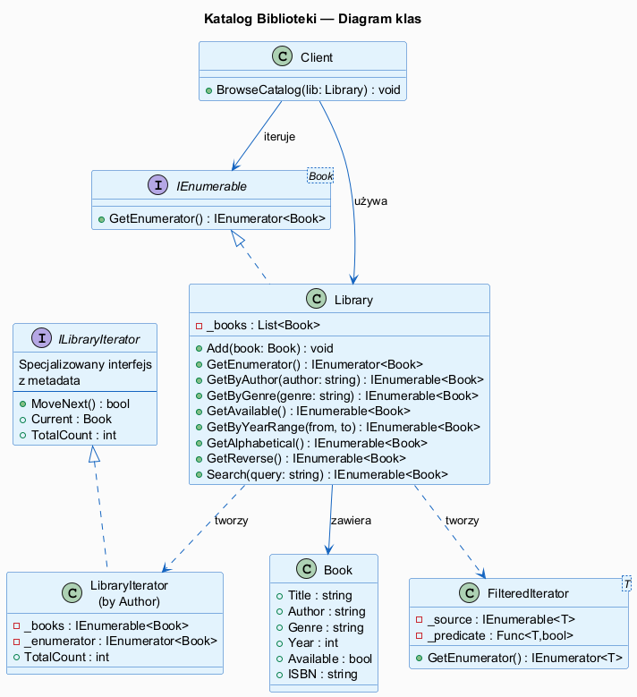
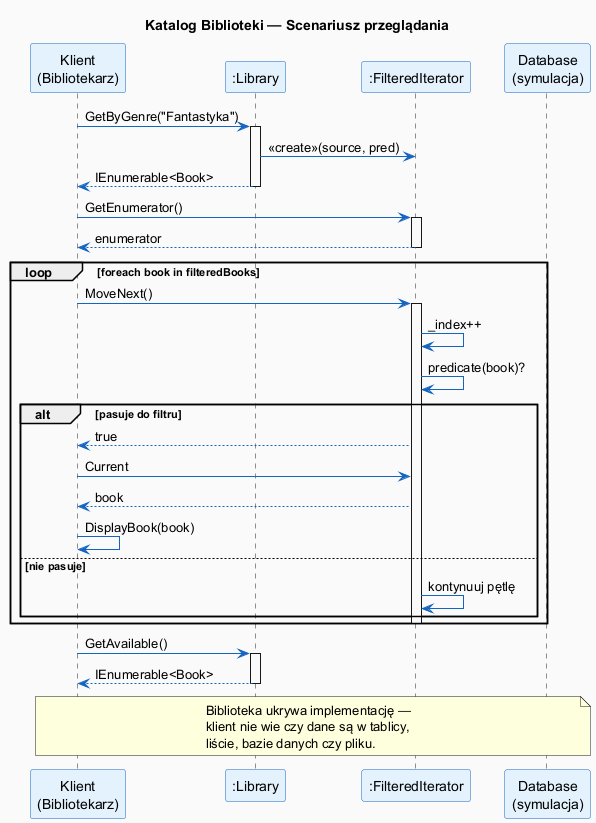

# 08 — Duży Przykład: Katalog Biblioteki i Alternatywy

## Spis treści

1. [Opis przykładu](#1-opis)
2. [Diagram klas](#2-diagram-klas)
3. [Diagram sekwencji](#3-diagram-sekwencji)
4. [Implementacja krok po kroku](#4-implementacja)
5. [Alternatywy](#5-alternatywy)
6. [Testy](#6-testy)
7. [Uruchamianie](#7-uruchamianie)

---

## 1. Opis przykładu <a name="1-opis"></a>

Biblioteka miejska przechowuje kolekcję **książek**. Pracownicy i czytelnicy potrzebują różnych sposobów przeglądania katalogu:

- przeglądanie całego katalogu (kolejność dodania)
- filtrowanie według gatunku, autora, dostępności
- sortowanie alfabetyczne
- wyszukiwanie po fragmencie tytułu/autora/ISBN
- iteracja po kilku bibliotekach naraz (kompozyt)
- asynchroniczne pobieranie z zewnętrznego źródła

Wzorzec **Iterator** pozwala dodawać każdy nowy sposób iteracji **bez modyfikacji klasy `Library`**.

---

## 2. Diagram klas <a name="2-diagram-klas"></a>



---

## 3. Diagram sekwencji <a name="3-diagram-sekwencji"></a>



---

## 4. Implementacja krok po kroku <a name="4-implementacja"></a>

### Krok 1 — model domeny

```csharp
record Book(string Title, string Author, string Genre, int Year, bool Available, string ISBN);
```

`record` w C# 12 — niemutowalny, z automatycznym `Equals`, `ToString`, destrukturyzacją.

### Krok 2 — kolekcja implementuje IEnumerable

```csharp
class Library : IEnumerable<Book>
{
    private readonly List<Book> _books = [];

    public void Add(Book book) => _books.Add(book);

    // Domyślna iteracja
    public IEnumerator<Book> GetEnumerator() => _books.GetEnumerator();
    IEnumerator IEnumerable.GetEnumerator() => GetEnumerator();
}
```

### Krok 3 — filtry jako metody yield

```csharp
public IEnumerable<Book> GetByGenre(string genre)
{
    foreach (var b in _books)
        if (b.Genre.Equals(genre, StringComparison.OrdinalIgnoreCase))
            yield return b;   // leniwa ewaluacja!
}
```

### Krok 4 — kompozyt wielu kolekcji

```csharp
class CompositeLibrary(params Library[] libraries) : IEnumerable<Book>
{
    public IEnumerator<Book> GetEnumerator()
    {
        foreach (var lib in libraries)
            foreach (var book in lib)
                yield return book;
    }
}

// Użycie:
var combined = new CompositeLibrary(mainLib, branchLib);
foreach (var b in combined) { ... }
```

---

## 5. Alternatywy <a name="5-alternatywy"></a>

### LINQ (najpopularniejsza alternatywa)

```csharp
// LINQ — deklaratywny, czytelny
var results = library
    .Where(b => b.Genre == "SF" && b.Available)
    .OrderBy(b => b.Year)
    .Select(b => b.Title);
```

**Kiedy LINQ jest lepszy:**
- Operacje filtr + sort + projekcja w jednej linii
- Gdy pracujesz na istniejącej kolekcji (nie tworzysz własnej)
- Gdy czytelność jest ważniejsza niż wydajność

**Kiedy własny iterator jest lepszy:**
- Niestandardowa struktura (drzewo, graf)
- Wiele niezależnych kursorów naraz
- Złożone przechodzenie z wewnętrznym stanem

### IAsyncEnumerable (dla danych asynchronicznych)

```csharp
async IAsyncEnumerable<Book> FetchBooksAsync()
{
    foreach (var book in _remote)
    {
        await Task.Delay(100); // symulacja I/O
        yield return book;
    }
}

// Użycie:
await foreach (Book b in library.FetchBooksAsync())
    Console.WriteLine(b.Title);
```

### Wzorzec Visitor (gdy logika zależy od typu)

Gdy masz różne typy w kolekcji (Book, Magazine, DVD) i każdy przetwarza inaczej — użyj **Visitora** zamiast Iteratora.

---

## 6. Testy <a name="6-testy"></a>

28 testów jednostkowych (xUnit) sprawdzających:

| Kategoria | Testy |
|-----------|-------|
| Podstawowa iteracja | pełna kolekcja, pusta kolekcja |
| Filtr po gatunku | zgodność, case-insensitive, brak wyników |
| Filtr po autorze | pełne/częściowe dopasowanie |
| Dostępność | dostępne, niedostępne, suma = całość |
| Zakres lat | granice włącznie, brak wyników |
| Sortowanie | weryfikacja porządku alfabetycznego |
| Wyszukiwanie | po tytule, autorze, ISBN, brak wyników |
| Eksport CSV | nagłówek, ilość wierszy, lazy evaluation |
| Kompozyt | suma kolekcji, kolejność, puste kolekcje |
| Niezależność kursorów | dwa iteratory jednocześnie |
| Zgodność z LINQ | iterator = LINQ (GetByGenre, GetAvailable) |

---

## 7. Uruchamianie <a name="7-uruchamianie"></a>

```bash
# Przykład
cd src/15-iterator/08-duzy-przyklad-i-alternatywy/Examples
dotnet run

# Testy
cd src/15-iterator/08-duzy-przyklad-i-alternatywy/Tests
dotnet test --verbosity normal
```
