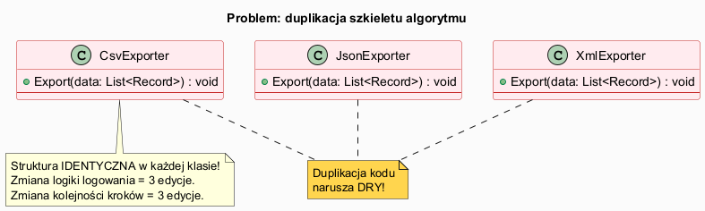
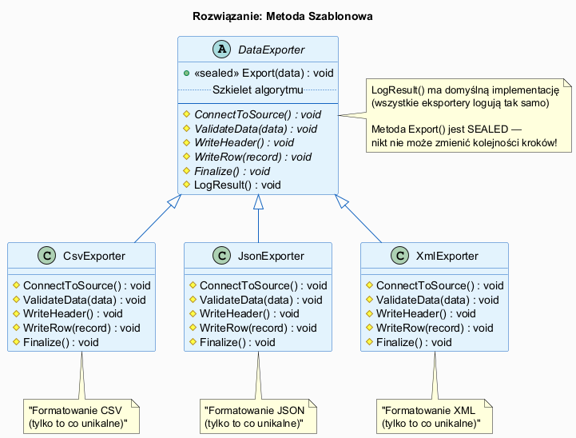

# 01 — Idea i Kontekst Wzorca Metoda Szablonowa

## Spis treści

1. [Rys historyczny](#1-historia)
2. [Problem — duplikacja szkieletu algorytmu](#2-problem)
3. [Rozwiązanie — koncepcja wzorca](#3-rozwiązanie)
4. [Zasada Hollywood Principle](#4-hollywood)
5. [Potrżeby które wzorzec zaspokaja](#5-potrżeby)
6. [Uruchamianie przykładu](#6-uruchamianie)
7. [Literatura](#7-literatura)

---

## 1. Rys historyczny <a name="1-historia"></a>

Wzorzec **Metoda Szablonowa** (Template Method) został opisany przez Gang of Four w 1994 roku w książce *Design Patterns*. Jest jednym z **najstarszych i najczęściej stosowanych wzorców** — pojawia się w każdym niemal frameworku, od Javy przez .NET po Python.

Wzorzec wyrasta z obserwacji, że wiele klas dzieli **tę samą ogólną strukturę algorytmu**, różniąc się jedynie w szczegółach poszczególnych kroków. Programiści intuicyjnie stosowali jego ideę długo przed formalnym opisem GoF — wyodrębniając wspólne szkielety do klas bazowych.

### Wzorzec w .NET Framework

Liczne klasy bazowe w .NET używają Template Method:

| Klasa .NET | Metoda szablonowa | Kroki do nadpisania |
|-----------|-------------------|---------------------|
| `Stream` | `Read()` / `Write()` | `ReadAsync()`, `Seek()` itp. |
| `TextWriter` | `WriteLine()` | `Write(char)` |
| `DbConnection` | `Open()` | `CreateDbCommand()` |
| ASP.NET `Controller` | `OnActionExecuting()` | filtry akcji |
| xUnit `TheoryData` | `GetEnumerator()` | dostarczenie danych |

---

## 2. Problem — duplikacja szkieletu algorytmu <a name="2-problem"></a>



### Scenariusz

Piszesz system eksportu danych do różnych formatów. Każdy eksporter wykonuje **identyczną sekwencję kroków**, różniącą się tylko formatowaniem:

```csharp
// CsvExporter
class CsvExporter
{
    public void Export(List<Record> data)
    {
        ConnectToDatabase();    // <- identyczne
        ValidateData(data);     // <- identyczne
        OpenFile("output.csv"); // <- różne: csv
        WriteHeader();          // <- różne: "Name,Email,Age"
        foreach (var r in data)
            WriteRow(r);        // <- różne: "Jan,jan@x.com,42"
        CloseFile();            // <- różne: zamknij plik
        LogCompletion();        // <- identyczne
    }
}

// JsonExporter — KOPIA z drobnymi zmianami!
class JsonExporter
{
    public void Export(List<Record> data)
    {
        ConnectToDatabase();    // <- kopia!
        ValidateData(data);     // <- kopia!
        OpenFile("output.json"); // <- różne: json
        WriteHeader();          // <- różne: "["
        foreach (var r in data)
            WriteRow(r);        // <- różne: {...}
        CloseFile();            // <- różne: "]"
        LogCompletion();        // <- kopia!
    }
}
```

**Problemy z tym kodem:**
- Zmiana `LogCompletion()` wymaga edycji **N klas** (N = liczba formatów)
- Zmiana kolejności kroków też wymaga N edycji
- Łatwo popełnić błąd przy kopiowaniu
- Naruszenie zasady DRY (*Don't Repeat Yourself*)

---

## 3. Rozwiązanie — koncepcja wzorca <a name="3-rozwiązanie"></a>



**Klucz:** Przenieś szkielet algorytmu do klasy bazowej. Wyodrębnij to co **zmienne** jako `abstract` metody, to co **wspólne** zostaw w klasie bazowej.

```csharp
abstract class DataExporter
{
    // METODA SZABLONOWA — sealed gwarantuje niezmienność kolejności kroków
    public sealed void Export(List<Record> data)
    {
        ConnectToSource();       // <- może być wspólna lub abstract
        ValidateData(data);      // <- abstract: każdy format inaczej waliduje
        WriteHeader();           // <- abstract: inny nagłówek dla każdego formatu
        foreach (var r in data)
            WriteRow(r);         // <- abstract: inne formatowanie
        Finalize();              // <- abstract: zamknięcie pliku/streamu
        LogResult();             // <- virtual z domyślną implementacją!
    }

    protected abstract void ConnectToSource();
    protected abstract void ValidateData(List<Record> data);
    protected abstract void WriteHeader();
    protected abstract void WriteRow(Record record);
    protected abstract void Finalize();

    // Krok wspólny — jedna implementacja dla wszystkich!
    protected virtual void LogResult()
        => Console.WriteLine($"Eksport {GetType().Name} zakończony.");
}
```

**Wynik:**  
- Zmiana `LogResult()` = **1 edycja** (w klasie bazowej)
- Zmiana kolejności kroków = **1 edycja** (w metodzie szablonowej)
- Każda podklasa implementuje tylko to co unikalne

---

## 4. Zasada Hollywood Principle <a name="4-hollywood"></a>

> **"Nie dzwoń do nas — my zadzwonimy do ciebie"**  
> *(Don't call us, we'll call you)*

Wzorzec Metoda Szablonowa jest klasycznym przykładem **Hollywood Principle** — zasady odwrócenia sterowania (IoC):

```
Normalny przepływ:        Template Method:
────────────────          ────────────────────────────
Podklasa → Baza           Baza wywołuje Podklasę
step1()                   TemplateMethod() {
step2()       →               step1();  ← wywołuje podklasę
step3()                       step2();  ← wywołuje podklasę
                              step3();  ← wywołuje podklasę
                          }
```

**Podklasa "rejestruje" swoje implementacje** (`abstract` i `virtual` metody), a klasa bazowa wywołuje je w odpowiednim momencie. Podklasa nie wie KIEDY zostanie wywołana — to decyduje klasa bazowa.

---

## 5. Potrżeby które wzorzec zaspokaja <a name="5-potrżeby"></a>

| Potrzeba | Przykład | Rozwiązanie Template Method |
|----------|----------|----------------------------|
| Eliminacja duplikacji algorytmu | N eksporterów z tą samą sekwencją kroków | Szkielet w klasie bazowej |
| Kontrola punktów rozszerzenia | Framework musi wywołać `setUp()` przed testem | `abstract setUp()` w klasie bazowej |
| Ochrona algorytmu przed zmianą | Kolejność kroków musi być stała | `sealed` metoda szablonowa |
| Opcjonalne rozszerzenia | Rzadkie zachowania jak logowanie VIP | `virtual` hook z pustą implementacją |
| Wspólny stan | Eksportery dzielą połączenie z bazą | Pola w klasie bazowej |

---

## 6. Uruchamianie przykładu <a name="6-uruchamianie"></a>

```bash
cd src/15-metoda-szablonowa/01-idea-i-kontekst/Examples
dotnet run
```

Przykład demonstruje:
- Kod **bez wzorca** — widoczna duplikacja struktury
- Kod **z wzorcem** — trzy eksportery przez jedną hierarchię
- Polimorfizm — ta sama pętla obsługuje wszystkie formaty

---

## 7. Literatura <a name="7-literatura"></a>

1. Gamma E. i in. — *Design Patterns* (1994), s. 325–330 — oryginalna definicja GoF.
1. Freeman E., Robson E. — *Head First Design Patterns* (2020), rozdz. 8, s. 289–332.
1. [Refactoring Guru — Template Method](https://refactoring.guru/design-patterns/template-method)
1. [Microsoft — Abstract classes](https://learn.microsoft.com/en-us/dotnet/csharp/programming-guide/classes-and-structs/abstract-and-sealed-classes-and-class-members)
