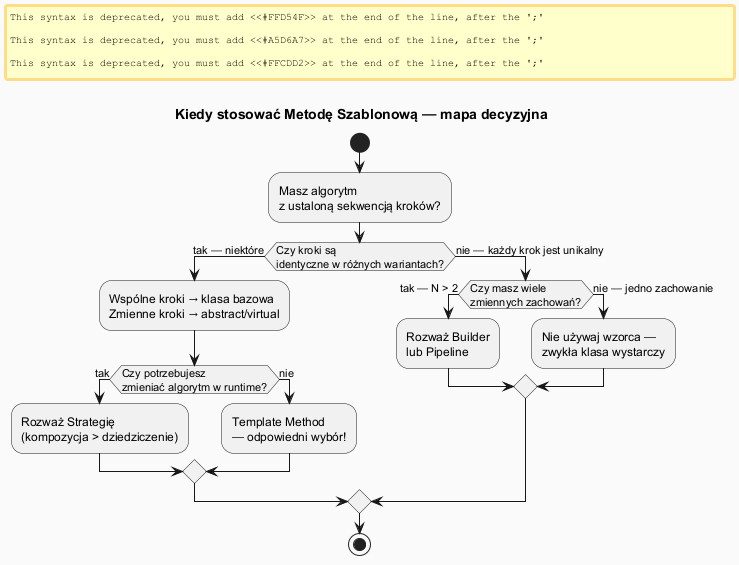
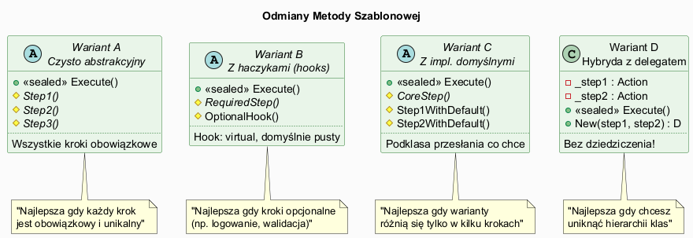

# 02 — Kiedy Stosować, Zalety, Wady i Odmiany

## Spis treści

1. [Sygnały — kiedy stosować](#1-sygnaly)
2. [Diagram decyzyjny](#2-diagram)
3. [Zalety szczegółowo](#3-zalety)
4. [Wady i pułapki](#4-wady)
5. [Odmiany wzorca](#5-odmiany)
6. [Porównanie z innymi wzorcami](#6-porównanie)
7. [Uruchamianie](#7-uruchamianie)

---

## 1. Sygnały — kiedy stosować <a name="1-sygnaly"></a>

Stosuj **Metodę Szablonową** gdy widzisz co najmniej jedno z poniższych:

### Sygnał 1: Copy-paste z drobnymi zmianami

```csharp
// ✗ ZŁE — skopiowano i zmieniono tylko format:
class PdfGenerator  { void Generate() { Init(); LoadData(); FormatAsPdf(); Save(); Log(); } }
class WordGenerator { void Generate() { Init(); LoadData(); FormatAsWord(); Save(); Log(); } }
class HtmlGenerator { void Generate() { Init(); LoadData(); FormatAsHtml(); Save(); Log(); } }

// ✓ DOBRE — szkielet w jednym miejscu:
abstract class DocumentGenerator
{
    public sealed void Generate() { Init(); LoadData(); Format(); Save(); Log(); }
    protected abstract void Format();
}
```

### Sygnał 2: Framework musi narzucić kolejność

```csharp
// xUnit — Setup → Test → Cleanup (zawsze w tej kolejności)
// ASP.NET — OnAuthorization → OnActionExecuting → Action → OnActionExecuted

abstract class BaseController : Controller
{
    public sealed IActionResult HandleRequest()
    {
        AuthorizeRequest(); // zawsze pierwsze
        var result = ProcessRequest(); // każdy kontroler inaczej
        LogRequest(); // zawsze ostatnie
        return result;
    }
    protected abstract IActionResult ProcessRequest();
}
```

### Sygnał 3: Wiele wariantów algorytmu z tym samym "rusztowaniem"

Przykłady z .NET: `Stream.Read()`, `TextWriter.Write()`, `DbConnection.Open()`

---

## 2. Diagram decyzyjny <a name="2-diagram"></a>





---

## 3. Zalety szczegółowo <a name="3-zalety"></a>

### DRY — zmiany w jednym miejscu

```csharp
abstract class GameAI
{
    public sealed void TakeTurn()
    {
        CollectResources();
        BuildStructures();
        Attack();
        LogTurn(); // JEDNA implementacja dla wszystkich AI
    }
    protected virtual void LogTurn()
        => Console.WriteLine($"[{GetType().Name}] tura zakończona"); // zmiana = 1 edycja
}
```

### Hollywood Principle — kontrola rozszerzalności

Framework decyduje **kiedy** wywołać metody podklas. Podklasy tylko **dostarczają implementację**:

```csharp
// Podklasa nie wywołuje klasy bazowej — klasa bazowa wywołuje podklasę
class WarriorAI : GameAI
{
    protected override void Attack()
        => Console.WriteLine("Atak mieczem!"); // nie wiadomo kiedy to zostanie wywołane
}
```

### Reużywalność szkieletu w frameworkach

```csharp
// ASP.NET Core — Pipeline jest Template Method
// Programista tylko implementuje specificzne middleware
app.Use(async (context, next) =>
{
    // przed
    await next.Invoke();
    // po
});
```

---

## 4. Wady i pułapki <a name="4-wady"></a>

### Fragile Base Class Problem

```csharp
abstract class DataExporter
{
    public sealed void Export(List<Record> data)
    {
        Validate(data);
        Open();
        WriteAll(data);
        Close(); // Jeśli zamienimy kolejność Close() i WriteAll() → wszystkie podklasy się psują!
    }
}
```

### Ograniczenie dziedziczenia (C#: jedna klasa bazowa)

```csharp
// Problem: chcemy Template Method RAZEM z inną klasą bazową
class MyProcessor : FileProcessor // ← już nie można dziedziczyć po DataExporter!
{
    // Rozwiązanie: użyj Strategii lub delegatów
}
```

### Trudność w testowaniu

```csharp
// Klasa abstrakcyjna wymaga tworzenia podklasy lub mockowania
abstract class DocumentProcessor
{
    public sealed void Process() { ... }
    protected abstract string LoadDocument();
}

// Test: musi stworzyć konkretną podklasę
class TestDocumentProcessor : DocumentProcessor
{
    protected override string LoadDocument() => "<xml>test</xml>";
}
```

**Alternatywa — delegaty (łatwe do testowania):**

```csharp
class DocumentProcessor(Func<string> loadDocument)
{
    public void Process()
    {
        var doc = loadDocument(); // łatwy mock!
        ...
    }
}

// Test: lambda zamiast podklasy
var processor = new DocumentProcessor(() => "<xml>test</xml>");
```

---

## 5. Odmiany wzorca <a name="5-odmiany"></a>

### Odmiana A — Czysto abstrakcyjny (wszystkie kroki obowiązkowe)

```csharp
abstract class DatabaseMigration
{
    public sealed void Execute()
    {
        BackupDatabase();   // abstract — obowiązkowy
        ApplyChanges();     // abstract — obowiązkowy
        ValidateResult();   // abstract — obowiązkowy
        UpdateVersion();    // abstract — obowiązkowy
    }
    protected abstract void BackupDatabase();
    protected abstract void ApplyChanges();
    protected abstract void ValidateResult();
    protected abstract void UpdateVersion();
}
```

### Odmiana B — Z haczykami (hooks)

```csharp
abstract class CaffeineRecipe
{
    public sealed void PrepareRecipe()
    {
        BoilWater();
        Brew();
        PourInCup();
        if (CustomerWantsCondiments()) // hook-guard
            AddCondiments();
    }

    protected abstract void Brew();
    protected abstract void AddCondiments();
    protected void BoilWater() => Console.WriteLine("Gotuję wodę");
    protected void PourInCup() => Console.WriteLine("Wlewam do filiżanki");
    protected virtual bool CustomerWantsCondiments() => true; // hook
}
```

### Odmiana C — Z implementacjami domyślnymi

```csharp
abstract class HttpRequestHandler
{
    public sealed IActionResult Handle(HttpRequest req)
    {
        if (!Authenticate(req)) return Unauthorized();
        var data = LoadData(req);
        data = Transform(data);
        return BuildResponse(data);
    }

    protected virtual bool Authenticate(HttpRequest req) => true; // domyślnie: wszyscy OK
    protected abstract object LoadData(HttpRequest req);
    protected virtual object Transform(object data) => data;      // domyślnie: bez zmian
    protected virtual IActionResult BuildResponse(object data) => Ok(data);

    private IActionResult Unauthorized() => new UnauthorizedResult();
    private IActionResult Ok(object d) => new OkObjectResult(d);
}
```

### Odmiana D — Z delegatem (bez dziedziczenia)

```csharp
class DataPipeline(Action connect, Action process, Action save)
{
    public void Run()
    {
        connect();
        process();
        save();
    }
}

// Użycie — bez dziedziczenia!
var pipeline = new DataPipeline(
    connect: () => Console.WriteLine("Połączono"),
    process: () => Console.WriteLine("Przetworzono"),
    save:    () => Console.WriteLine("Zapisano")
);
pipeline.Run();
```

---

## 6. Porównanie z innymi wzorcami <a name="6-porównanie"></a>

| Kryterium | Template Method | Strategia | Builder |
|-----------|-----------------|-----------|---------|
| Mechanizm | Dziedziczenie | Kompozycja | Kompozycja |
| Zmiana w runtime | ✗ | ✓ | Częściowo |
| Liczba kroków | Wiele (N > 2) | Jeden algorytm | Wiele produktów |
| Stan współdzielony | Przez `this` | Brak | Przez Builder |
| Testability | Średnia (abstract) | Wysoka | Wysoka |
| Kiedy użyć | Stały szkielet | Wymienne algorytmy | Złożone tworzenie |

---

## 7. Uruchamianie <a name="7-uruchamianie"></a>

```bash
cd src/15-metoda-szablonowa/02-kiedy-stosować-zalety-wady/Examples
dotnet run
```
