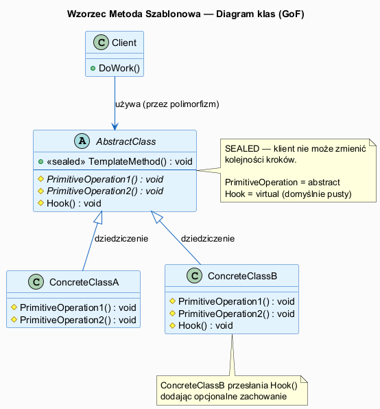
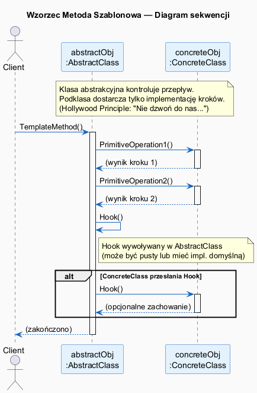
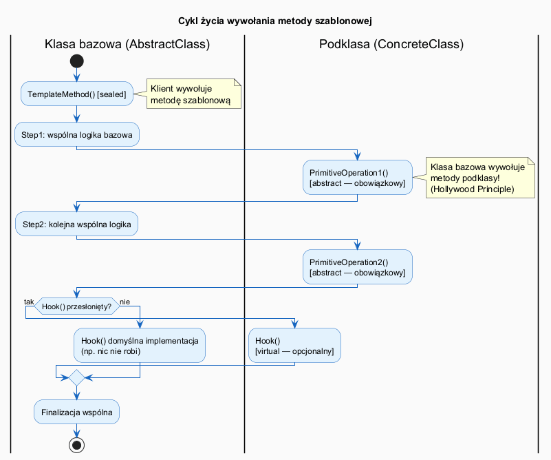

# 03 — Struktura i Działanie Wzorca (GoF)

## Spis treści

1. [Rolę w strukturze GoF](#1-rolę)
2. [Diagram klas](#2-diagram-klas)
3. [Diagram sekwencji](#3-sekwencja)
4. [Cykl życia wywołania](#4-cykl)
5. [Mapowanie na C# / .NET](#5-net)
6. [Konsekwencje stosowania](#6-konsekwencje)
7. [Uruchamianie](#7-uruchamianie)

---

## 1. Rolę w strukturze GoF <a name="1-rolę"></a>

| Rola GoF | Implementacja w C# | Opis |
|----------|--------------------|------|
| `AbstractClass` | `abstract class` z metodą `sealed` | Definiuje szkielet algorytmu i kroki |
| `TemplateMethod` | `public sealed void Execute()` | Ustala kolejność kroków — nie może być przesłonięta |
| `PrimitiveOperation` | `protected abstract void Step()` | Krok obowiązkowy — podklasa MUSI zaimplementować |
| `Hook` | `protected virtual void Hook()` | Krok opcjonalny — podklasa MOŻE przesłonić |
| `ConcreteClass` | Klasa dziedzicząca | Implementuje konkretne kroki algorytmu |

---

## 2. Diagram klas <a name="2-diagram-klas"></a>



### Kanoniczna implementacja C#

```csharp
abstract class AbstractClass
{
    // METODA SZABLONOWA — sealed: nikt nie może zmienić kolejności!
    public sealed void TemplateMethod()
    {
        PrimitiveOperation1(); // obowiązkowy krok
        PrimitiveOperation2(); // obowiązkowy krok
        Hook();                // opcjonalny krok
    }

    protected abstract void PrimitiveOperation1(); // primitive operation
    protected abstract void PrimitiveOperation2(); // primitive operation
    protected virtual void Hook() { }              // hook — domyślnie: nic
}

class ConcreteClassA : AbstractClass
{
    protected override void PrimitiveOperation1()
        => Console.WriteLine("A: Krok 1");
    protected override void PrimitiveOperation2()
        => Console.WriteLine("A: Krok 2");
}

class ConcreteClassB : AbstractClass
{
    protected override void PrimitiveOperation1()
        => Console.WriteLine("B: Krok 1");
    protected override void PrimitiveOperation2()
        => Console.WriteLine("B: Krok 2");
    protected override void Hook()              // opcjonalnie przesłonięty
        => Console.WriteLine("B: Hook!");
}
```

---

## 3. Diagram sekwencji <a name="3-sekwencja"></a>



**Kluczowa obserwacja:** Strzałki idą **od klasy bazowej do podklasy** dla kroków algorytmu. Klient wywołuje tylko metodę szablonową. Jest to **odwrócenie sterowania** (IoC).

---

## 4. Cykl życia wywołania <a name="4-cykl"></a>



### Szczegółowy przepływ

```
1. Client → AbstractClass.TemplateMethod()
2. AbstractClass → ConcreteClass.PrimitiveOperation1()   ← Hollywood!
3. AbstractClass (logika wspólna między krokami)
4. AbstractClass → ConcreteClass.PrimitiveOperation2()   ← Hollywood!
5. AbstractClass sprawdza: czy Hook() jest przesłonięty?
   - Jeśli tak: AbstractClass → ConcreteClass.Hook()
   - Jeśli nie: AbstractClass.Hook() (pusta implementacja)
6. AbstractClass.TemplateMethod() kończy działanie
```

---

## 5. Mapowanie na C# / .NET <a name="5-net"></a>

### Słowa kluczowe C#

| Koncepcja | Słowo kluczowe | Opis |
|-----------|---------------|------|
| Klasa bazowa | `abstract class` | Może mieć implementacje; nie można instancjonować |
| Metoda szablonowa | `public sealed void` | Niezmienialny szkielet |
| Primitive Operation | `protected abstract void` | Podklasa MUSI zaimplementować |
| Hook | `protected virtual void` | Podklasa MOŻE przesłonić |
| Wymuszone wywołanie bazowej | `base.Method()` | Rozszerzenie hooka (nie zastąpienie) |

### `System.IO.Stream` — Template Method w BCL

```csharp
// Stream to AbstractClass
public abstract class Stream
{
    // Template Method (uproszczony):
    public void CopyTo(Stream destination)
    {
        byte[] buffer = new byte[81920];
        int read;
        while ((read = Read(buffer, 0, buffer.Length)) > 0) // ← abstract!
            destination.Write(buffer, 0, read);             // ← abstract!
    }

    // Primitive Operations — każdy strumień implementuje inaczej:
    public abstract int Read(byte[] buffer, int offset, int count);
    public abstract void Write(byte[] buffer, int offset, int count);
}

// ConcreteClass:
public class FileStream : Stream
{
    public override int Read(byte[] buffer, int offset, int count) { /* I/O */ }
    public override void Write(byte[] buffer, int offset, int count) { /* I/O */ }
}
```

---

## 6. Konsekwencje stosowania <a name="6-konsekwencje"></a>

### Pozytywne

1. **Eliminacja duplikacji** — szkielet algorytmu w jednym miejscu
2. **Kontrola rozszerzania** — tylko wyznaczone kroki mogą być zmieniane
3. **Zasada OCP** — nowe warianty = nowa podklasa (bez edycji bazowej)
4. **Wymuszona spójność** — wszystkie podklasy przestrzegają tego samego protokołu

### Negatywne

1. **Fragile Base Class** — zmiana bazowej może zepsuć wszystkie podklasy
2. **Liskov Substitution** — podklasa musi zachowywać kontrakt bazowej
3. **Ograniczenie dziedziczenia** — C# nie ma wielodziedziczenia klas
4. **Trudny debug** — przepływ sterowania "skacze" między klasami

---

## 7. Uruchamianie <a name="7-uruchamianie"></a>

```bash
cd src/15-metoda-szablonowa/03-struktura-i-działanie/Examples
dotnet run
```
