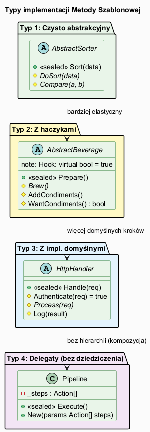
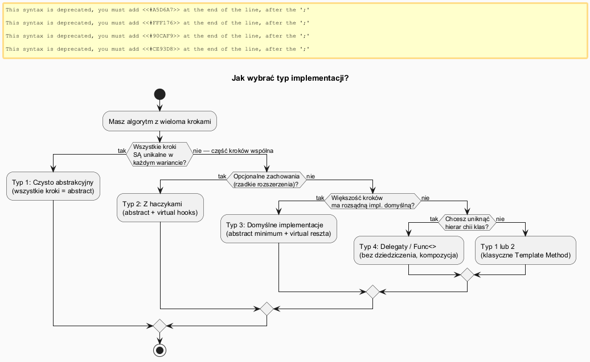

# 04 — Typy Implementacji Metody Szablonowej

## Spis treści

1. [Przegląd typów](#1-przeglad)
2. [Diagram typów](#2-diagram)
3. [Typ 1: Czysto abstrakcyjny](#3-typ1)
4. [Typ 2: Z haczykami (Hooks)](#4-typ2)
5. [Typ 3: Z domyślnymi implementacjami](#5-typ3)
6. [Typ 4: Delegaty (bez dziedziczenia)](#6-typ4)
7. [Porównanie: abstract class vs interface default methods](#7-interface)
8. [Schemat decyzji](#8-decyzja)
9. [Uruchamianie](#9-uruchamianie)

---

## 1. Przegląd typów <a name="1-przeglad"></a>

| # | Typ | Kiedy | Przykład |
|---|-----|-------|---------|
| 1 | **Czysto abstrakcyjny** | Wszystkie kroki unikalne w każdym wariancie | Sortowanie, parsery formatów |
| 2 | **Z haczykami (Hooks)** | Opcjonalne rozszerzenia w niektórych wariantach | Przepisy, zamówienia VIP |
| 3 | **Z domyślnymi impl.** | Większość kroków ma rozsądne domyślne zachowanie | HTTP handlers, procesory |
| 4 | **Delegaty / Func<>** | Chcesz uniknąć hierarchii klas, testowalność | ETL pipeline, strategie |

---

## 2. Diagram typów <a name="2-diagram"></a>



---

## 3. Typ 1: Czysto abstrakcyjny <a name="3-typ1"></a>

Wszystkie kroki zadeklarowane jako `abstract`. Podklasa **musi** zaimplementować każdy krok.

```csharp
abstract class AbstractSorter
{
    // Metoda szablonowa — określa kolejność
    public sealed void Sort(int[] data)
    {
        DoSort(data);   // ← abstract: każdy sorter implementuje inaczej
        Verify(data);   // ← virtual: można przesłonić, ale nie trzeba
    }

    protected abstract void DoSort(int[] data);           // OBOWIĄZKOWY
    protected virtual void Verify(int[] data) { ... }     // opcjonalny
}
```

**Kiedy:** Gdy każda implementacja jest kompletnie inna i nie ma sensu mieć domyślnych zachowań.

---

## 4. Typ 2: Z haczykami (Hooks) <a name="4-typ2"></a>

Haczyki (`hooks`) to metody `virtual` z domyślną implementacją (często pustą lub zwracającą `bool`), które **mogą** być przesłonięte przez podklasy.

```csharp
abstract class CaffeineRecipe
{
    public sealed void Prepare()
    {
        BoilWater();
        Brew();
        PourInCup();
        if (WantsCondiments())    // Hook-guard: warunek sterujący
            AddCondiments();
    }

    protected abstract void Brew();
    protected abstract void AddCondiments();

    // Hooki:
    protected virtual bool WantsCondiments() => true;  // domyślnie: tak
}

class HerbalTea : CaffeineRecipe
{
    protected override void Brew() => Console.WriteLine("Zaparzam ziołową");
    protected override void AddCondiments() { }        // pusta
    protected override bool WantsCondiments() => false; // hook: bez dodatków
}
```

**Rodzaje hooków:**
- **Hook-guard** (`bool`): steruje czy krok jest wykonywany
- **Hook-extend** (void): podklasa **rozszerza** domyślne zachowanie (`base.Hook()`)
- **Hook-data** (return value): podklasa dostarcza dane dla bazowej

---

## 5. Typ 3: Z domyślnymi implementacjami <a name="5-typ3"></a>

Większość kroków jest `virtual` z sensowną implementacją domyślną. Podklasy przesłaniają **tylko to, co muszą**.

```csharp
abstract class HttpRequestHandler
{
    public sealed void Handle(HttpRequest req)
    {
        if (!Authenticate(req)) { /* 401 */ return; }
        if (!Authorize(req))    { /* 403 */ return; }
        var result = Process(req);
        Log(req, result);
    }

    protected virtual bool Authenticate(HttpRequest req) => true; // domyślnie: OK
    protected virtual bool Authorize(HttpRequest req) => true;    // domyślnie: OK
    protected abstract string Process(HttpRequest req);            // OBOWIĄZKOWY
    protected virtual void Log(HttpRequest req, string res) { ... }
}
```

---

## 6. Typ 4: Delegaty (bez dziedziczenia) <a name="6-typ4"></a>

Zamiast hierarchii klas — `Func<>` i `Action<>` wstrzykiwane przez konstruktor. Metoda szablonowa to zwykła metoda klasy.

```csharp
class DataPipeline(
    Func<string> extract,
    Func<string, string> transform,
    Action<string> load)
{
    public void Run()
    {
        var raw = extract();           // wstrzyknięty krok
        var processed = transform(raw); // wstrzyknięty krok
        load(processed);               // wstrzyknięty krok
    }
}

// Użycie — bez dziedziczenia!
var pipeline = new DataPipeline(
    extract:   () => FetchFromDatabase(),
    transform: data => ParseJson(data),
    load:      result => SaveToWarehouse(result)
);
pipeline.Run();
```

**Zalety:** Testowalność (mocki bez klas), kompozycja zamiast dziedziczenia, lepsze z IoC.

**Wady:** Brak wspólnego interfejsu (trudniej podmieniać), brak hook-guardów.

---

## 7. Abstract class vs Interface default methods <a name="7-interface"></a>

Od C# 8.0 interfejsy mogą mieć **domyślne implementacje metod**, co pozwala na wzorzec podobny do Template Method:

```csharp
interface IDocumentProcessor
{
    // Template Method jako sealed default interface method
    sealed void ProcessDocument(string path)
    {
        var content = Load(path);
        if (Validate(content))
            Save(path, Transform(content));
        OnComplete(path); // hook
    }

    string Load(string path);
    bool Validate(string content);
    string Transform(string content);
    void Save(string path, string content);
    void OnComplete(string path) { }  // hook z domyślną (pustą) implementacją
}
```

| Cecha | `abstract class` | `interface` (DIM) |
|-------|-----------------|-------------------|
| Stan (pola) | ✅ | ❌ |
| Wiele "baz" | ❌ | ✅ |
| Hermetyzacja pól | ✅ | ❌ |
| `sealed` method | ✅ | ✅ (C# 8+) |
| Kiedy wybrać | Gdy potrzebujesz stanu | Gdy chcesz wielokrotnego implementowania |

---

## 8. Schemat decyzji <a name="8-decyzja"></a>



---

## 9. Uruchamianie <a name="9-uruchamianie"></a>

```bash
cd src/15-metoda-szablonowa/04-typy-implementacji/Examples
dotnet run
```
