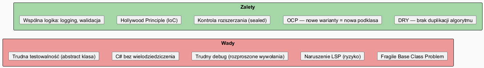
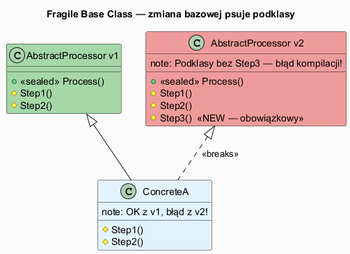

# 05 — Wady i Zalety Wzorca Metoda Szablonowa

## Spis treści

1. [Zalety](#1-zalety)
2. [Wady i zagrożenia](#2-wady)
3. [Kiedy NIE stosować](#3-kiedy-nie)
4. [Implikacje dla SOLID](#4-solid)
5. [Alternatywy](#5-alternatywy)
6. [Diagram: zalety vs wady](#6-diagram)
7. [Uruchamianie](#7-uruchamianie)

---

## 1. Zalety <a name="1-zalety"></a>

### 1.1 Eliminacja duplikacji (DRY)

Wspólny szkielet algorytmu żyje **w jednym miejscu**. Zmieniasz logikę otwierania pliku — zmieniasz w klasie bazowej, wszystkie podklasy korzystają automatycznie.

```csharp
// PRZED: duplikacja w każdej klasie
class CsvProcessor { void Process(path) { Open(); Parse(); Close(); Log(); } }
class JsonProcessor { void Process(path) { Open(); Parse(); Close(); Log(); } }

// PO: Open/Close/Log tylko raz w AbstractProcessor
abstract class AbstractProcessor { sealed void Process(path) { Open(); Parse(); Close(); Log(); } }
```

### 1.2 Kontrola rozszerzania (`sealed`)

Słowo `sealed` gwarantuje niezmienność kolejności kroków. Żadna podklasa nie może "zoptymalizować" metody szablonowej w sposób, który złamie kontrakt.

### 1.3 Hollywood Principle (IoC)

"Nie dzwoń do nas — my zadzwonimy do ciebie." Podklasa **nie wywołuje** kroków samodzielnie — bazowa **wywołuje je w odpowiednim momencie**. Eliminuje błędy "zapomniałem wywołać super()".

### 1.4 Otwarte/Zamknięte (OCP)

Nowy wariant algorytmu = nowa podklasa. Klasa bazowa nie jest modyfikowana.

---

## 2. Wady i zagrożenia <a name="2-wady"></a>

### 2.1 Fragile Base Class Problem

Zmiana klasy bazowej może **zepsuć wszystkie podklasy**:

- Dodanie nowego `abstract` kroku → błąd kompilacji we wszystkich podklasach
- Zmiana kolejności kroków w metodzie szablonowej → zmiana semantyki podklas
- Usunięcie hooka → podklasy, które go przesłaniały, tracą funkcjonalność

**Rozwiązanie:** Nowe kroki dodawaj jako `virtual` z domyślną implementacją.

### 2.2 Naruszenie LSP (Liskov Substitution Principle)

Podklasa musi **zachowywać kontrakt** klasy bazowej:

```csharp
// NARUSZENIE LSP:
class UnsafeProcessor : AbstractProcessor
{
    protected override void Open(string path)
        => throw new NotSupportedException(); // łamie kontrakt!
}

// Kod klienta oczekuje, że Process() zadziała dla każdego procesora:
AbstractProcessor p = new UnsafeProcessor();
p.Process("file.dat"); // NiespodziewanyWyjątek!
```

### 2.3 Trudna testowalność klas abstrakcyjnych

Nie można bezpośrednio instancjonować klasy abstrakcyjnej. Opcje:
1. Tworzenie "testowej" podklasy z mock-implementacją
2. Użycie frameworku moq (`.SetupAbstractMember()`)
3. Refaktoryzacja do delegatów (Typ 4)

### 2.4 Głęboka hierarchia klas

Wielopoziomowa hierarchia sprawia, że przepływ sterowania jest rozproszony, debug jest trudny, a rozumienie kodu wymaga przeskakiwania między plikami.

### 2.5 C# — brak wielodziedziczenia klas

Podklasa może dziedziczyć tylko z jednej klasy abstrakcyjnej. To ogranicza kompozycję zachowań.

---

## 3. Kiedy NIE stosować <a name="3-kiedy-nie"></a>

| Sygnał | Co zrobić zamiast |
|--------|------------------|
| Podklasy przesłaniają większość kroków | → Strategia (wstrzyknij zachowania jako interfejsy) |
| Chcesz testować bez podklas | → Delegaty (Func<>/Action<>) |
| Hierarchia przekracza 2 poziomy | → Kompozycja (SRP, dekorator) |
| Różne algorytmy bez wspólnego szkieletu | → Strategia lub Command |
| Potrzebujesz wielodziedziczenia | → Interfejsy + kompozycja |

---

## 4. Implikacje dla SOLID <a name="4-solid"></a>

| Zasada | Implikacja Template Method |
|--------|---------------------------|
| **SRP** | ⚠️ Klasa bazowa zarządza zarówno szkieletem jak i domyślnymi krokami — dwa obowiązki |
| **OCP** | ✅ Nowe warianty nie modyfikują bazowej |
| **LSP** | ⚠️ Podklasy muszą przestrzegać kontraktu bazowej |
| **ISP** | ✅ Brak wpływu (dotyczy interfejsów) |
| **DIP** | ⚠️ Kod klienta zależy od konkretnej abstrakcyjnej klasy, nie interfejsu |

---

## 5. Alternatywy <a name="5-alternatywy"></a>

| Alternatywa | Kiedy wybrać | Wada |
|-------------|-------------|------|
| **Strategia** | Różne algorytmy, łatwa podmiana w runtime | Mniejsza kontrola kolejności kroków |
| **Dekorator** | Dynamiczne dodawanie zachowań | Złożoność owijania |
| **Builder** | Konstruowanie złożonych obiektów krok po kroku | Nie dotyczy algorytmów |
| **Func<>/delegaty** | Testowalność, IoC container, bez hierarchii | Brak hooków, trudniejsza dokumentacja |

### Przykład: Template Method → Strategia

```csharp
// PRZED (Template Method):
abstract class DataExporter
{
    sealed void Export(data) { Format(data); Write(data); }
    abstract string Format(data);
    abstract void Write(string data);
}

// PO (Strategia):
class DataExporter(IFormatter formatter, IWriter writer)
{
    void Export(data)
    {
        var formatted = formatter.Format(data);
        writer.Write(formatted);
    }
}
// Teraz formatter i writer można wstrzyknąć przez konstruktor — łatwiejsze testy!
```

---

## 6. Diagram: zalety vs wady <a name="6-diagram"></a>





---

## 7. Uruchamianie <a name="7-uruchamianie"></a>

```bash
cd src/15-metoda-szablonowa/05-wady-i-zalety/Examples
dotnet run
```
