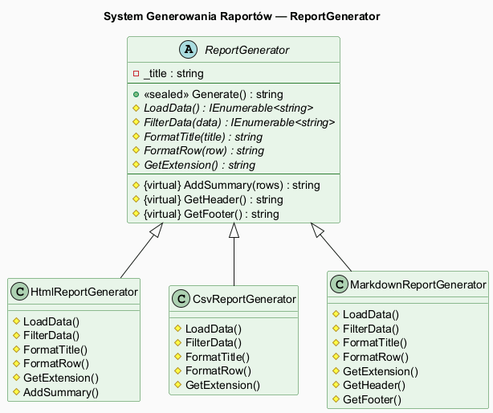
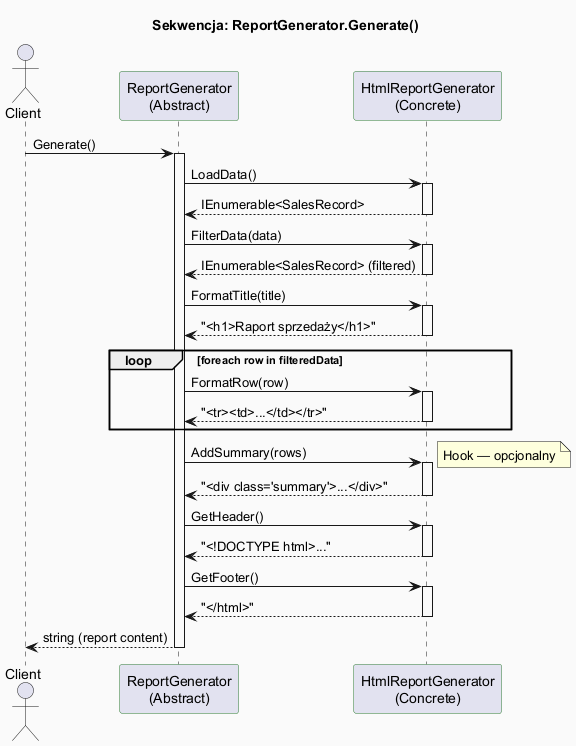

# 06 — Duży Przykład i Alternatywy

## Spis treści

1. [Opis przykładu](#1-opis)
2. [Diagram systemu raportów](#2-diagram)
3. [Sekwencja wywołań](#3-sekwencja)
4. [Implementacja Template Method](#4-template)
5. [Alternatywa: Strategia](#5-strategia)
6. [Alternatywa: Delegaty](#6-delegaty)
7. [Porównanie podejść](#7-porównanie)
8. [Testy jednostkowe](#8-testy)
9. [Uruchamianie](#9-uruchamianie)

---

## 1. Opis przykładu <a name="1-opis"></a>

System generowania raportów sprzedażowych w trzech formatach: **HTML**, **CSV**, **Markdown**.

Każdy raport wykonuje ten sam algorytm:
1. Załaduj dane (`LoadData`)
2. Filtruj dane (`FilterData`)
3. Sformatuj tytuł (`FormatTitle`)
4. Sformatuj każdy wiersz (`FormatRow`)
5. Opcjonalnie: dodaj podsumowanie (`AddSummary` — hook)
6. Dodaj nagłówek/stopkę (`GetHeader` / `GetFooter` — hooki)

Tylko sposób formatowania różni się między wariantami — idealny kandydat dla **Metody Szablonowej**.

---

## 2. Diagram systemu raportów <a name="2-diagram"></a>



---

## 3. Sekwencja wywołań <a name="3-sekwencja"></a>



---

## 4. Implementacja Template Method <a name="4-template"></a>

```csharp
abstract class ReportGenerator(string title, IEnumerable<SalesRecord> allData)
{
    // Metoda szablonowa — szkielet algorytmu
    public sealed string Generate()
    {
        var data = LoadData();
        var filtered = FilterData(data);
        var rows = filtered.ToList();

        var sb = new StringBuilder();
        sb.AppendLine(GetHeader());
        sb.AppendLine(FormatTitle(title));
        foreach (var row in rows)
            sb.AppendLine(FormatRow(row));
        var summary = AddSummary(rows);  // hook — zwraca "" jeśli nie przesłonięty
        if (!string.IsNullOrEmpty(summary))
            sb.AppendLine(summary);
        sb.AppendLine(GetFooter());
        return sb.ToString();
    }

    // Primitive Operations — OBOWIĄZKOWE
    protected abstract IEnumerable<SalesRecord> FilterData(IEnumerable<SalesRecord> data);
    protected abstract string FormatTitle(string title);
    protected abstract string FormatRow(SalesRecord record);

    // Krok wspólny (nie abstract)
    protected IEnumerable<SalesRecord> LoadData() => allData;

    // Hooki — OPCJONALNE
    protected virtual string AddSummary(IList<SalesRecord> rows) => string.Empty;
    protected virtual string GetHeader() => string.Empty;
    protected virtual string GetFooter() => string.Empty;
}
```

---

## 5. Alternatywa: Strategia <a name="5-strategia"></a>

Zamiast hierarchii klas — wstrzykiwane strategie (`IReportFormatStrategy`, `IReportFilterStrategy`):

```csharp
class StrategyReportGenerator(
    IReportFormatStrategy format,
    IReportFilterStrategy filter,
    string title)
{
    public string Generate(IEnumerable<SalesRecord> allData)
    {
        var filtered = filter.Filter(allData).ToList();
        // ...używa format.FormatTitle(), format.FormatRow(), itd.
    }
}

// Użycie — podmiana w runtime bez nowej klasy!
var gen = new StrategyReportGenerator(
    new HtmlFormatStrategy(),
    new CategoryFilter("Elektronika"),
    "Raport");
```

---

## 6. Alternatywa: Delegaty <a name="6-delegaty"></a>

```csharp
var report = new DelegateReportGenerator(
    title: "Raport",
    filter: records => records.Where(r => r.Revenue > 500m),
    formatTitle: t => $"# {t}",
    formatRow: r => $"{r.Product}: {r.Revenue:C}",
    addSummary: rows => $"Total: {rows.Sum(r => r.Revenue):C}"
);
```

Szczególnie wygodne w testach jednostkowych — bez tworzenia podklas.

---

## 7. Porównanie podejść <a name="7-porównanie"></a>

| Cecha | Template Method | Strategia | Delegaty |
|-------|----------------|-----------|---------|
| Kolejność kroków gwarantowana | ✅ sealed | ⚠️ ręczna | ⚠️ ręczna |
| Nowy wariant bez edycji bazowej | ✅ nowa podklasa | ✅ nowe impl. | ✅ nowa lambda |
| Podmiana w runtime | ❌ | ✅ | ✅ |
| Testowanie bez podklas | ❌ | ✅ | ✅ |
| Wspólny stan bazowej | ✅ | ❌ | ❌ |

---

## 8. Testy jednostkowe <a name="8-testy"></a>

Projekt `Tests/` zawiera testy xUnit sprawdzające:

- Kolejność wywołań kroków (`GetHeader` przed `GetFooter`, `FilterData` przed `FormatRow`)
- Aktywację i brak aktywacji hooka `AddSummary`
- Poprawność filtrowania (tylko pasujące rekordy w wyjściu)
- Wszystkie rekordy pojawiają się w wyjściu
- Testowalność wersji z delegatami (bez podklas)

```bash
cd src/15-metoda-szablonowa/06-duży-przykład-i-alternatywy/Tests
dotnet test --nologo
```

---

## 9. Uruchamianie <a name="9-uruchamianie"></a>

```bash
# Przykłady:
cd src/15-metoda-szablonowa/06-duży-przykład-i-alternatywy/Examples
dotnet run

# Testy:
cd src/15-metoda-szablonowa/06-duży-przykład-i-alternatywy/Tests
dotnet test --nologo
```
