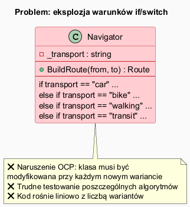
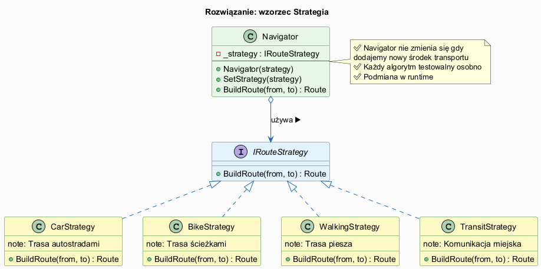

# 01 — Idea i Kontekst Wzorca Strategia

## Spis treści

1. [Historia i źródła](#1-historia)
2. [Problem, który rozwiązuje](#2-problem)
3. [Koncepcja wzorca](#3-koncepcja)
4. [Definicja GoF](#4-definicja)
5. [Strategia w .NET BCL](#5-net)
6. [Uruchamianie](#6-uruchamianie)
7. [Literatura](#7-literatura)

---

## 1. Historia i źródła <a name="1-historia"></a>

Wzorzec **Strategia** pochodzi z kultowej książki *Design Patterns* (GoF, 1994) — jednego z 23 opisanych tam wzorców. Należy do grupy wzorców **behawioralnych** (behavioral patterns).

**Kluczowy cytat z GoF:**
> *"Define a family of algorithms, encapsulate each one, and make them interchangeable. Strategy lets the algorithm vary independently from clients that use it."*

Wzorzec Strategia stał się fundamentem myślenia o **kompozycji zamiast dziedziczenia** — jednej z centralnych zasad OOP. Właśnie od tego wzorca zaczyna się słynna książka *Head First Design Patterns* (Freeman & Freeman, 2004):

> *"Identify the aspects of your application that vary and separate them from what stays the same."*

**Zasada Open/Closed** (Bertrand Meyer, 1988, Robert Martin) jest wzorcowo realizowana przez Strategię:
- **Otwarta** na rozszerzenie → dodaj nową klasę strategii
- **Zamknięta** na modyfikację → `Context` nie zmienia się

---

## 2. Problem, który rozwiązuje <a name="2-problem"></a>



### Antypattern: masa warunków if/switch

```csharp
class ReportGenerator
{
    public string Generate(Report report, string format)
    {
        if (format == "json")
            return JsonSerializer.Serialize(report);    // 10 linii
        else if (format == "csv")
            return ToCsv(report);                       // 15 linii
        else if (format == "xml")
            return ToXml(report);                       // 20 linii
        else if (format == "pdf")
            return ToPdf(report);                       // 30 linii
        throw new NotSupportedException(format);
    }
}
```

**Symptomy wskazujące na potrzebę Strategii:**

- Klasa ma wiele wariantów podobnego algorytmu (sortowanie, eksport, rabaty, walidacja...)
- Algorytm musi być wymienialny **w trakcie działania** aplikacji
- Każda nowa odmiana wymaga modyfikacji istniejącej klasy
- Testy muszą uruchamiać całą klasę, żeby przetestować jeden wariant
- Klienci muszą znać szczegóły implementacji, żeby wybrać wariant

---

## 3. Koncepcja wzorca <a name="3-koncepcja"></a>



### Kluczowa idea

1. Wydziel **zmienną część** (algorytm) do oddzielnej klasy
2. Zdefiniuj **interfejs** (kontrakt) dla wszystkich wariantów algorytmu
3. `Context` (klient wzorca) **posiada referencję** do interfejsu
4. Konkretna implementacja jest **wstrzykiwana z zewnątrz** (Dependency Injection)

```csharp
// PRZED: Navigator wie o wszystkich algorytmach
class BadNavigator { if (type == "car") ... else if ... }

// PO: Navigator zna tylko interfejs
class Navigator(IRouteStrategy strategy)
{
    public string BuildRoute(string from, string to)
        => _strategy.BuildRoute(from, to); // deleguje do strategii
}
```

---

## 4. Definicja GoF <a name="4-definicja"></a>

**Wzorzec Strategia (Strategy)** — behawioralny wzorzec projektowy.

**Uczestnicy:**

| Rola | Opis |
|------|------|
| `Context` | Utrzymuje referencję do `Strategy`. Może wstrzykiwać ją przez konstruktor lub setter. Deleguje wykonanie algorytmu do strategii. |
| `Strategy` (interfejs) | Definiuje wspólny interfejs dla wszystkich obsługiwanych algorytmów. `Context` używa tego interfejsu do wywołania algorytmu. |
| `ConcreteStrategy` | Implementuje algorytm używając interfejsu `Strategy`. |

**Schemat współpracy:**
1. `Context` przechowuje referencję do `Strategy`
2. Klient tworzy `ConcreteStrategy` i przekazuje ją do `Context`
3. `Context` deleguje algorytm do obiektu `Strategy` gdy jest potrzebny

---

## 5. Strategia w .NET BCL <a name="5-net"></a>

Wzorzec Strategia jest wbudowany w wiele klas .NET:

| Interfejs/Klasa | Rola Strategii | Przykład |
|----------------|---------------|----------|
| `IComparer<T>` | Algorytm porównania | `list.Sort(new PriceComparer())` |
| `IEqualityComparer<T>` | Algorytm równości | `new HashSet<T>(new CaseInsensitiveEq())` |
| `StringComparer` | Gotowe strategie | `StringComparer.OrdinalIgnoreCase` |
| `IFormatProvider` | Algorytm formatowania | `price.ToString("C", culture)` |
| `Comparer<T>.Create()` | Strategia z lambdy | `Comparer<T>.Create((a,b) => a.Age - b.Age)` |
| LINQ `.OrderBy()` | Strategia (klucz) | `items.OrderBy(x => x.Price)` |

```csharp
// IComparer<T> to dosłownie wzorzec Strategia:
class PriceComparer : IComparer<Product>
{
    public int Compare(Product? x, Product? y)
        => (x?.Price ?? 0).CompareTo(y?.Price ?? 0);
}

var products = new List<Product> { ... };
products.Sort(new PriceComparer());  // strategia wstrzyknięta do Sort()
```

---

## 6. Uruchamianie <a name="6-uruchamianie"></a>

```bash
cd src/17-strategia/01-idea-i-kontekst/Examples
dotnet run
```

---

## 7. Literatura <a name="7-literatura"></a>

1. **GoF** — *Design Patterns*, Addison-Wesley 1994, s. 315–323
1. **Freeman & Freeman** — *Head First Design Patterns*, O'Reilly 2004, rozdz. 1
1. **Martin** — *Clean Code*, rozdz. 17 (Smells and Heuristics)
1. **RefactoringGuru** — https://refactoring.guru/design-patterns/strategy
1. **Microsoft Docs** — https://learn.microsoft.com/en-us/dotnet/api/system.collections.generic.icomparer-1
