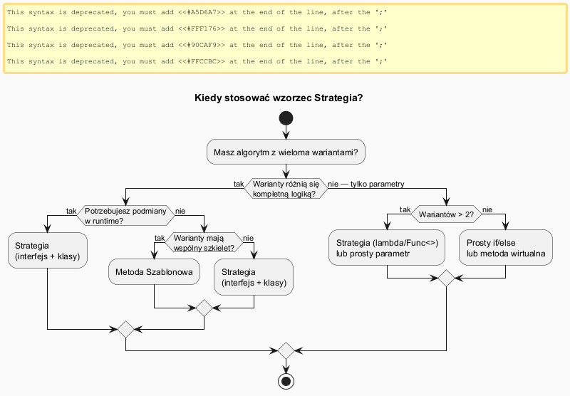
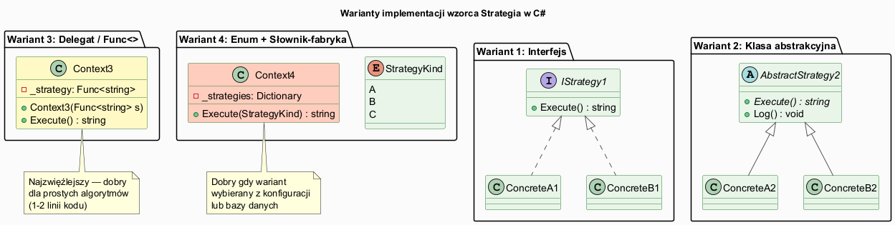

# 02 — Kiedy Stosować, Zalety i Wady

## Spis treści

1. [Sygnały wskazujące na Strategię](#1-sygnały)
2. [Diagram decyzyjny](#2-diagram)
3. [Zalety](#3-zalety)
4. [Wady i ograniczenia](#4-wady)
5. [Warianty implementacji](#5-warianty)
6. [Strategia vs Metoda Szablonowa](#6-vs)
7. [Uruchamianie](#7-uruchamianie)

---

## 1. Sygnały wskazujące na Strategię <a name="1-sygnały"></a>

### Zastosuj Strategię gdy:

- **Eksplozja warunków** — klasa zawiera serię `if/else` lub `switch` wybierającą wariant algorytmu
- **Wymienność w runtime** — algorytm musi być podmienialny bez przebudowy obiektu
- **Wiele klas różniących się zachowaniem** — wiele podklas różni się tylko jedną metodą
- **Ukrywanie danych algorytmu** — klient nie powinien znać szczegółów implementacji
- **Testowalność** — każdy algorytm musi być testowalny niezależnie

### Konkretne scenariusze:

| Domena | Strategie |
|--------|-----------|
| Nawigacja GPS | Auto, rower, pieszo, komunikacja miejska |
| E-commerce | Rabat procentowy, progowy, lojalnościowy |
| Płatności | Karta, PayPal, przelew, BLIK |
| Sortowanie | Bubble Sort, Quick Sort, Merge Sort |
| Kompresja | GZIP, ZIP, BZip2, brak |
| Walidacja | Email, długość, wymagane, regex |
| Eksport | JSON, CSV, XML, PDF |
| Podatek | PL 23%, DE 19%, GB 20%, UE 0% |

---

## 2. Diagram decyzyjny <a name="2-diagram"></a>



---

## 3. Zalety <a name="3-zalety"></a>

| # | Zaleta | Szczegóły |
|---|--------|-----------|
| ✅ | **OCP** | Nowe strategie = nowe klasy, bez modyfikacji Context |
| ✅ | **SRP** | Context zajmuje się przepływem, strategia — algorytmem |
| ✅ | **Testowalność** | Każda strategia testowalna w izolacji |
| ✅ | **Runtime swap** | Podmiana algorytmu bez restart/rekompilacji |
| ✅ | **Eliminacja if/switch** | Polimorfizm zamiast warunków |
| ✅ | **Kompozycja** | Preferowana nad dziedziczeniem |
| ✅ | **DI-friendly** | Naturalne wstrzykiwanie przez konstruktor |

---

## 4. Wady i ograniczenia <a name="4-wady"></a>

| # | Wada | Kiedy problem |
|---|------|--------------|
| ⚠️ | **Over-engineering** | Dla 2 wariantów wystarczy if/else |
| ⚠️ | **Wzrost liczby klas** | Każda strategia to osobna klasa |
| ⚠️ | **Klient musi znać strategie** | Klient decyduje którą wstrzyknąć |
| ⚠️ | **Komunikacja Context↔Strategy** | Context może przekazywać zbyt dużo danych |
| ⚠️ | **Nie zastępuje DI** | Trzeba zbudować mechanizm wyboru strategii |

### Kiedy NIE używać:

```csharp
// ❌ Over-engineering — tylko 2 warianty, nigdy nie przybędzie trzeci
interface IGreeting { string Greet(string name); }
class FormalGreeting : IGreeting { ... }
class InformalGreeting : IGreeting { ... }

// ✅ Wystarczy prosta metoda lub parametr
string Greet(string name, bool formal) =>
    formal ? $"Dzień dobry, {name}." : $"Hej, {name}!";
```

---

## 5. Warianty implementacji <a name="5-warianty"></a>



| Wariant | Zalety | Kiedy |
|---------|--------|-------|
| **Interfejs** | Maksymalna elastyczność, DI | Domyślny wybór |
| **Klasa abstrakcyjna** | Wspólna logika w bazie | Gdy strategie mają wspólny kod |
| **Func<>** | Zwięzłość, brak klas | Prosty algorytm 1-5 linii |
| **Enum + słownik** | Wybór po wartości konfiguracji | Strategia z bazy/appsettings |

---

## 6. Strategia vs Metoda Szablonowa <a name="6-vs"></a>

| Cecha | Strategia | Metoda Szablonowa |
|-------|-----------|-------------------|
| Mechanizm | Kompozycja | Dziedziczenie |
| Podmiana w runtime | ✅ Tak | ❌ Nie |
| Współdzielony kod | Przez interfejs/bazę | Bezpośrednio w klasie bazowej |
| Liczba klas | Context + N strategii | N podklas |
| Ziarnistość | Cały algorytm | Kroki algorytmu |

```csharp
// Strategia — cały algorytm wstrzykiwany
class Sorter(ISortStrategy strategy) { ... }

// Metoda Szablonowa — tylko "kroki" nadpisywane
abstract class DataMiner
{
    public void Mine() { Open(); Extract(); Parse(); Close(); } // szkielet
    protected abstract string Extract(); // zmienna część
}
```

---

## 7. Uruchamianie <a name="7-uruchamianie"></a>

```bash
cd src/17-strategia/02-kiedy-stosowac-zalety-wady/Examples
dotnet run
```
