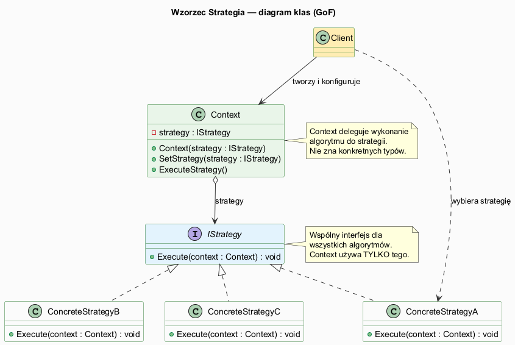
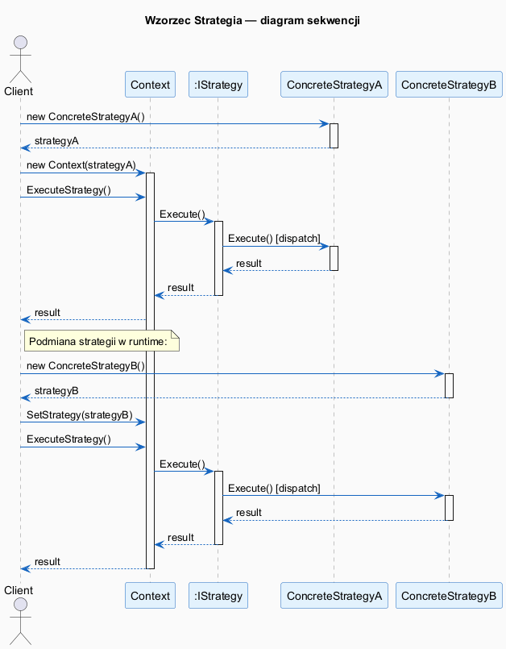

# 03 — Struktura i Działanie (GoF)

## Spis treści

1. [Role GoF](#1-role)
2. [Diagram klas](#2-diagram-klas)
3. [Diagram sekwencji](#3-diagram-sekwencji)
4. [Mapowanie na C#](#4-mapowanie)
5. [Konsekwencje wzorca](#5-konsekwencje)
6. [Uruchamianie](#6-uruchamianie)

---

## 1. Role GoF <a name="1-role"></a>

| Rola GoF | Rola w C# | Opis |
|----------|-----------|------|
| **Strategy** | `interface IStrategy` | Wspólny kontrakt dla wszystkich algorytmów. Context zna tylko ten typ. |
| **ConcreteStrategy** | Klasy implementujące IStrategy | Konkretne algorytmy. Niezależne od siebie i od Context. |
| **Context** | Klasa z `private IStrategy _strategy` | Utrzymuje referencję do strategii. Deleguje algorytm. |
| **Client** | Kod wywołujący (Program.cs) | Tworzy Context i konkretną strategię. Łączy je razem. |

---

## 2. Diagram klas <a name="2-diagram-klas"></a>



### Kluczowe relacje:

- `Context` ◇──▶ `IStrategy` — **agregacja**: Context posiada strategię, ale jej nie tworzy
- `IStrategy` ◁··· `ConcreteStrategy` — **realizacja**: klasy implementują interfejs
- `Client` ──▶ `Context` — klient tworzy Context i go konfiguruje
- `Client` ···▶ `ConcreteStrategy` — klient tworzy konkretną strategię i wstrzykuje do Context

---

## 3. Diagram sekwencji <a name="3-diagram-sekwencji"></a>



### Przepływ wywołań:

```
Client → new ConcreteStrategyA()          // 1. Utwórz strategię
Client → new Context(strategyA)           // 2. Wstrzyknij do Context
Client → Context.ExecuteStrategy()        // 3. Wywołaj przez Context
       → Context → strategy.Execute()     // 4. Context deleguje
       → ConcreteStrategyA.Execute()      // 5. Konkretny algorytm
       ← result                           // 6. Wynik wraca
```

---

## 4. Mapowanie na C# <a name="4-mapowanie"></a>

```csharp
// GoF: Strategy (interfejs)
interface IStrategy
{
    string Execute(string context);
}

// GoF: Context
class Context(IStrategy strategy)         // Primary constructor (C# 12)
{
    private IStrategy _strategy = strategy;

    public void SetStrategy(IStrategy s) => _strategy = s;   // "hot swap"

    public string ExecuteStrategy(string data)
        => _strategy.Execute(data);       // delegacja
}

// GoF: ConcreteStrategy
class ConcreteStrategyA : IStrategy
{
    public string Execute(string data) => /* algorytm A */;
}

// GoF: Client
var strategy = new ConcreteStrategyA();   // klient tworzy strategię
var context = new Context(strategy);      // wstrzykuje przez konstruktor
context.ExecuteStrategy("dane");          // wywołuje przez Context
context.SetStrategy(new ConcreteStrategyB()); // podmiana w runtime
```

### Przekazywanie danych do strategii

GoF opisuje dwa podejścia:

| Podejście | Przykład | Kiedy |
|-----------|---------|-------|
| Dane przez parametr Execute() | `strategy.Execute(data)` | Strategia stateless |
| Context jako parametr Execute() | `strategy.Execute(this)` | Strategia potrzebuje stanu Context |

---

## 5. Konsekwencje wzorca <a name="5-konsekwencje"></a>

Jak opisuje GoF (s. 317-318):

1. **Rodziny algorytmów** — definiuje rodzinę algorytmów z której Context może korzystać
2. **Alternatywa dla podklas** — zamiast dziedziczenia Context ze specjalizowanymi wariantami
3. **Eliminacja warunków** — `if/switch` znika, zastąpiony polimorfizmem
4. **Wybór implementacji** — klient może wybierać implementacje o różnych tradeoffs (czas vs pamięć)
5. **Komunikacja Context↔Strategy** — `Context` może przekazywać więcej danych niż strategia potrzebuje
6. **Wzrost liczby obiektów** — każda strategia to osobna klasa

---

## 6. Uruchamianie <a name="6-uruchamianie"></a>

```bash
cd src/17-strategia/03-struktura-i-dzialanie/Examples
dotnet run
```
